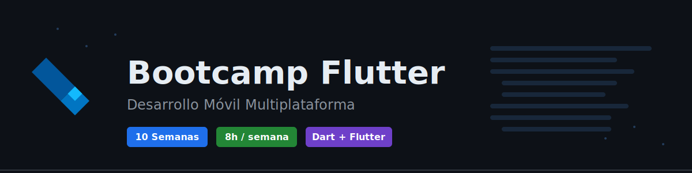

# Bootcamp Flutter - SENA

## 🎯 Descripción del Bootcamp

Bootcamp intensivo de Flutter para estudiantes de Tecnología en Análisis y Desarrollo de Software del SENA. Duración: **10 semanas** con una dedicación de **8 horas semanales**.

## 📚 Objetivos de Aprendizaje

Al finalizar este bootcamp, los estudiantes serán capaces de:

- Dominar los fundamentos del lenguaje Dart
- Desarrollar aplicaciones móviles multiplataforma con Flutter
- Implementar arquitecturas limpias y escalables
- Gestionar el estado de aplicaciones complejas
- Integrar APIs REST y servicios backend
- Publicar aplicaciones en stores
- Aplicar buenas prácticas de desarrollo móvil

## 🗓️ Estructura del Bootcamp

### Semana 1: Introducción a Dart I

**Dedicación:** 8 horas

- Fundamentos del lenguaje Dart
- Variables, tipos de datos y operadores
- Estructuras de control y funciones
- **[Ver contenido detallado →](./semana-01/README.md)**

### Semana 2: Introducción a Dart II y Fundamentos de Flutter

**Dedicación:** 8 horas

- Programación orientada a objetos en Dart
- Introducción a Flutter y su ecosistema
- Primer proyecto Flutter
- **[Ver contenido detallado →](./semana-02/README.md)**

### Semana 3: Widgets y Layouts en Flutter

**Dedicación:** 8 horas

- Widgets básicos y avanzados
- Sistema de layouts
- Diseño responsivo
- **[Ver contenido detallado →](./semana-03/README.md)**

### Semana 4: Navegación y Rutas

**Dedicación:** 8 horas

- Sistema de navegación
- Rutas nombradas
- Paso de datos entre pantallas
- **[Ver contenido detallado →](./semana-04/README.md)**

### Semana 5: Gestión de Estado

**Dedicación:** 8 horas

- setState y estado local
- Provider
- Introducción a otros gestores de estado
- **[Ver contenido detallado →](./semana-05/README.md)**

### Semana 6: Consumo de APIs y HTTP

**Dedicación:** 8 horas

- HTTP requests con Dart
- Modelos y serialización JSON
- Manejo de respuestas y errores
- **[Ver contenido detallado →](./semana-06/README.md)**

### Semana 7: Persistencia de Datos

**Dedicación:** 8 horas

- SharedPreferences
- SQLite y bases de datos locales
- Almacenamiento de archivos
- **[Ver contenido detallado →](./semana-07/README.md)**

### Semana 8: Características Nativas y Plugins

**Dedicación:** 8 horas

- Cámara y galería
- Geolocalización
- Notificaciones
- **[Ver contenido detallado →](./semana-08/README.md)**

### Semana 9: Arquitectura y Testing

**Dedicación:** 8 horas

- Clean Architecture
- Testing unitario y de widgets
- Buenas prácticas
- **[Ver contenido detallado →](./semana-09/README.md)**

### Semana 10: Proyecto Final y Deployment

**Dedicación:** 8 horas

- Integración de conocimientos
- Optimización y performance
- Preparación para publicación
- **[Ver contenido detallado →](./semana-10/README.md)**

## 🛠️ Requisitos Previos

- Conocimientos básicos de programación
- Computadora con mínimo 8GB RAM
- Android Studio o VS Code instalado
- SDK de Flutter instalado
- Emulador o dispositivo físico para pruebas

## 📦 Instalación de Herramientas

### Flutter SDK

```bash
# Descargar Flutter
git clone https://github.com/flutter/flutter.git -b stable

# Agregar Flutter al PATH
export PATH="$PATH:`pwd`/flutter/bin"

# Verificar instalación
flutter doctor
```

### VS Code (Recomendado)

Extensiones necesarias:

- Flutter
- Dart
- Flutter Widget Snippets

### Android Studio

- Android SDK
- Emulador Android

## 📋 Evaluación

- **Ejercicios semanales:** 40%
- **Proyectos parciales:** 30%
- **Proyecto final:** 30%

**[📊 Ver criterios de evaluación detallados →](./_docs/EVALUACION.md)**

## 📂 Recursos Adicionales

- **[📚 Recursos de Aprendizaje Completos →](./_docs/RECURSOS.md)**
- **[💡 Catálogo de Ideas de Proyectos →](./_docs/PROYECTOS.md)**
- [Documentación oficial de Flutter](https://flutter.dev/docs)
- [Dart Language Tour](https://dart.dev/guides/language/language-tour)
- [Flutter Widget Catalog](https://flutter.dev/docs/development/ui/widgets)
- [Pub.dev - Paquetes Flutter](https://pub.dev/)

## 🤝 Metodología

- **Aprendizaje activo:** Desarrollo de proyectos desde la primera semana
- **Peer programming:** Trabajo en parejas
- **Code reviews:** Retroalimentación constante
- **Daily commits:** Práctica diaria con Git

## 📞 Contacto y Soporte

- **Instructor:** [Nombre del instructor]
- **Horario de asesorías:** [Definir horarios]
- **Canal de comunicación:** [Discord/Slack/Teams]

---

**SENA - Tecnología en Análisis y Desarrollo de Software**

_Última actualización: Noviembre 2025_
