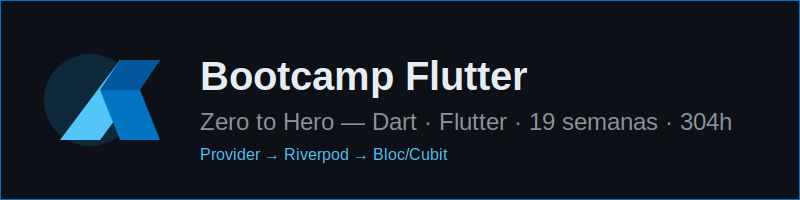

<p align="center">
  
</p>

<p align="center">
  <a href="LICENSE"></a>
  <a href="#"></a>
  <a href="#"></a>
  <a href="#"></a>
  <a href="#"></a>
</p>

<p align="center">
  <a href="README_EN.md"></a>
</p>

---

## 📋 Descripción

Bootcamp intensivo de **19 semanas (~4.75 meses)** enfocado en **Dart y Flutter** para construir aplicaciones móviles multiplataforma modernas. Diseñado para llevar a desarrolladores con **conocimientos básicos de programación (POO)** — sin experiencia previa en Dart — hasta **Desarrollador Flutter Junior**, con énfasis en código limpio, arquitectura escalable y apps listas para producción.

### 🎯 Objetivos

Al finalizar el bootcamp, los estudiantes serán capaces de:

- ✅ Dominar Dart moderno: null safety, async/await, Futures/Streams, POO, mixins
- ✅ Construir interfaces con el sistema de widgets de Flutter y layouts responsivos
- ✅ Implementar navegación compleja con go_router
- ✅ Gestionar estado con la progresión Provider → Riverpod → Bloc/Cubit
- ✅ Consumir APIs REST de forma robusta con Dio
- ✅ Manejar formularios con validación
- ✅ Implementar persistencia local (SharedPreferences, Hive/Isar, sqflite) y autenticación completa
- ✅ Diseñar apps con Clean Architecture
- ✅ Crear animaciones implícitas y explícitas, y widgets personalizados con CustomPainter
- ✅ Acceder a APIs nativas (cámara, geolocalización, permisos) vía platform channels
- ✅ Implementar push notifications con Firebase Cloud Messaging
- ✅ Escribir tests automatizados (unit, widget, integration, golden)
- ✅ Optimizar performance de apps Flutter con DevTools
- ✅ Publicar en App Store y Google Play
- ✅ Implementar CI/CD y actualizaciones OTA

### 🚀 ¿Por qué Dart + Flutter?

> **Flutter moderno desde el día 1** — un solo código base para Android, iOS, web y desktop.

Flutter es el framework multiplataforma con mayor adopción para desarrollo móvil nativo desde una sola base de código. Este bootcamp arranca con una semana dedicada a Dart (el lenguaje del framework) y construye sobre ella el resto del temario, siguiendo el mismo patrón "lenguaje puente → framework" usado en los demás bootcamps de este catálogo.

---

## 🗓️ Estructura del Bootcamp

|         Fase          | Semanas | Horas | Temas Principales                                                          |
| :--------------------: | :-----: | :---: | --------------------------------------------------------------------------- |
| **Lenguaje (Dart)**    |    1    |  16h  | Null safety, async/await, POO, mixins, extension methods                    |
| **Fundamentos Flutter**|   2-3   |  32h  | Widgets, layout, Material/Cupertino, navegación con go_router               |
| **Estado y Datos**     |  4-10   | 112h  | Provider, Riverpod, networking, forms, persistencia, auth, Clean Architecture + Bloc |
| **Avanzado**           | 11-16   |  96h  | Animaciones, platform channels, push notifications, testing, performance    |
| **Producción**         | 17-19   |  48h  | Build/release, publicación en tiendas, CI/CD, proyecto final                |

**Total: 19 semanas** | **304 horas** de formación intensiva

---

## 📚 Contenido por Semana

Cada semana incluye:

```
bootcamp/week-XX-tema_principal/
├── README.md                 # Descripción y objetivos
├── rubrica-evaluacion.md     # Criterios de evaluación
├── 0-assets/                 # Imágenes y diagramas
├── 1-teoria/                 # Material teórico
├── 2-practicas/              # Ejercicios guiados
├── 3-proyecto/               # Proyecto semanal
├── 4-recursos/               # Recursos adicionales
│   ├── ebooks-free/
│   ├── videografia/
│   └── webgrafia/
└── 5-glosario/               # Términos clave
```

Ver el temario semana a semana completo en [docs/plan-estudios.md](docs/plan-estudios.md).

### 🔑 Componentes Clave

- 📖 **Teoría**: Conceptos fundamentales con ejemplos del mundo real
- 💻 **Práctica**: Ejercicios progresivos y proyectos hands-on
- 📝 **Evaluación**: Evidencias de conocimiento, desempeño y producto
- 🎓 **Recursos**: Glosarios, referencias y material complementario

---

## 🛠️ Stack Tecnológico

| Tecnología          | Uso                                  |
| -------------------- | ------------------------------------- |
| Dart                  | Lenguaje principal (null safety)      |
| Flutter (canal stable)| Framework UI multiplataforma          |
| go_router             | Navegación declarativa                |
| Provider              | Gestión de estado local (semana 4)    |
| Riverpod               | Gestión de estado estándar del curso  |
| flutter_bloc           | Gestión de estado por eventos (semana 10) |
| Dio                    | Cliente HTTP y consumo de APIs REST   |
| flutter_secure_storage | Almacenamiento seguro (tokens)        |
| Hive / Isar / sqflite  | Persistencia local                    |
| Firebase Auth          | Autenticación                         |
| Firebase Cloud Messaging | Push notifications                  |
| flutter_test / mocktail | Testing unitario y de widgets        |
| integration_test        | Testing E2E                          |
| Docker / Docker Compose | Entorno reproducible (analyze/test/build) y paridad con CI |
| GitHub Actions / Fastlane | CI/CD y publicación               |

> Versiones exactas pineadas y calendario de auditoría en [docs/stack-versions.md](docs/stack-versions.md) — se fijan al iniciar cada cohorte para garantizar reproducibilidad.

**Entorno de desarrollo**: Docker (analyze/test/build reproducibles) + Flutter SDK local (emulador/simulador)
**Publicación**: App Store Connect + Google Play Console

> 🐳 **Docker es el entorno oficial** para `flutter analyze`/`flutter test`/`flutter build` — garantiza que todos los estudiantes usen exactamente las mismas versiones, igual que en CI. Docker **no reemplaza** el SDK local: renderizar la app en un emulador/simulador siempre requiere Flutter instalado en el host (ver [docs/docker-setup.md](docs/docker-setup.md) para el detalle de esta limitación).

---
## 🚀 Inicio Rápido

### Prerrequisitos

- **Docker 27+** y **Docker Compose 2.31+** — entorno oficial para analyze/test/build (`docker --version`, `docker compose version`)
- **Flutter SDK** (canal stable) instalado localmente y `flutter doctor` sin errores — necesario para `flutter run` en emulador/simulador
- **Git** para control de versiones
- **VS Code** (recomendado) con extensiones incluidas, o Android Studio
- Emulador Android (Android Studio) y/o simulador iOS (Xcode, solo macOS)
- Conocimientos básicos de programación orientada a objetos (no requiere Dart previo)

### 1. Clonar el Repositorio

```bash
git clone https://github.com/ergrato-dev/bc-flutter.git
cd bc-flutter
```

### 2. Instalar Extensiones de VS Code

```bash
# Abrir en VS Code
code .

# Las extensiones recomendadas aparecerán automáticamente
# O ejecutar: Ctrl+Shift+P → "Extensions: Show Recommended Extensions"
```

### 3. Navegar a la Semana Actual

```bash
cd bootcamp/week-01-fundamentos_dart_y_entorno
```

### 4. Seguir las Instrucciones

Cada semana contiene un `README.md` con instrucciones detalladas.

### 5. Validar tu Código con Docker (analyze/test/build)

```bash
docker compose run --rm flutter flutter analyze
docker compose run --rm flutter flutter test
```

Ver [docs/docker-setup.md](docs/docker-setup.md) para el flujo completo (incluye por qué el emulador/simulador sigue necesitando el SDK local).

---

## 📊 Metodología de Aprendizaje

### Estrategias Didácticas

- 🎯 **Aprendizaje Basado en Proyectos (ABP)**
- 🏛️ **Dominios Únicos**: Cada aprendiz aplica conceptos a su dominio asignado (anticopia)
- 🧩 **Práctica Deliberada**
- 📱 **Mobile-First Thinking**
- 🏗️ **Progresión Arquitectónica**: Provider → Riverpod → Bloc/Cubit, deliberada semana a semana
- 👥 **Code Review entre pares**
- 🎮 **Live Coding**

### Distribución del Tiempo (16h/semana)

- **Teoría**: 4 horas
- **Prácticas**: 6 horas
- **Proyecto**: 6 horas

### Evaluación

Cada semana incluye tres tipos de evidencias:

1. **Conocimiento 🧠** (30%): Cuestionarios y evaluaciones teóricas
2. **Desempeño 💪** (40%): Ejercicios prácticos en clase
3. **Producto 📦** (30%): Entregables evaluables (proyectos funcionales)

**Criterio de aprobación**: Mínimo 70% en cada tipo de evidencia. Implementación coherente con el dominio asignado. Originalidad: sin copia entre aprendices.

---

## 🏛️ Política de Dominios Únicos (Anticopia)

Cada aprendiz recibe un **dominio único asignado por el instructor** desde la primera clase, que usa en todos los proyectos del bootcamp.

Ejemplos de dominios: 📖 Biblioteca, 💊 Farmacia, 🏋️ Gimnasio, 🏫 Escuela, 🏬 Tienda de mascotas, 🍽️ Restaurante, 🏦 Banco, 🚕 Taxis, 🏥 Hospital, 🎥 Cine, 🏞️ Hotel, ✈️ Viajes, 🏎️ Concesionario, 👗 Ropa, 🛠️ Taller, y más.

**Objetivo:**

- ✅ Prevenir copia entre estudiantes
- ✅ Fomentar implementaciones originales
- ✅ Aplicar conceptos generales a contextos específicos
- ✅ Desarrollar capacidad de abstracción y adaptación

**Responsabilidades del instructor:**

1. Asignar un dominio único a cada aprendiz al inicio
2. Mantener registro de dominios asignados
3. No repetir dominios en el mismo grupo
4. Validar coherencia con el dominio en evaluaciones

---

## 📞 Soporte

- 💬 **Discussions**: [GitHub Discussions](https://github.com/ergrato-dev/bc-flutter/discussions)
- 🐛 **Issues**: [GitHub Issues](https://github.com/ergrato-dev/bc-flutter/issues)

---

## ⚠️ Exención de Responsabilidad

Este repositorio es un recurso **educativo** creado con fines de aprendizaje. Al utilizarlo, aceptas los siguientes términos:

- **Solo fines educativos**: El contenido, los ejemplos de código y los proyectos están diseñados exclusivamente para la enseñanza y el aprendizaje. No constituyen asesoramiento profesional, legal ni de seguridad.
- **Sin garantías**: El material se proporciona **"tal cual"**, sin garantías de ningún tipo, expresas o implícitas, incluyendo idoneidad para un propósito particular o ausencia de errores.
- **Código en producción**: Los ejemplos de código son ilustrativos. Antes de usarlos en entornos productivos, debes realizar revisiones de seguridad, rendimiento y adaptación a tu contexto específico.
- **Versiones de software**: Las versiones de librerías y herramientas mencionadas pueden quedar desactualizadas. Siempre consulta la documentación oficial más reciente.
- **Limitación de responsabilidad**: Los autores y contribuidores no se responsabilizan por pérdidas de datos, daños directos o indirectos, interrupciones de servicio ni cualquier otro perjuicio derivado del uso de este material.
- **Responsabilidad del estudiante**: Cada estudiante es responsable de sus propias implementaciones, entornos de desarrollo y decisiones técnicas.

---

## 📄 Licencia

Este proyecto está bajo la licencia **[CC BY-NC-SA 4.0](https://creativecommons.org/licenses/by-nc-sa/4.0/)** (Creative Commons Attribution-NonCommercial-ShareAlike 4.0 International).

**Puedes:** compartir y adaptar el material, incluso crear forks educativos.<br>
**No puedes:** usar este material con fines comerciales.<br>
**Debes:** dar crédito apropiado y distribuir las adaptaciones bajo la misma licencia.

Ver el archivo [LICENSE](LICENSE) para el texto completo.

---

## 🏆 Agradecimientos

- [Flutter](https://flutter.dev/) — Por el framework UI multiplataforma
- [Dart](https://dart.dev/) — Por el lenguaje del framework
- [Riverpod](https://riverpod.dev/) — Por la gestión de estado moderna y testeable
- [Bloc](https://bloclibrary.dev/) — Por el patrón de gestión de estado orientado a eventos
- [Firebase](https://firebase.google.com/) — Por auth, mensajería y backend-as-a-service
- Comunidad Flutter — Por los recursos y ejemplos
- Todos los contribuidores

---

## 📚 Documentación Adicional

- [🤖 Instrucciones de Copilot](.github/copilot-instructions.md)
- [📜 Código de Conducta](CODE_OF_CONDUCT.md)
- [🔒 Política de Seguridad](SECURITY.md)
- [🗓️ Plan de Estudios Detallado](docs/plan-estudios.md)

---

<p align="center">
  <strong>🎓 Bootcamp Flutter - Zero to Hero</strong><br>
  <em>De cero conocimiento de Dart a desarrollador Flutter en 4.75 meses</em>
</p>

<p align="center">
  <a href="bootcamp/week-01-fundamentos_dart_y_entorno">Comenzar Semana 1</a> •
  <a href="https://github.com/ergrato-dev/bc-flutter/issues">Reportar Issue</a>
</p>

<p align="center">
  Hecho con ❤️ para la comunidad de desarrolladores
</p>
