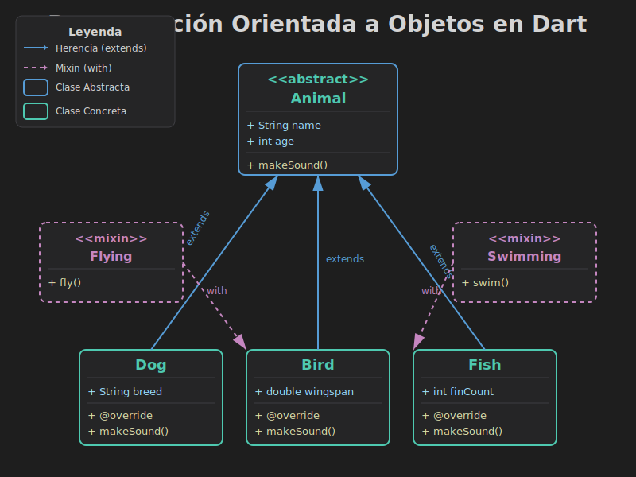
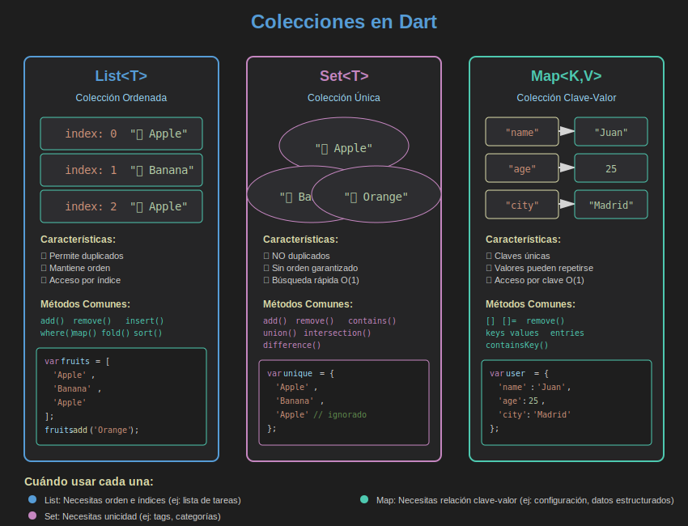
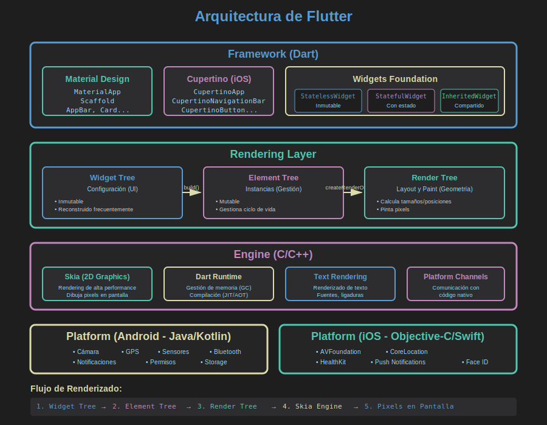
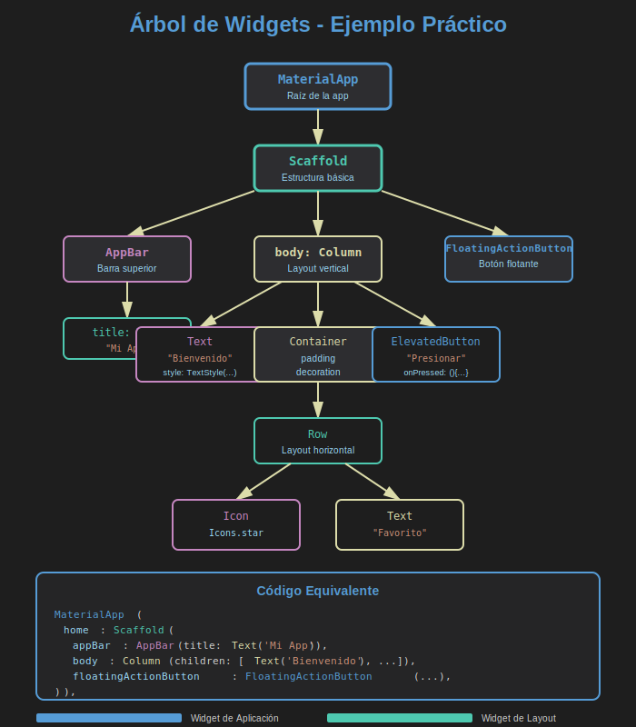
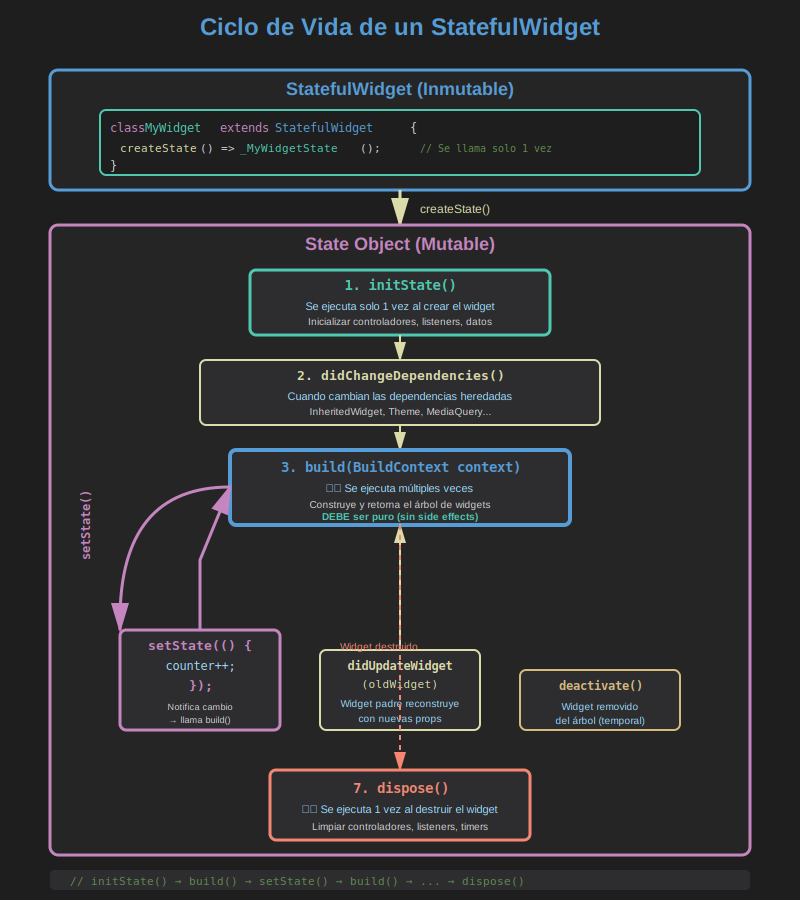

# 🎯 Semana 02: POO en Dart y Fundamentos de Flutter

> **Duración**: 8 horas de dedicación semanal  
> **Nivel**: 🟢 Básico-Intermedio  
> **Enfoque**: Programación Orientada a Objetos, Colecciones y Primera App Flutter

---

## 📋 Índice de Contenidos

1. [Objetivos de Aprendizaje](#-objetivos-de-aprendizaje)
2. [Estructura de la Semana](#-estructura-de-la-semana)
3. [Teoría (6 horas)](#-teoría)
4. [Prácticas (3.75 horas)](#-prácticas)
5. [Proyecto Integrador (3-4 horas)](#-proyecto-integrador)
6. [Recursos Complementarios](#-recursos-complementarios)
7. [Glosario Técnico](#-glosario-técnico)
8. [Evaluación](#-evaluación)

---

## 🎯 Objetivos de Aprendizaje

Al completar esta semana, serás capaz de:

- ✅ **POO**: Crear clases con herencia, mixins e interfaces en Dart
- ✅ **Colecciones**: Manipular List, Set y Map con operaciones avanzadas
- ✅ **Flutter**: Configurar entorno y crear tu primera aplicación
- ✅ **Widgets**: Entender y usar widgets básicos de Flutter
- ✅ **Estado**: Diferenciar StatelessWidget y StatefulWidget
- ✅ **Proyecto**: Integrar POO, colecciones y Flutter en una app completa

---

## 📂 Estructura de la Semana

```
semana-02/
├── 0-assets/              # 🎨 Diagramas y recursos visuales (6 SVGs)
├── 1-teoria/              # 📚 Módulos teóricos (6.5 horas)
│   ├── 01-poo-dart.md            (2 horas)
│   ├── 02-colecciones-estructuras.md (2 horas)
│   └── 03-intro-flutter.md       (2.5 horas)
├── 2-practicas/           # 💻 Ejercicios guiados (3.75 horas)
│   ├── practica-01-poo-biblioteca.md     (45 min)
│   ├── practica-02-colecciones-gestor-tareas.md (45 min)
│   ├── practica-03-mixins-habilidades.md (45 min)
│   ├── practica-04-flutter-hola-mundo.md (45 min)
│   └── practica-05-flutter-contador.md   (45 min)
├── 3-proyecto/            # 🔨 Proyecto integrador (3-4 horas)
│   ├── README.md                 (Guía completa)
│   ├── tasks_screen.dart         (Pantalla tareas)
│   ├── notes_screen.dart         (Pantalla notas)
│   └── contacts_screen.dart      (Pantalla contactos)
├── 4-recursos/            # 📖 Material complementario (12 recursos)
│   ├── 01-videos-poo.md
│   ├── 08-documentacion-oficial.md
│   └── README.md
└── 5-glosario/            # 📚 Términos técnicos (50+ definiciones)
    └── README.md
```

---

## 📚 Teoría

### 🎓 Módulos Teóricos (6.5 horas totales)

#### 📘 Módulo 1: POO en Dart (2 horas)

**Archivo**: [`1-teoria/01-poo-dart.md`](1-teoria/01-poo-dart.md)

**Contenido**:

- Clases y objetos
- Constructores (default, named, factory)
- Encapsulamiento (getters/setters)
- Herencia (`extends`, `super`)
- Clases abstractas e interfaces (`implements`)
- Mixins (`with`)
- Sobrescritura (`@override`)

**Recurso Visual**: 

**Glosario Relacionado**: [abstract](#abstract), [class](#class), [constructor](#constructor), [extends](#extends), [mixin](#mixin), [@override](#override), [super](#super)

**Recursos Complementarios**:

- 📹 [Videos POO](4-recursos/01-videos-poo.md) - 9 videos curados (ES/EN)
- 📖 [Documentación Oficial Dart](4-recursos/08-documentacion-oficial.md#dart-language)

---

#### 📗 Módulo 2: Colecciones y Estructuras (2 horas)

**Archivo**: [`1-teoria/02-colecciones-estructuras.md`](1-teoria/02-colecciones-estructuras.md)

**Contenido**:

- **List**: Listas ordenadas con índices
  - Métodos: `add()`, `remove()`, `map()`, `where()`, `fold()`
- **Set**: Conjuntos sin duplicados
  - Operaciones: unión, intersección, diferencia
- **Map**: Pares clave-valor
  - Métodos: `putIfAbsent()`, `update()`, `forEach()`
- Iteración avanzada con `for-in`, `forEach()`, `map()`
- Operadores `..` (cascade) y `?.` (null-aware)

**Recurso Visual**: 

**Glosario Relacionado**: [List](#list), [Map](#map), [Set](#set), [dynamic](#dynamic), [null](#null)

**Recursos Complementarios**:

- 📹 [Videos Colecciones](4-recursos/02-videos-colecciones.md)
- 📖 [Documentación Dart Collections](4-recursos/08-documentacion-oficial.md#collections)

---

#### 📙 Módulo 3: Introducción a Flutter (2.5 horas)

**Archivo**: [`1-teoria/03-intro-flutter.md`](1-teoria/03-intro-flutter.md)

**Contenido**:

- Instalación de Flutter SDK
- Configuración de VS Code
- Estructura de proyecto Flutter
- Widgets fundamentales (`StatelessWidget`, `StatefulWidget`)
- Árbol de widgets
- Ciclo de vida de widgets
- Material Design en Flutter
- Hot Reload y Hot Restart

**Recursos Visuales**:

- 
- 
- 

**Glosario Relacionado**: [Flutter](#flutter), [Widget](#widget), [StatelessWidget](#statelesswidget), [StatefulWidget](#statefulwidget), [build()](#build), [setState()](#setstate), [MaterialApp](#materialapp), [Scaffold](#scaffold)

**Recursos Complementarios**:

- 📹 [Videos Flutter Intro](4-recursos/03-videos-flutter-intro.md)
- 📖 [Documentación Oficial Flutter](4-recursos/08-documentacion-oficial.md#flutter)
- 🔧 [Herramientas Desarrollo](4-recursos/09-herramientas-desarrollo.md)

---

## 💻 Prácticas

### 🛠️ Ejercicios Prácticos (3.75 horas totales)

| #   | Práctica                                                                 | Dificultad    | Tiempo | Conceptos                       |
| --- | ------------------------------------------------------------------------ | ------------- | ------ | ------------------------------- |
| 1   | [Sistema de Biblioteca](2-practicas/practica-01-poo-biblioteca.md)       | 🟢 Básico     | 45 min | POO, herencia, polimorfismo     |
| 2   | [Gestor de Tareas](2-practicas/practica-02-colecciones-gestor-tareas.md) | 🟡 Intermedio | 45 min | List, Map, métodos colecciones  |
| 3   | [Sistema de Habilidades](2-practicas/practica-03-mixins-habilidades.md)  | 🟡 Intermedio | 45 min | Mixins, interfaces, composición |
| 4   | [Hola Mundo Flutter](2-practicas/practica-04-flutter-hola-mundo.md)      | 🟢 Básico     | 45 min | StatelessWidget, Material       |
| 5   | [Contador Flutter](2-practicas/practica-05-flutter-contador.md)          | 🟢 Básico     | 45 min | StatefulWidget, setState()      |

**Metodología**:

1. Lee el enunciado completo
2. Intenta resolver sin ver la solución (30 min)
3. Compara con la solución propuesta
4. Experimenta con variaciones
5. Documenta tus aprendizajes

---

## 🔨 Proyecto Integrador

### 📱 Agenda Personal Digital

**Archivo Guía**: [`3-proyecto/README.md`](3-proyecto/README.md)

**Descripción**: Aplicación Flutter completa que integra POO, colecciones y widgets para gestionar:

- ✅ **Tareas** con prioridades y fechas
- 📝 **Notas** con categorías y favoritos
- 👤 **Contactos** con agenda alfabética

**Arquitectura**:

```
lib/
├── models/
│   ├── task.dart          # Modelo Task con enums
│   ├── note.dart          # Modelo Note con categorías
│   └── contact.dart       # Modelo Contact
├── services/
│   ├── task_manager.dart  # Lógica de tareas
│   ├── note_manager.dart  # Lógica de notas
│   └── contact_manager.dart # Lógica de contactos
└── screens/
    ├── home_screen.dart        # Pantalla principal
    ├── tasks_screen.dart       # 🔗 Gestión de tareas
    ├── notes_screen.dart       # 🔗 Gestión de notas
    └── contacts_screen.dart    # 🔗 Gestión de contactos
```

**Pantallas Implementadas**:

1. [`tasks_screen.dart`](3-proyecto/tasks_screen.dart) - CRUD tareas con filtros y búsqueda
2. [`notes_screen.dart`](3-proyecto/notes_screen.dart) - Notas con grid y categorías
3. [`contacts_screen.dart`](3-proyecto/contacts_screen.dart) - Agenda alfabética

**Tiempo Estimado**: 3-4 horas

**Conceptos Aplicados**:

- POO: Modelos con constructores y métodos
- Colecciones: List/Map para gestión de datos
- Flutter: StatefulWidget, navegación, formularios
- Estado: setState() para actualización UI

**Recursos de Apoyo**:

- 📖 [Guías de Diseño](3-proyecto/GUIA-DISENO.md)
- 📊 [Ejemplos de Datos](3-proyecto/EJEMPLOS-DATOS.md)
- 📹 [Videos Flutter Widgets](4-recursos/03-videos-flutter-intro.md)

---

## 📖 Recursos Complementarios

### 📚 Biblioteca de Recursos (12 items numerados)

**Índice Completo**: [`4-recursos/README.md`](4-recursos/README.md)

#### 🎥 Videografía (01-03)

- 📹 **[01 - Videos POO](4-recursos/01-videos-poo.md)** - 9 videos curados (Fernando Herrera, The Net Ninja)
- 📹 **[02 - Videos Colecciones](4-recursos/02-videos-colecciones.md)** - Listas, mapas y operaciones
- 📹 **[03 - Videos Flutter Intro](4-recursos/03-videos-flutter-intro.md)** - Primeros pasos en Flutter

#### 📚 eBooks (04-05)

- 📖 **[04 - eBooks Dart Avanzado](4-recursos/04-ebooks-dart-avanzado.md)** - Libros gratuitos Dart
- 📖 **[05 - eBooks Flutter](4-recursos/05-ebooks-flutter.md)** - Recursos Flutter completos

#### 🌐 Webgrafía (06-08)

- 🔗 **[06 - Artículos POO](4-recursos/06-articulos-poo.md)** - Blog posts y tutoriales
- 🔗 **[07 - Artículos Flutter](4-recursos/07-articulos-flutter.md)** - Guías y patrones
- 📖 **[08 - Documentación Oficial](4-recursos/08-documentacion-oficial.md)** - dart.dev, flutter.dev, pub.dev

#### 🔧 Herramientas (09-10)

- 🛠️ **[09 - Herramientas Desarrollo](4-recursos/09-herramientas-desarrollo.md)** - IDEs, extensiones, DevTools
- 🎮 **[10 - Playgrounds Online](4-recursos/10-playgrounds-online.md)** - DartPad, Zapp.run

#### 👥 Comunidades (11-12)

- 💬 **[11 - Comunidades](4-recursos/11-comunidades.md)** - Discord, Reddit, Stack Overflow
- 📺 **[12 - Canales YouTube](4-recursos/12-canales-youtube.md)** - Creadores de contenido Flutter

**Cómo Usar los Recursos**:

1. Prioriza según tu estilo de aprendizaje (🎥 visual, 📖 lectura, 💻 práctica)
2. Combina recursos (ej: video + artículo + práctica)
3. Usa 🟢🟡🔴 para filtrar por nivel
4. Dedica 30 min diarios a recursos complementarios

---

## 📚 Glosario Técnico

### 🔍 Diccionario de Términos (50+ definiciones)

**Acceso Completo**: [`5-glosario/README.md`](5-glosario/README.md)

**Categorías**:

- **POO** (15 términos): abstract, class, constructor, extends, factory, getter, implements, mixin, Object, @override, private, setter, super, this, with
- **Collections** (3 términos): List, Map, Set
- **Flutter** (20 términos): AppBar, build(), BuildContext, Column, Container, Flutter, Hot Reload, immutable, main(), Material, MaterialApp, Navigator, Row, runApp(), Scaffold, setState(), State, StatefulWidget, StatelessWidget, Widget
- **Dart** (12 términos): async/await, const, Dart, dynamic, enum, final, Future, late, null, package, var, void

**Ejemplo de Entrada**:

```markdown
### `StatefulWidget`

**Definición**: Widget que mantiene estado mutable y puede reconstruirse cuando cambia.

**Sintaxis**:
class MyWidget extends StatefulWidget {
@override
State<MyWidget> createState() => \_MyWidgetState();
}

class \_MyWidgetState extends State<MyWidget> {
int counter = 0;

@override
Widget build(BuildContext context) {
return Text('$counter');
}
}

**Casos de Uso**: Contadores, formularios, animaciones, cualquier UI que cambie.

**Ver También**: [StatelessWidget](#statelesswidget), [setState()](#setstate), [State](#state)
```

**Cómo Navegar**:

- Usa Ctrl+F para buscar términos
- Sigue los enlaces [Ver También]
- Prioriza términos marcados como 🔴 Alta prioridad

---

## 🎨 Assets Visuales

### 📊 Diagramas y Recursos Gráficos

**Catálogo Completo**: [`0-assets/README.md`](0-assets/README.md)

| ID  | Asset                                                        | Dimensiones | Uso                                 |
| --- | ------------------------------------------------------------ | ----------- | ----------------------------------- |
| 01  | [Diagrama POO](0-assets/01-diagrama-poo.svg)                 | 800x600     | Herencia, mixins, clases abstractas |
| 02  | [Diagrama Colecciones](0-assets/02-diagrama-colecciones.svg) | 850x650     | List, Set, Map con operaciones      |
| 03  | [Estructura Flutter](0-assets/03-estructura-flutter.svg)     | 900x700     | Arquitectura en capas               |
| 04  | [Widget Tree](0-assets/04-widget-tree.svg)                   | 700x800     | Árbol de widgets ejemplo            |
| 05  | [Ciclo de Vida](0-assets/05-ciclo-vida-widget.svg)           | 800x900     | Lifecycle StatefulWidget            |
| 06  | [Navegación Flutter](0-assets/06-navegacion-flutter.svg)     | 800x600     | Push/pop stack                      |

**Características**:

- 🎨 Tema oscuro (#1e1e1e)
- 🎨 Paleta de colores consistente
- 📱 Optimizados para markdown y web
- 🔗 Referenciados en teoría y prácticas

---

## ✅ Checklist de Completitud

### 📝 Progreso Semanal

**Teoría** (6.5 horas):

- [ ] Módulo 1: POO en Dart (2 horas)
- [ ] Módulo 2: Colecciones (2 horas)
- [ ] Módulo 3: Flutter Intro (2.5 horas)

**Prácticas** (3.75 horas):

- [ ] Práctica 01: Biblioteca POO (45 min)
- [ ] Práctica 02: Gestor Tareas (45 min)
- [ ] Práctica 03: Mixins Habilidades (45 min)
- [ ] Práctica 04: Hola Mundo Flutter (45 min)
- [ ] Práctica 05: Contador Flutter (45 min)

**Proyecto** (3-4 horas):

- [ ] Modelos creados (Task, Note, Contact)
- [ ] Services implementados (3 managers)
- [ ] Pantalla Home funcional
- [ ] Pantalla Tasks con CRUD
- [ ] Pantalla Notes con grid
- [ ] Pantalla Contacts alfabética
- [ ] Navegación entre pantallas
- [ ] Testing manual completo

**Recursos**:

- [ ] He revisado al menos 3 videos (01-03)
- [ ] He consultado documentación oficial (08)
- [ ] He explorado herramientas DevTools (09)
- [ ] He usado el glosario como referencia (5-glosario/)

---

## 🎓 Evaluación

### 📊 Criterios de Evaluación (100 puntos)

**Rúbrica Detallada**: [`RUBRICA-EVALUACION.md`](RUBRICA-EVALUACION.md)

| Categoría               | Peso | Puntos  | Descripción                            |
| ----------------------- | ---- | ------- | -------------------------------------- |
| **POO en Dart**         | 30%  | 30      | Clases, herencia, mixins, polimorfismo |
| **Colecciones**         | 20%  | 20      | List, Map, Set y sus métodos           |
| **Flutter Básico**      | 30%  | 30      | Widgets, estado, ciclo de vida         |
| **Proyecto Integrador** | 20%  | 20      | Agenda personal completa y funcional   |
| **TOTAL**               | 100% | **100** |                                        |

### 📋 Criterios Específicos

#### POO en Dart (30 puntos)

- ✅ **Práctica 01 - Biblioteca** (10 pts): Herencia, polimorfismo, encapsulamiento
- ✅ **Práctica 03 - Mixins** (10 pts): Uso correcto de mixins y composición
- ✅ **Modelos del Proyecto** (10 pts): Task, Note, Contact bien diseñados

#### Colecciones (20 puntos)

- ✅ **Práctica 02 - Gestor Tareas** (10 pts): Operaciones con List/Map
- ✅ **Services del Proyecto** (10 pts): Gestión eficiente de colecciones

#### Flutter Básico (30 puntos)

- ✅ **Práctica 04 - Hola Mundo** (5 pts): StatelessWidget básico
- ✅ **Práctica 05 - Contador** (10 pts): StatefulWidget y setState()
- ✅ **Navegación** (15 pts): Navegación funcional entre pantallas

#### Proyecto Integrador (20 puntos)

- ✅ **Funcionalidad** (10 pts): CRUD completo en las 3 pantallas
- ✅ **Calidad del Código** (5 pts): Código limpio y bien estructurado
- ✅ **UX/UI** (5 pts): Interfaz usable y atractiva

### 🎯 Escala de Calificación

| Rango  | Nivel               | Descripción                                      |
| ------ | ------------------- | ------------------------------------------------ |
| 90-100 | 🏆 **Excelente**    | Dominio completo de todos los conceptos          |
| 80-89  | ⭐ **Muy Bueno**    | Comprensión sólida con implementación correcta   |
| 70-79  | ✅ **Bueno**        | Comprende conceptos, algunos detalles mejorables |
| 60-69  | 🔄 **Suficiente**   | Comprensión básica, requiere refuerzo            |
| 0-59   | ❌ **Insuficiente** | No alcanza los objetivos mínimos                 |

---

## 📝 Notas Importantes

### 🔧 Comandos Flutter Esenciales

```bash
# Verificar instalación de Flutter
flutter doctor

# Crear nuevo proyecto
flutter create mi_agenda

# Ejecutar en dispositivo/emulador
flutter run

# Ver dispositivos conectados
flutter devices

# Limpiar cache de build
flutter clean

# Instalar dependencias
flutter pub get

# Actualizar Flutter SDK
flutter upgrade
```

### 💡 Tips de Desarrollo

1. **Hot Reload**: Usa `r` en la terminal para recargar cambios sin reiniciar
2. **Widget Inspector**: Presiona `i` para inspeccionar el árbol de widgets
3. **Errores**: Lee los mensajes completos, Flutter da información muy útil
4. **DevTools**: Explora las herramientas de desarrollo de Flutter
5. **Documentación**: Usa `Ctrl+Click` en VS Code para ver definiciones

### 🐛 Troubleshooting Común

**Error: Flutter SDK not found**

```bash
# Verificar PATH
echo $PATH
# Agregar Flutter al PATH en ~/.zshrc o ~/.bashrc
export PATH="$PATH:/ruta/a/flutter/bin"
```

**Error: No devices connected**

```bash
# Android
flutter emulators --launch <emulator_id>

# iOS (solo macOS)
open -a Simulator
```

**Error: Gradle build failed**

```bash
cd android
./gradlew clean
cd ..
flutter clean
flutter pub get
flutter run
```

---

## 🚀 Siguientes Pasos

### Prepárate para Semana 3

La próxima semana profundizaremos en:

- 📐 **Layouts Avanzados**: Column, Row, Stack, Flex
- 🎨 **Diseño Responsivo**: MediaQuery, LayoutBuilder
- 🎪 **Widgets Complejos**: ListView, GridView, CustomScrollView
- 🎭 **Navegación Avanzada**: Rutas nombradas, argumentos

**Requisitos Previos**:

- ✅ Dominio de StatefulWidget
- ✅ Comprensión del árbol de widgets
- ✅ Familiaridad con Material Design

---

## 📚 Resumen de Archivos Clave

### 📂 Navegación Rápida

| Tipo          | Archivo                                                                        | Descripción            |
| ------------- | ------------------------------------------------------------------------------ | ---------------------- |
| 📘 Teoría     | [01-poo-dart.md](1-teoria/01-poo-dart.md)                                      | POO completo en Dart   |
| 📗 Teoría     | [02-colecciones-estructuras.md](1-teoria/02-colecciones-estructuras.md)        | List, Set, Map         |
| 📙 Teoría     | [03-intro-flutter.md](1-teoria/03-intro-flutter.md)                            | Primeros pasos Flutter |
| 💻 Práctica   | [practica-01-poo-biblioteca.md](2-practicas/practica-01-poo-biblioteca.md)     | POO aplicado           |
| 💻 Práctica   | [practica-05-flutter-contador.md](2-practicas/practica-05-flutter-contador.md) | StatefulWidget         |
| 🔨 Proyecto   | [README.md](3-proyecto/README.md)                                              | Guía proyecto completo |
| 📖 Recursos   | [01-videos-poo.md](4-recursos/01-videos-poo.md)                                | Videos curados POO     |
| 📖 Recursos   | [08-documentacion-oficial.md](4-recursos/08-documentacion-oficial.md)          | Docs oficiales         |
| 📚 Referencia | [README.md](5-glosario/README.md)                                              | Glosario 50+ términos  |
| 🎨 Visual     | [01-diagrama-poo.svg](0-assets/01-diagrama-poo.svg)                            | Diagrama POO           |

---

## 🎉 ¡Felicitaciones!

Al completar esta semana habrás dado un paso gigante en tu camino como desarrollador Flutter. Has aprendido:

✅ **POO sólida** - Fundamental para cualquier aplicación profesional  
✅ **Gestión de datos** - Colecciones que usarás constantemente  
✅ **Flutter real** - No solo teoría, una app completa funcional

**¡Sigue así!** 🚀

---

**Dedicación:** 8 horas | **Anterior:** [← Semana 1](../semana-01/README.md) | **Siguiente:** [Semana 3 →](../semana-03/README.md)

---

<div align="center">

**Bootcamp Flutter** | Desarrollado con ❤️ para aprender Flutter

[🏠 Inicio](../../README.md) | [📚 Recursos Generales](../../_docs/RECURSOS.md) | [📋 Proyectos](../../_docs/PROYECTOS.md)

</div>
