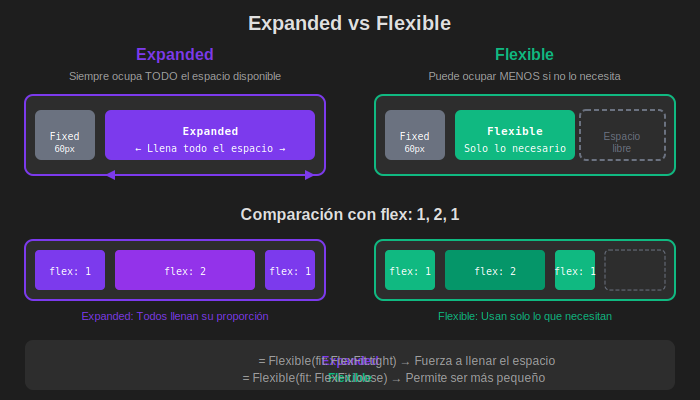

# 🎨 Assets - Semana 03

> Recursos visuales y diagramas para Widgets y Layouts en Flutter.

---

## 📁 Contenido

| #   | Archivo                         | Descripción                            | Usado en  |
| --- | ------------------------------- | -------------------------------------- | --------- |
| 01  | `01-widget-tree-diagram.svg`    | Diagrama del árbol de widgets          | Módulo 01 |
| 02  | `02-column-row-axis.svg`        | Ejes de Column y Row                   | Módulo 02 |
| 03  | `03-main-cross-alignment.svg`   | MainAxisAlignment y CrossAxisAlignment | Módulo 02 |
| 04  | `04-expanded-flexible.svg`      | Diferencia entre Expanded y Flexible   | Módulo 02 |
| 05  | `05-stack-positioned.svg`       | Stack y Positioned                     | Módulo 02 |
| 06  | `06-responsive-breakpoints.svg` | Breakpoints para diseño responsivo     | Módulo 03 |

---

## 🖼️ Vista Previa

### 01. Widget Tree


Muestra la jerarquía de widgets desde MaterialApp hasta widgets hoja.

### 02. Column/Row Axis


Ilustra el eje principal (main) y cruzado (cross) en layouts.

### 03. Alignment


Visualiza las opciones de alineación en ambos ejes.

### 04. Expanded vs Flexible


Compara comportamiento de ambos widgets.

### 05. Stack


Superposición de widgets con Positioned.

### 06. Breakpoints


Puntos de quiebre para móvil, tablet y desktop.

---

## 📝 Uso en Documentación

```markdown

```
