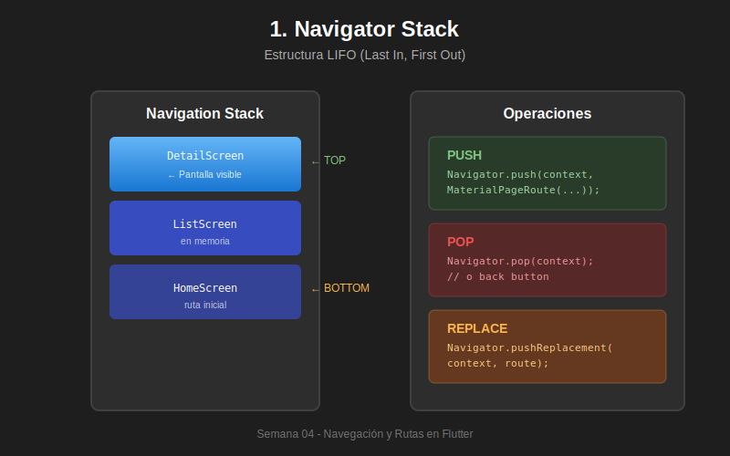

# 🧭 Semana 04: Navegación y Rutas en Flutter



---

## 📋 Información General

| Aspecto | Detalle |
|---------|---------|
| **Semana** | 04 de 10 |
| **Tema** | Navegación y Rutas |
| **Dedicación** | 8 horas |
| **Nivel** | Intermedio |
| **Prerrequisitos** | Semanas 01-03 completadas |

---

## 🎯 Objetivos de Aprendizaje

Al finalizar esta semana, serás capaz de:

- [ ] Comprender el funcionamiento del **Navigator Stack** (LIFO)
- [ ] Implementar navegación con **push**, **pop** y **pushReplacement**
- [ ] Configurar y usar **rutas nombradas** centralizadas
- [ ] Pasar y recuperar **argumentos** entre pantallas
- [ ] Implementar **BottomNavigationBar** con preservación de estado
- [ ] Crear **Drawer** para navegación lateral
- [ ] Usar **TabBar/TabBarView** para navegación por pestañas
- [ ] Manejar **navegación anidada** con múltiples navigators
- [ ] Controlar el **back button** con PopScope
- [ ] Aplicar mejores prácticas de UX en navegación

---

## 📚 Contenido de la Semana

### 📖 Teoría (3 módulos)

| # | Módulo | Contenido | Tiempo |
|---|--------|-----------|--------|
| 01 | [Navegación Básica](./1-teoria/01-navegacion-basica.md) | Navigator, push/pop, MaterialPageRoute, paso de datos | 45 min |
| 02 | [Rutas Nombradas](./1-teoria/02-rutas-nombradas.md) | Routes map, arguments, onGenerateRoute, AppRoutes | 45 min |
| 03 | [Navegación Avanzada](./1-teoria/03-navegacion-avanzada.md) | BottomNav, Drawer, TabBar, navegación anidada | 60 min |

**Tiempo estimado teoría:** 2.5 horas

---

### 💻 Prácticas (5 ejercicios)

| # | Práctica | Descripción | Nivel | Pts |
|---|----------|-------------|-------|-----|
| 01 | [Navegación Básica](./2-practicas/practica-01-navegacion-basica.md) | App de tareas con push/pop | ⭐ | 5 |
| 02 | [Rutas Nombradas](./2-practicas/practica-02-rutas-nombradas.md) | Catálogo de productos | ⭐⭐ | 6 |
| 03 | [Bottom Navigation](./2-practicas/practica-03-bottom-navigation.md) | App social con tabs | ⭐⭐ | 6 |
| 04 | [Drawer Menu](./2-practicas/practica-04-drawer-menu.md) | App empresarial | ⭐⭐⭐ | 6 |
| 05 | [App Multinivel](./2-practicas/practica-05-app-multinivel.md) | E-commerce completo | ⭐⭐⭐ | 7 |

**Tiempo estimado prácticas:** 2.5 horas

---

### 🔨 Proyecto Integrador: TravelApp

| Aspecto | Detalle |
|---------|---------|
| **Nombre** | TravelApp - Viajes y Reservas |
| **Descripción** | App de viajes con navegación compleja multinivel |
| **Puntos** | 50 pts (50% de la nota) |
| **Tiempo** | 3 horas |

**Documentación del Proyecto:**
- 📋 [README - Especificación completa](./3-proyecto/README.md)
- 🎨 [Guía de Diseño](./3-proyecto/GUIA-DISENO.md)
- 📊 [Datos de Ejemplo](./3-proyecto/EJEMPLOS-DATOS.md)

**Características principales:**
- BottomNavigationBar con 4 tabs
- Drawer con navegación secundaria
- Flujo de reservas completo
- Navegación anidada por secciones
- Control del back button

---

## 🗂️ Estructura de la Semana

```
semana-04/
├── README.md                    # 📍 Este documento
├── RUBRICA-EVALUACION.md        # 📊 Criterios de evaluación
├── 0-assets/                    # 🎨 Diagramas SVG
│   ├── 01-navigator-stack.svg
│   ├── 02-push-pop-flow.svg
│   ├── 03-named-routes.svg
│   ├── 04-bottom-navigation.svg
│   ├── 05-drawer-navigation.svg
│   └── 06-nested-navigation.svg
├── 1-teoria/                    # 📖 Módulos teóricos
│   ├── 01-navegacion-basica.md
│   ├── 02-rutas-nombradas.md
│   └── 03-navegacion-avanzada.md
├── 2-practicas/                 # 💻 Ejercicios prácticos
│   ├── practica-01-navegacion-basica.md
│   ├── practica-02-rutas-nombradas.md
│   ├── practica-03-bottom-navigation.md
│   ├── practica-04-drawer-menu.md
│   └── practica-05-app-multinivel.md
├── 3-proyecto/                  # 🔨 Proyecto integrador
│   ├── README.md
│   ├── GUIA-DISENO.md
│   └── EJEMPLOS-DATOS.md
├── 4-recursos/                  # 📚 Material de apoyo (12 docs)
└── 5-glosario/                  # 📖 Términos técnicos
```

---

## ⏱️ Distribución del Tiempo (8 horas)

| Actividad | Horas | Porcentaje |
|-----------|-------|------------|
| Teoría (3 módulos) | 2.5 h | 31% |
| Prácticas (5 ejercicios) | 2.5 h | 31% |
| Proyecto TravelApp | 3 h | 38% |
| **TOTAL** | **8 h** | **100%** |

---

## 📊 Sistema de Evaluación

| Componente | Puntos | Porcentaje |
|------------|--------|------------|
| Evaluación Teórica | 20 pts | 20% |
| Prácticas (5) | 30 pts | 30% |
| Proyecto TravelApp | 50 pts | 50% |
| **TOTAL** | **100 pts** | **100%** |

### Escala de Calificación

| Rango | Calificación |
|-------|--------------|
| 90-100 | ⭐ Excelente |
| 80-89 | ✅ Muy Bueno |
| 70-79 | 👍 Bueno |
| 60-69 | ⚠️ Suficiente |
| 0-59 | ❌ Insuficiente |

📋 [Ver Rúbrica Detallada](./RUBRICA-EVALUACION.md)

---

## 🛣️ Ruta de Aprendizaje Sugerida

### Día 1-2: Fundamentos (3 horas)
```
1. 📖 Leer: 01-navegacion-basica.md (45 min)
2. 💻 Hacer: practica-01 - Navegación básica (30 min)
3. 📖 Leer: 02-rutas-nombradas.md (45 min)
4. 💻 Hacer: practica-02 - Rutas nombradas (45 min)
```

### Día 3-4: Navegación Avanzada (2.5 horas)
```
1. 📖 Leer: 03-navegacion-avanzada.md (60 min)
2. 💻 Hacer: practica-03 - Bottom Navigation (30 min)
3. 💻 Hacer: practica-04 - Drawer Menu (30 min)
4. 💻 Hacer: practica-05 - App Multinivel (30 min)
```

### Día 5-7: Proyecto Integrador (2.5 horas)
```
1. 📋 Revisar: Especificación TravelApp (15 min)
2. 🎨 Consultar: Guía de diseño (15 min)
3. 🔨 Desarrollar: Implementación del proyecto (2 horas)
```

---

## 🔑 Conceptos Clave

### Navigator Stack
```dart
// El Navigator funciona como una pila (LIFO)
Navigator.push(context, MaterialPageRoute(
  builder: (context) => DetailScreen(),
));
Navigator.pop(context);
```

### Rutas Nombradas
```dart
MaterialApp(
  routes: {
    '/': (context) => HomeScreen(),
    '/detail': (context) => DetailScreen(),
  },
);
Navigator.pushNamed(context, '/detail', arguments: item);
```

### Bottom Navigation con IndexedStack
```dart
Scaffold(
  body: IndexedStack(
    index: _currentIndex,
    children: _screens, // Preserva estado
  ),
  bottomNavigationBar: BottomNavigationBar(...),
);
```

---

## ✅ Checklist de Completitud

### Teoría
- [ ] Módulo 01: Navegación Básica
- [ ] Módulo 02: Rutas Nombradas
- [ ] Módulo 03: Navegación Avanzada

### Prácticas
- [ ] Práctica 01: Navegación Básica (5 pts)
- [ ] Práctica 02: Rutas Nombradas (6 pts)
- [ ] Práctica 03: Bottom Navigation (6 pts)
- [ ] Práctica 04: Drawer Menu (6 pts)
- [ ] Práctica 05: App Multinivel (7 pts)

### Proyecto
- [ ] Estructura de navegación implementada
- [ ] BottomNavigationBar con 4 tabs
- [ ] Drawer con menú lateral
- [ ] Flujos de usuario completos
- [ ] Código documentado

---

## 📚 Recursos de Apoyo

- 📖 [Documentación Oficial](./4-recursos/08-documentacion-oficial.md)
- 📹 [Videos Recomendados](./4-recursos/01-videos-navegacion-basica.md)
- 🔧 [Herramientas](./4-recursos/09-herramientas-desarrollo.md)
- 📚 [Ver Todos los Recursos](./4-recursos/README.md)
- 📖 [Glosario de Términos](./5-glosario/README.md)

---

## 🔗 Navegación del Bootcamp

| ⬅️ Anterior | 🏠 Inicio | ➡️ Siguiente |
|-------------|-----------|--------------|
| [Semana 03: Widgets y Layouts](../semana-03/README.md) | [Índice del Bootcamp](../../README.md) | [Semana 05: Gestión de Estado](../semana-05/README.md) |

---

## 💡 Tips para esta Semana

1. **Practica el Stack Mental**: Visualiza siempre el estado del stack
2. **Centraliza las Rutas**: Usa AppRoutes class desde el inicio
3. **IndexedStack es tu Amigo**: Para preservar estado en tabs
4. **Cierra el Drawer**: Siempre pop() antes de pushNamed desde drawer
5. **PopScope para UX**: Controla el back button en flujos críticos

---

*Semana 04 - Navegación y Rutas en Flutter*  
*Bootcamp Flutter - 8 horas de dedicación*  
*¡Domina la navegación y crea apps con flujos profesionales! 🚀*
```

### 2. Rutas Nombradas (2 horas)

#### Definir Rutas

```dart
MaterialApp(
  initialRoute: '/',
  routes: {
    '/': (context) => HomeScreen(),
    '/detalle': (context) => DetalleScreen(),
    '/perfil': (context) => PerfilScreen(),
  },
)
```

#### Navegación con Rutas Nombradas

```dart
// Navegar
Navigator.pushNamed(context, '/detalle');

// Navegar con argumentos
Navigator.pushNamed(
  context,
  '/detalle',
  arguments: {'id': 123, 'nombre': 'Producto'},
);

// Recibir argumentos
final args = ModalRoute.of(context)!.settings.arguments as Map;
```

#### onGenerateRoute

```dart
onGenerateRoute: (settings) {
  if (settings.name == '/detalle') {
    final args = settings.arguments as Map;
    return MaterialPageRoute(
      builder: (context) => DetalleScreen(id: args['id']),
    );
  }
  return null;
}
```

### 3. Navegación Avanzada (2 horas)

#### Navigator 2.0 (Básico)

- Router
- RouterDelegate
- RouteInformationParser

#### Stack de Navegación

```dart
// Reemplazar pantalla actual
Navigator.pushReplacement(context, route);

// Limpiar stack y navegar
Navigator.pushAndRemoveUntil(
  context,
  route,
  (route) => false, // Eliminar todas
);

// Navegar hasta una ruta específica
Navigator.popUntil(context, ModalRoute.withName('/home'));
```

#### Retornar Datos

```dart
// Esperar resultado
final resultado = await Navigator.push(context, route);

// Retornar datos al hacer pop
Navigator.pop(context, 'Datos de retorno');
```

### 4. Navegación con Widgets (2 horas)

#### TabBar y TabBarView

```dart
DefaultTabController(
  length: 3,
  child: Scaffold(
    appBar: AppBar(
      bottom: TabBar(
        tabs: [
          Tab(icon: Icon(Icons.home), text: 'Inicio'),
          Tab(icon: Icon(Icons.search), text: 'Buscar'),
          Tab(icon: Icon(Icons.person), text: 'Perfil'),
        ],
      ),
    ),
    body: TabBarView(
      children: [
        HomeTab(),
        SearchTab(),
        ProfileTab(),
      ],
    ),
  ),
)
```

#### BottomNavigationBar

```dart
int _selectedIndex = 0;

BottomNavigationBar(
  currentIndex: _selectedIndex,
  onTap: (index) {
    setState(() {
      _selectedIndex = index;
    });
  },
  items: [
    BottomNavigationBarItem(icon: Icon(Icons.home), label: 'Inicio'),
    BottomNavigationBarItem(icon: Icon(Icons.search), label: 'Buscar'),
    BottomNavigationBarItem(icon: Icon(Icons.person), label: 'Perfil'),
  ],
)
```

#### Drawer (Menú Lateral)

```dart
Drawer(
  child: ListView(
    children: [
      UserAccountsDrawerHeader(
        accountName: Text('Usuario'),
        accountEmail: Text('usuario@email.com'),
        currentAccountPicture: CircleAvatar(...),
      ),
      ListTile(
        leading: Icon(Icons.home),
        title: Text('Inicio'),
        onTap: () {
          Navigator.pop(context);
          Navigator.pushNamed(context, '/home');
        },
      ),
      // Más items...
    ],
  ),
)
```

## 💻 Ejercicios Prácticos

### Ejercicio 1: Navegación Básica

Crea una app con 3 pantallas:

- Pantalla de inicio con 2 botones
- Pantalla de perfil
- Pantalla de configuración
- Implementa navegación push/pop

### Ejercicio 2: Pasar Datos

Desarrolla una lista de contactos:

- Lista de contactos en pantalla principal
- Tap en contacto para ver detalles
- Pasar objeto completo del contacto
- Mostrar todos los datos

### Ejercicio 3: Rutas Nombradas

Refactoriza la app anterior usando:

- Rutas nombradas
- Argumentos en rutas
- onGenerateRoute para rutas dinámicas

### Ejercicio 4: BottomNavigationBar

Crea una app con navegación inferior:

- 4 tabs: Inicio, Explorar, Favoritos, Perfil
- Mantener estado de cada tab
- Iconos y labels descriptivos

### Ejercicio 5: Drawer Navigation

Implementa un menú lateral con:

- Header personalizado
- 5+ opciones de navegación
- Iconos para cada opción
- Cerrar drawer al navegar

## 🔨 Proyecto de la Semana

**App de Tienda en Línea (E-commerce)**

Desarrolla una aplicación de comercio electrónico con navegación completa:

**Características:**

1. **Pantalla Principal (Home)**

   - BottomNavigationBar con 4 tabs:
     - Inicio: Productos destacados
     - Categorías: Grid de categorías
     - Carrito: Lista de productos en carrito
     - Perfil: Información del usuario
   - Drawer con opciones adicionales

2. **Navegación de Productos**

   - Lista de productos por categoría
   - Tap en producto → Detalles del producto
   - Pasar datos del producto

3. **Pantalla de Detalles**

   - Información completa del producto
   - Galería de imágenes (PageView)
   - Botón "Agregar al carrito"
   - Botón "Compartir"

4. **Carrito de Compras**

   - Lista de productos agregados
   - Cantidad y precio
   - Total a pagar
   - Botón "Proceder al pago"

5. **Proceso de Checkout**

   - Formulario de dirección de envío
   - Método de pago
   - Resumen del pedido
   - Confirmación

6. **Drawer Menu**
   - Mis pedidos
   - Favoritos
   - Configuración
   - Ayuda
   - Cerrar sesión

**Requisitos técnicos:**

- Usar rutas nombradas para todas las pantallas
- Implementar BottomNavigationBar
- Implementar Drawer
- Pasar datos entre pantallas
- Mantener estado del carrito (StatefulWidget)
- Mínimo 20 productos en 5 categorías
- Animaciones de transición suaves

**Estructura de datos:**

```dart
class Producto {
  final String id;
  final String nombre;
  final String descripcion;
  final double precio;
  final List<String> imagenes;
  final String categoria;
  final double rating;
  final int stock;
}

class ItemCarrito {
  final Producto producto;
  int cantidad;
}
```

**Rutas a implementar:**

```dart
routes: {
  '/': (context) => MainScreen(), // Con BottomNav
  '/detalle-producto': (context) => DetalleProductoScreen(),
  '/categoria': (context) => CategoriaScreen(),
  '/checkout': (context) => CheckoutScreen(),
  '/confirmacion': (context) => ConfirmacionScreen(),
  '/mis-pedidos': (context) => MisPedidosScreen(),
  '/favoritos': (context) => FavoritosScreen(),
}
```

## 📖 Recursos

### Documentación

- [Navigation and Routing](https://flutter.dev/docs/development/ui/navigation)
- [Navigator 2.0](https://flutter.dev/docs/development/ui/navigation/navigation-and-routing)
- [Cookbook: Navigation](https://flutter.dev/docs/cookbook/navigation)

### Videos

- [Flutter Navigation Tutorial](https://www.youtube.com/watch?v=nyvwx7o277U)
- [Navigator 2.0 Explained](https://www.youtube.com/watch?v=FBoAXUqKqq0)

### Paquetes Útiles

- [go_router](https://pub.dev/packages/go_router)
- [auto_route](https://pub.dev/packages/auto_route)
- [fluro](https://pub.dev/packages/fluro)

## ✅ Checklist de Completitud

- [ ] Ejercicio 1: Navegación básica completado
- [ ] Ejercicio 2: Pasar datos completado
- [ ] Ejercicio 3: Rutas nombradas completado
- [ ] Ejercicio 4: BottomNav completado
- [ ] Ejercicio 5: Drawer completado
- [ ] Proyecto: E-commerce app completado
- [ ] Todas las rutas funcionando correctamente
- [ ] Navegación fluida sin errores
- [ ] Datos pasados correctamente entre pantallas
- [ ] Código subido al repositorio

## 🎓 Evaluación

- **Ejercicios prácticos (1-5):** 35%
- **Proyecto de la semana:** 55%
- **Calidad de navegación y UX:** 10%

## 📝 Notas Importantes

- Siempre proporcionar un botón o gesto para regresar
- Considerar el comportamiento del botón back de Android
- Mantener la navegación intuitiva y predecible
- Evitar stacks de navegación muy profundos
- Limpiar el stack cuando sea necesario (ej: después de login)

## 🔧 Snippets Útiles

```dart
// Hero animation entre pantallas
Hero(
  tag: 'hero-tag',
  child: Image.asset('image.png'),
)

// WillPopScope para controlar botón back
WillPopScope(
  onWillPop: () async {
    // Lógica personalizada
    return true; // Permitir pop
  },
  child: Scaffold(...),
)

// Animación personalizada
PageRouteBuilder(
  pageBuilder: (context, animation, secondaryAnimation) => NextScreen(),
  transitionsBuilder: (context, animation, secondaryAnimation, child) {
    return FadeTransition(opacity: animation, child: child);
  },
)
```

---

**Dedicación:** 8 horas | **Anterior:** [← Semana 3](../semana-03/README.md) | **Siguiente:** [Semana 5 →](../semana-05/README.md)
