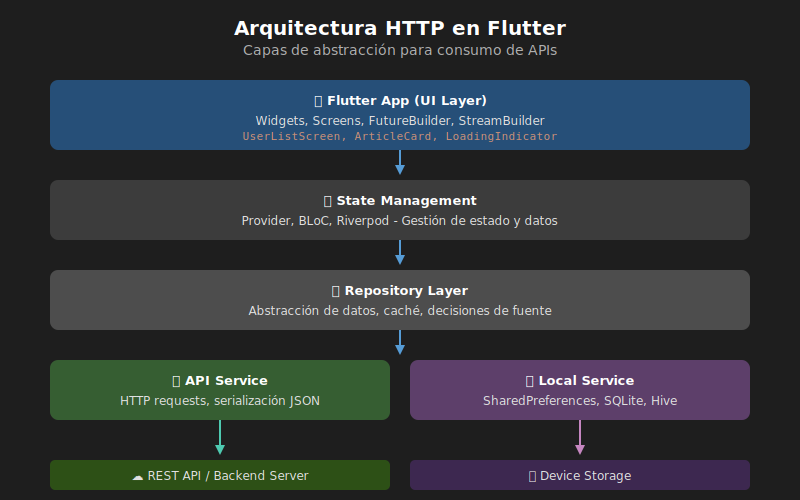
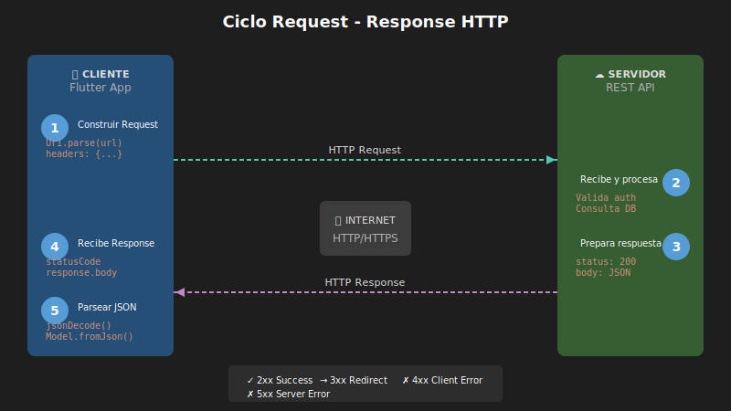
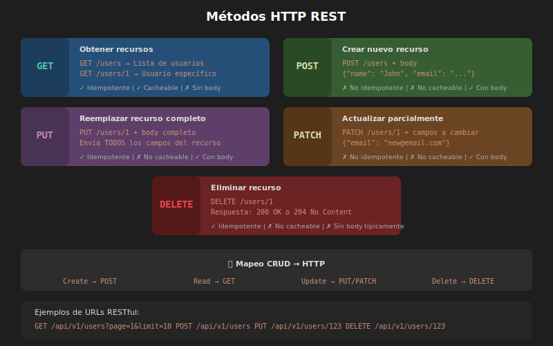

# 📡 Semana 06: Consumo de APIs y HTTP



## 🎯 Objetivos de Aprendizaje

Al finalizar esta semana, serás capaz de:

- [ ] Comprender el protocolo HTTP y arquitectura REST
- [ ] Realizar peticiones GET, POST, PUT, PATCH, DELETE
- [ ] Usar los packages `http` y `Dio` para networking
- [ ] Serializar y deserializar JSON a modelos Dart
- [ ] Manejar estados de carga, error y éxito
- [ ] Implementar búsqueda con debounce y cancelación
- [ ] Aplicar patrones de error handling robustos
- [ ] Crear una app que consume una API real

---

## ⏱️ Distribución del Tiempo

**Total: 8 horas**

| Actividad | Tiempo | Descripción |
|-----------|--------|-------------|
| 📚 Teoría | 2h | HTTP, REST, async, serialización |
| 💻 Prácticas | 2-3h | 5 ejercicios progresivos |
| 🔨 Proyecto | 3-4h | News Reader App |

---

## 📚 Contenido

### 1. Teoría

| # | Módulo | Temas |
|---|--------|-------|
| 01 | [Fundamentos HTTP y REST](./1-teoria/01-fundamentos-http-rest.md) | Protocolo HTTP, métodos, códigos de estado, REST |
| 02 | [http Package y Dio](./1-teoria/02-http-package-dio.md) | Peticiones HTTP, interceptores, configuración |
| 03 | [Serialización JSON](./1-teoria/03-serializacion-json.md) | Modelos, fromJson/toJson, json_serializable |

### 2. Prácticas

| # | Práctica | Conceptos |
|---|----------|-----------|
| 01 | [JSONPlaceholder API](./2-practicas/practica-01-jsonplaceholder-api.md) | GET requests, modelos básicos |
| 02 | [CRUD Completo](./2-practicas/practica-02-crud-completo.md) | POST, PUT, DELETE |
| 03 | [FutureBuilder Lista](./2-practicas/practica-03-futurebuilder-lista.md) | Estados de carga/error/éxito |
| 04 | [Dio e Interceptores](./2-practicas/practica-04-dio-interceptores.md) | Logging, auth, configuración |
| 05 | [Búsqueda Tiempo Real](./2-practicas/practica-05-busqueda-tiempo-real.md) | Debounce, cancelación |

### 3. Proyecto Integrador

| Archivo | Contenido |
|---------|-----------|
| [README.md](./3-proyecto/README.md) | News Reader App - Especificaciones |
| [GUIA-DISENO.md](./3-proyecto/GUIA-DISENO.md) | Wireframes, paleta de colores, UI |
| [EJEMPLOS-DATOS.md](./3-proyecto/EJEMPLOS-DATOS.md) | Estructura JSON, mocks |

### 4. Recursos

| # | Recurso | Descripción |
|---|---------|-------------|
| 01 | [Cheatsheet HTTP](./4-recursos/01-cheatsheet-http-methods.md) | Métodos y códigos de estado |
| 02 | [Guía http Package](./4-recursos/02-guia-rapida-http-package.md) | Referencia rápida |
| 03 | [Guía Dio](./4-recursos/03-guia-rapida-dio.md) | Interceptores y configuración |
| 04 | [Error Handling](./4-recursos/04-patrones-error-handling.md) | Result, Either, AsyncValue |
| 05 | [JSON Patterns](./4-recursos/05-json-serialization-patterns.md) | Serialización avanzada |
| 06 | [APIs Gratuitas](./4-recursos/06-apis-gratuitas-practicar.md) | Lista de APIs para practicar |
| 07 | [Debugging](./4-recursos/07-debugging-network.md) | Herramientas de debug |
| 08 | [Seguridad API Keys](./4-recursos/08-seguridad-api-keys.md) | Proteger credenciales |
| 09 | [Caching](./4-recursos/09-caching-strategies.md) | Estrategias de caché |
| 10 | [Best Practices REST](./4-recursos/10-mejores-practicas-rest.md) | Diseño de APIs |
| 11 | [Testing](./4-recursos/11-testing-api-calls.md) | Tests de servicios |
| 12 | [Referencias](./4-recursos/12-referencias-oficiales.md) | Documentación oficial |

### 5. Glosario

📖 [Glosario de términos](./5-glosario/README.md) - API, HTTP, REST, JSON, async, y más.

---

## 🔧 Stack Tecnológico

```yaml
dependencies:
  # HTTP
  http: ^1.1.0
  dio: ^5.4.0
  
  # Serialización
  json_annotation: ^4.8.1
  
  # Estado
  provider: ^6.1.1
  
  # Persistencia
  shared_preferences: ^2.2.2

dev_dependencies:
  build_runner: ^2.4.8
  json_serializable: ^6.7.1
```

---

## 📊 Diagramas

### Arquitectura HTTP en Flutter


### Ciclo Request-Response


### Métodos HTTP


---

## ✅ Checklist de Completitud

### Teoría
- [ ] Leído y comprendido módulo 01 (HTTP/REST)
- [ ] Leído y comprendido módulo 02 (http/Dio)
- [ ] Leído y comprendido módulo 03 (JSON)

### Prácticas
- [ ] Práctica 01: JSONPlaceholder API
- [ ] Práctica 02: CRUD Completo
- [ ] Práctica 03: FutureBuilder Lista
- [ ] Práctica 04: Dio e Interceptores
- [ ] Práctica 05: Búsqueda Tiempo Real

### Proyecto
- [ ] Home con titulares de noticias
- [ ] Categorías funcionales
- [ ] Búsqueda con debounce
- [ ] Detalle de noticia
- [ ] Favoritos con persistencia
- [ ] Navegación completa
- [ ] README con instrucciones

---

## 🎓 Evaluación

| Componente | Peso |
|------------|------|
| Teoría | 15% |
| Prácticas | 35% |
| Proyecto | 50% |

📋 Ver [Rúbrica de Evaluación](./RUBRICA-EVALUACION.md) para criterios detallados.

---

## 🔗 Enlaces Rápidos

- 📖 [Flutter Networking Cookbook](https://docs.flutter.dev/cookbook/networking)
- 📦 [http package](https://pub.dev/packages/http)
- 📦 [Dio package](https://pub.dev/packages/dio)
- 🌐 [JSONPlaceholder](https://jsonplaceholder.typicode.com)
- 📰 [NewsAPI](https://newsapi.org)

---

## 💡 Tips de la Semana

1. **Empieza simple** - Usa http para peticiones básicas
2. **Maneja todos los estados** - Loading, error, success, empty
3. **Tipado fuerte** - Crea modelos para tus datos
4. **Seguridad** - Nunca expongas API keys en el código
5. **Testing** - Usa mocks para probar sin red

---

## 📅 Navegación

| ⬅️ Anterior | Actual | Siguiente ➡️ |
|-------------|--------|--------------|
| [Semana 05: Gestión de Estado](../semana-05/README.md) | **Semana 06** | [Semana 07: Persistencia](../semana-07/README.md) |

---

📅 **Semana 06 de 10** | 🎯 **Dedicación:** 8 horas | 📱 **Flutter Bootcamp**
