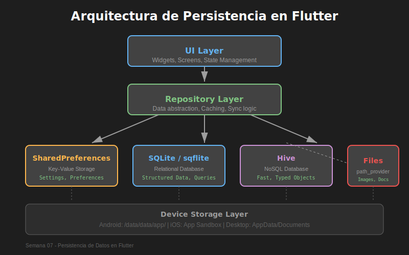
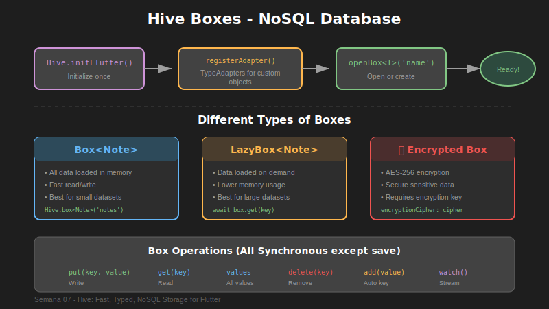
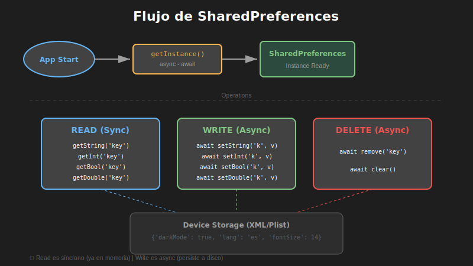
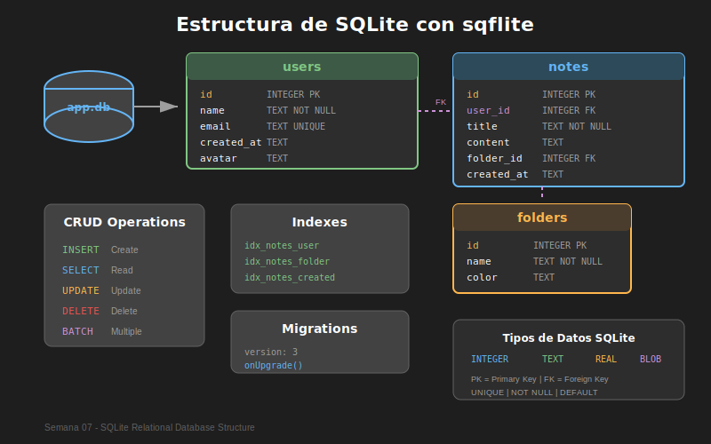
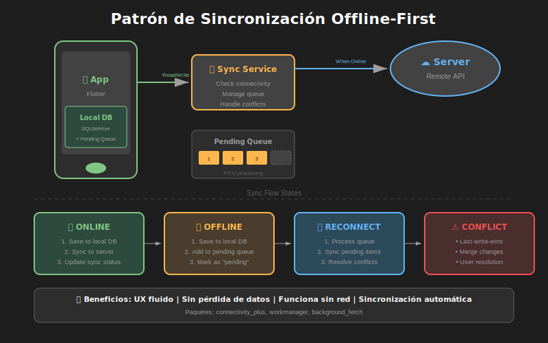

# 📱 Semana 7: Persistencia de Datos

<div align="center">



**Domina el almacenamiento local en Flutter**

[](https://flutter.dev)
[](https://dart.dev)
[](https://pub.dev/packages/sqflite)
[](https://pub.dev/packages/hive)

</div>

---

## 🎯 Objetivos de Aprendizaje

Al completar esta semana, serás capaz de:

- [ ] Almacenar preferencias de usuario con **SharedPreferences**
- [ ] Diseñar e implementar bases de datos relacionales con **SQLite/sqflite**
- [ ] Usar almacenamiento NoSQL de alto rendimiento con **Hive**
- [ ] Manejar archivos locales con **path_provider**
- [ ] Implementar el patrón **Repository** para abstraer la persistencia
- [ ] Crear sistemas de **backup y restauración** de datos
- [ ] Aplicar estrategias de **migración de datos**

---

## ⏱️ Distribución del Tiempo (8 horas)

| Actividad    | Tiempo | Descripción                            |
| ------------ | ------ | -------------------------------------- |
| 📚 Teoría    | 2-3h   | Conceptos de persistencia, tecnologías |
| 💻 Prácticas | 2-3h   | 5 ejercicios progresivos               |
| 🔨 Proyecto  | 3-4h   | NotesVault - App de notas avanzada     |

---

## 📂 Estructura de la Semana

```
semana-07/
├── 📄 README.md                    ← Estás aquí
├── 📊 RUBRICA-EVALUACION.md        # Criterios de evaluación
├── 📁 0-assets/                    # Diagramas y recursos visuales
├── 📁 1-teoria/                    # Contenido teórico (3 módulos)
├── 📁 2-practicas/                 # Ejercicios prácticos (5 prácticas)
├── 📁 3-proyecto/                  # Proyecto NotesVault
├── 📁 4-recursos/                  # Material complementario
└── 📁 5-glosario/                  # Términos y definiciones
```

---

## 📚 Contenido Teórico

### [1. SharedPreferences y Almacenamiento Key-Value](./1-teoria/01-shared-preferences.md)

> **Tiempo estimado:** 45 minutos

- ¿Qué es SharedPreferences?
- Tipos de datos soportados
- Operaciones CRUD
- Casos de uso ideales
- Limitaciones y consideraciones
- Buenas prácticas

### [2. SQLite con sqflite - Bases de Datos Relacionales](./1-teoria/02-sqlite-sqflite.md)

> **Tiempo estimado:** 90 minutos

- Fundamentos de SQLite
- Configuración de sqflite
- Diseño de esquemas
- Operaciones CRUD avanzadas
- Migraciones de base de datos
- Índices y optimización
- Transacciones y batch operations

### [3. Hive - Almacenamiento NoSQL de Alto Rendimiento](./1-teoria/03-hive-nosql.md)

> **Tiempo estimado:** 60 minutos

- Introducción a Hive
- Boxes y TypeAdapters
- Operaciones CRUD
- Relaciones en NoSQL
- Lazy loading y rendimiento
- Encriptación de datos
- Comparativa con SQLite

---

## 💻 Prácticas

### [Práctica 1: UserPreferencesManager](./2-practicas/practica-01-shared-preferences.md)

> **Dificultad:** ⭐ Básica | **Tiempo:** 30 min

Crea un gestor de preferencias de usuario con SharedPreferences que maneje tema, idioma, notificaciones y estado de login.

**Tecnologías:** SharedPreferences, Singleton Pattern

---

### [Práctica 2: TaskDatabase](./2-practicas/practica-02-sqlite-tareas.md)

> **Dificultad:** ⭐⭐ Intermedia | **Tiempo:** 45 min

Implementa una base de datos SQLite para gestión de tareas con CRUD completo, categorías y sistema de migraciones.

**Tecnologías:** sqflite, path, SQL

---

### [Práctica 3: ContactsBox](./2-practicas/practica-03-hive-contactos.md)

> **Dificultad:** ⭐⭐ Intermedia | **Tiempo:** 45 min

Desarrolla un sistema de contactos con Hive, incluyendo TypeAdapters personalizados, búsqueda y filtrado.

**Tecnologías:** Hive, hive_flutter, TypeAdapters

---

### [Práctica 4: AppFileManager](./2-practicas/practica-04-archivos.md)

> **Dificultad:** ⭐⭐ Intermedia | **Tiempo:** 40 min

Crea un gestor de archivos que maneje lectura/escritura, directorios temporales, cache y documentos del usuario.

**Tecnologías:** path_provider, dart:io

---

### [Práctica 5: Repository Pattern](./2-practicas/practica-05-repository-pattern.md)

> **Dificultad:** ⭐⭐⭐ Avanzada | **Tiempo:** 50 min

Implementa el patrón Repository para abstraer la capa de datos, permitiendo cambiar entre SQLite y Hive sin modificar el código de UI.

**Tecnologías:** Abstract classes, Interfaces, DI

---

## 🔨 Proyecto de la Semana: NotesVault

<div align="center">



</div>

### [📋 Especificación Completa](./3-proyecto/README.md)

Desarrolla **NotesVault**, una aplicación de notas profesional con:

| Feature                    | Descripción                                  |
| -------------------------- | -------------------------------------------- |
| 📝 **Notas con Markdown**  | Crear, editar y renderizar notas en Markdown |
| 📁 **Sistema de Carpetas** | Organizar notas en carpetas jerárquicas      |
| 🏷️ **Etiquetas/Tags**      | Clasificar notas con múltiples tags          |
| 🔍 **Búsqueda Avanzada**   | Buscar por título, contenido y tags          |
| 📎 **Adjuntos**            | Adjuntar imágenes a las notas                |
| ⚙️ **Configuración**       | Tema, fuente, auto-guardado                  |
| 💾 **Backup/Restore**      | Exportar e importar datos                    |

### Arquitectura del Proyecto

```
lib/
├── core/
│   ├── database/         # SQLite setup
│   ├── storage/          # Hive & files
│   └── constants/
├── data/
│   ├── models/           # Note, Folder, Tag
│   ├── repositories/     # Repository implementations
│   └── datasources/      # SQLite, Hive, File datasources
├── domain/
│   └── repositories/     # Abstract repository interfaces
└── presentation/
    ├── screens/
    └── widgets/
```

---

## 📖 Recursos Adicionales

### [📁 Ver todos los recursos](./4-recursos/)

| Recurso                                                                          | Descripción              |
| -------------------------------------------------------------------------------- | ------------------------ |
| [Cheatsheet SharedPreferences](./4-recursos/01-cheatsheet-shared-preferences.md) | Referencia rápida        |
| [Cheatsheet SQLite](./4-recursos/02-cheatsheet-sqlite.md)                        | Comandos y sintaxis      |
| [Cheatsheet Hive](./4-recursos/03-cheatsheet-hive.md)                            | Operaciones comunes      |
| [Patrones de Migración](./4-recursos/04-patrones-migracion.md)                   | Estrategias avanzadas    |
| [Seguridad y Encriptación](./4-recursos/05-seguridad-encriptacion.md)            | Proteger datos sensibles |
| [Backup y Restauración](./4-recursos/06-backup-restauracion.md)                  | Import/Export            |
| [Optimización](./4-recursos/07-optimizacion-rendimiento.md)                      | Performance tips         |
| [Testing](./4-recursos/08-testing-persistencia.md)                               | Unit tests para datos    |

---

## 📊 Diagramas de Referencia

<table>
<tr>
<td width="50%">

### Arquitectura de Persistencia


</td>
<td width="50%">

### Flujo de SharedPreferences



</td>
</tr>
<tr>
<td width="50%">

### Estructura SQLite



</td>
<td width="50%">

### Organización Hive


</td>
</tr>
<tr>
<td width="50%">

### Sincronización Offline



</td>
<td width="50%">

### Ciclo de Vida de Datos


</td>
</tr>
</table>

---

## 📦 Dependencias de la Semana

```yaml
dependencies:
  # Almacenamiento Key-Value
  shared_preferences: ^2.2.2

  # Base de datos SQLite
  sqflite: ^2.3.0
  path: ^1.8.3

  # Rutas del sistema
  path_provider: ^2.1.1

  # Base de datos NoSQL
  hive: ^2.2.3
  hive_flutter: ^1.1.0

  # Conectividad (opcional para sync)
  connectivity_plus: ^5.0.2

dev_dependencies:
  # Generador de TypeAdapters
  hive_generator: ^2.0.1
  build_runner: ^2.4.6
```

---

## 📝 Glosario

### [📖 Ver glosario completo](./5-glosario/)

| Término         | Definición                                                                       |
| --------------- | -------------------------------------------------------------------------------- |
| **ACID**        | Propiedades de transacciones: Atomicidad, Consistencia, Aislamiento, Durabilidad |
| **Box**         | Contenedor de datos en Hive (equivalente a tabla)                                |
| **CRUD**        | Create, Read, Update, Delete                                                     |
| **DAO**         | Data Access Object - patrón de acceso a datos                                    |
| **Migration**   | Actualización del esquema de base de datos                                       |
| **ORM**         | Object-Relational Mapping                                                        |
| **Repository**  | Patrón que abstrae el acceso a datos                                             |
| **TypeAdapter** | Serializador de objetos para Hive                                                |

---

## ✅ Checklist de Completitud

### Teoría

- [ ] Leí el módulo de SharedPreferences
- [ ] Leí el módulo de SQLite/sqflite
- [ ] Leí el módulo de Hive

### Prácticas

- [ ] ✅ Práctica 1: UserPreferencesManager
- [ ] ✅ Práctica 2: TaskDatabase
- [ ] ✅ Práctica 3: ContactsBox
- [ ] ✅ Práctica 4: AppFileManager
- [ ] ✅ Práctica 5: Repository Pattern

### Proyecto

- [ ] CRUD de notas funcionando
- [ ] Sistema de carpetas implementado
- [ ] Tags y búsqueda funcionando
- [ ] Persistencia con SQLite + Hive
- [ ] Configuración de usuario guardada
- [ ] UI completa y funcional

---

## 🎓 Evaluación

### [📊 Ver rúbrica completa](./RUBRICA-EVALUACION.md)

| Componente          | Peso |
| ------------------- | ---- |
| Teoría              | 20%  |
| Prácticas           | 30%  |
| Proyecto NotesVault | 50%  |

### Criterios de Calificación

| Rango  | Nivel           |
| ------ | --------------- |
| 90-100 | ⭐ Excelente    |
| 80-89  | ✅ Muy Bueno    |
| 70-79  | 👍 Bueno        |
| 60-69  | ⚠️ Suficiente   |
| 0-59   | ❌ Insuficiente |

---

## 🔗 Navegación del Bootcamp

| ← Anterior                      | Índice          | Siguiente →                                 |
| ------------------------------- | --------------- | ------------------------------------------- |
| [Semana 6: APIs](../semana-06/) | [Bootcamp](../) | [Semana 8: Features Nativas](../semana-08/) |

---

<div align="center">

**¿Listo para dominar la persistencia de datos?** 🚀

_La capacidad de guardar y recuperar datos es fundamental para cualquier aplicación profesional._

</div>
