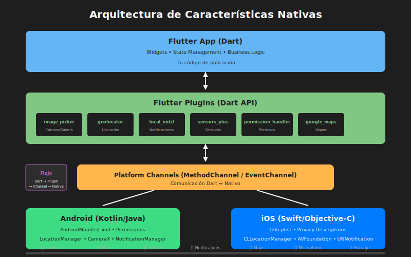

# 📱 Semana 8: Características Nativas y Plugins

[](https://flutter.dev)
[](https://dart.dev)
[]()
[]()

## 📋 Descripción

Esta semana exploramos el **acceso a características nativas del dispositivo** mediante plugins de Flutter. Aprenderás a usar la cámara, obtener la ubicación del usuario, enviar notificaciones, acceder a sensores del dispositivo y gestionar permisos de manera profesional.

> **Proyecto de la Semana:** TravelDiary - Una aplicación de diario de viajes con fotos geolocalizadas, mapas interactivos y recordatorios.

---

## 🎯 Objetivos de Aprendizaje

Al finalizar esta semana, serás capaz de:

- [ ] Capturar fotos y videos usando la cámara del dispositivo
- [ ] Seleccionar imágenes de la galería con optimización
- [ ] Obtener la ubicación actual y tracking continuo
- [ ] Integrar Google Maps con marcadores y rutas
- [ ] Implementar notificaciones locales y push
- [ ] Acceder a sensores (acelerómetro, giroscopio, etc.)
- [ ] Gestionar permisos correctamente en Android e iOS
- [ ] Manejar Platform Channels para comunicación nativa

---

## 🗂️ Estructura de la Semana

```
semana-08/
├── README.md                          # Este archivo
├── RUBRICA-EVALUACION.md              # Criterios de evaluación
├── 0-assets/                          # Diagramas y recursos visuales
│   ├── 01-flujo-permisos.svg
│   ├── 02-camara-galeria.svg
│   ├── 03-geolocalizacion.svg
│   ├── 04-notificaciones.svg
│   ├── 05-sensores.svg
│   └── 06-arquitectura-nativa.svg
├── 1-teoria/                          # Módulos teóricos
│   ├── 01-camara-galeria.md
│   ├── 02-geolocalizacion-mapas.md
│   └── 03-notificaciones.md
├── 2-practicas/                       # Ejercicios prácticos
│   ├── practica-01-photo-capture.md
│   ├── practica-02-location-tracker.md
│   ├── practica-03-notification-manager.md
│   ├── practica-04-sensor-dashboard.md
│   └── practica-05-permissions-manager.md
├── 3-proyecto/                        # Proyecto TravelDiary
│   ├── README.md
│   ├── GUIA-DISENO.md
│   └── EJEMPLOS-DATOS.md
├── 4-recursos/                        # Material complementario
│   ├── 01-videos-camara-galeria.md
│   ├── 02-videos-geolocalizacion.md
│   ├── 03-videos-notificaciones.md
│   ├── 04-videos-sensores.md
│   ├── 05-ebooks-plugins-flutter.md
│   ├── 06-ebooks-firebase.md
│   ├── 07-webgrafia-documentacion.md
│   ├── 08-webgrafia-tutoriales.md
│   ├── 09-herramientas-desarrollo.md
│   └── 10-comunidades-soporte.md
└── 5-glosario/                        # Terminología
    └── README.md
```

---

## ⏱️ Distribución del Tiempo

| Actividad                | Duración | Descripción                         |
| ------------------------ | -------- | ----------------------------------- |
| Teoría: Cámara y Galería | 1.5h     | image_picker, camera, procesamiento |
| Teoría: Geolocalización  | 1.5h     | geolocator, Google Maps, tracking   |
| Teoría: Notificaciones   | 1.5h     | Local notifications, FCM, push      |
| Prácticas                | 2h       | 5 ejercicios prácticos              |
| Proyecto TravelDiary     | 1.5h     | Aplicación integradora              |
| **Total**                | **8h**   |                                     |

---

## 📦 Packages Principales

```yaml
dependencies:
  # Cámara y Galería
  image_picker: ^1.0.4
  camera: ^0.10.5+5

  # Geolocalización y Mapas
  geolocator: ^10.1.0
  google_maps_flutter: ^2.5.0
  geocoding: ^2.1.1

  # Notificaciones
  flutter_local_notifications: ^16.1.0
  firebase_messaging: ^14.7.0

  # Sensores
  sensors_plus: ^4.0.2

  # Permisos
  permission_handler: ^11.1.0

  # Almacenamiento
  path_provider: ^2.1.1
  shared_preferences: ^2.2.2
```

---

## 📚 Contenido Teórico

### Módulo 1: Cámara y Galería

📄 [`1-teoria/01-camara-galeria.md`](./1-teoria/01-camara-galeria.md)

- **image_picker**: Captura rápida y selección de galería
- **camera**: Control total del hardware de cámara
- Procesamiento y optimización de imágenes
- Configuración Android (CameraX) e iOS (AVFoundation)

```dart
// Ejemplo: Captura de imagen con image_picker
final ImagePicker picker = ImagePicker();
final XFile? image = await picker.pickImage(
  source: ImageSource.camera,
  maxWidth: 1024,
  imageQuality: 80,
);
```

### Módulo 2: Geolocalización y Mapas

📄 [`1-teoria/02-geolocalizacion-mapas.md`](./1-teoria/02-geolocalizacion-mapas.md)

- **geolocator**: Ubicación actual y tracking continuo
- **google_maps_flutter**: Mapas interactivos
- Marcadores, polilíneas y geofencing
- Cálculo de distancias y rutas

```dart
// Ejemplo: Obtener ubicación actual
final Position position = await Geolocator.getCurrentPosition(
  desiredAccuracy: LocationAccuracy.high,
);
print('Lat: ${position.latitude}, Lng: ${position.longitude}');
```

### Módulo 3: Notificaciones

📄 [`1-teoria/03-notificaciones.md`](./1-teoria/03-notificaciones.md)

- **flutter_local_notifications**: Notificaciones locales
- **firebase_messaging**: Push notifications con FCM
- Notificaciones programadas y periódicas
- Canales de notificación en Android

```dart
// Ejemplo: Mostrar notificación local
await flutterLocalNotificationsPlugin.show(
  0,
  'Título',
  'Cuerpo de la notificación',
  notificationDetails,
);
```

---

## 💻 Prácticas

| #   | Práctica                                                                 | Descripción                           | Duración |
| --- | ------------------------------------------------------------------------ | ------------------------------------- | -------- |
| 1   | [PhotoCapture](./2-practicas/practica-01-photo-capture.md)               | Captura de fotos con cámara y galería | 25 min   |
| 2   | [LocationTracker](./2-practicas/practica-02-location-tracker.md)         | Tracking de ubicación en tiempo real  | 25 min   |
| 3   | [NotificationManager](./2-practicas/practica-03-notification-manager.md) | Sistema de notificaciones completo    | 25 min   |
| 4   | [SensorDashboard](./2-practicas/practica-04-sensor-dashboard.md)         | Dashboard de sensores del dispositivo | 25 min   |
| 5   | [PermissionsManager](./2-practicas/practica-05-permissions-manager.md)   | Gestión profesional de permisos       | 20 min   |

---

## 🔨 Proyecto: TravelDiary

📄 **Especificación completa:** [`3-proyecto/README.md`](./3-proyecto/README.md)

### Descripción

**TravelDiary** es una aplicación de diario de viajes que permite a los usuarios:

- 📸 Capturar fotos de sus viajes
- 📍 Geoetiquetar automáticamente las fotos
- 🗺️ Ver un mapa con todas las ubicaciones visitadas
- 🔔 Recibir recordatorios para añadir entradas
- 📝 Añadir notas y descripciones

### Arquitectura

```
lib/
├── main.dart
├── app.dart
├── core/
│   ├── constants/
│   ├── services/
│   │   ├── camera_service.dart
│   │   ├── location_service.dart
│   │   └── notification_service.dart
│   └── utils/
├── data/
│   ├── models/
│   │   └── diary_entry.dart
│   └── repositories/
├── presentation/
│   ├── screens/
│   │   ├── home_screen.dart
│   │   ├── new_entry_screen.dart
│   │   ├── map_screen.dart
│   │   └── entry_detail_screen.dart
│   ├── widgets/
│   └── providers/
└── config/
```

### Features Principales

| Feature          | Package                            | Descripción                |
| ---------------- | ---------------------------------- | -------------------------- |
| Captura de fotos | image_picker                       | Cámara y galería           |
| Geolocalización  | geolocator                         | Auto-tagging de ubicación  |
| Mapa interactivo | google_maps_flutter                | Visualización de viajes    |
| Recordatorios    | flutter_local_notifications        | Notificaciones programadas |
| Persistencia     | shared_preferences + path_provider | Almacenamiento local       |

### Entregables

- [ ] Pantalla principal con lista de entradas
- [ ] Formulario de nueva entrada con foto
- [ ] Geolocalización automática
- [ ] Mapa con marcadores de ubicaciones
- [ ] Sistema de recordatorios
- [ ] Detalle de entrada con foto y mapa

---

## 📖 Recursos

### Videos Recomendados

- 📹 [Cámara y Galería](./4-recursos/01-videos-camara-galeria.md)
- 📹 [Geolocalización](./4-recursos/02-videos-geolocalizacion.md)
- 📹 [Notificaciones](./4-recursos/03-videos-notificaciones.md)
- 📹 [Sensores](./4-recursos/04-videos-sensores.md)

### Documentación Oficial

- 📚 [Flutter Plugins](https://docs.flutter.dev/packages-and-plugins/using-packages)
- 📚 [image_picker](https://pub.dev/packages/image_picker)
- 📚 [geolocator](https://pub.dev/packages/geolocator)
- 📚 [flutter_local_notifications](https://pub.dev/packages/flutter_local_notifications)
- 📚 [permission_handler](https://pub.dev/packages/permission_handler)

### Herramientas

- 🔧 [Google Cloud Console](https://console.cloud.google.com/) - API Keys para Maps
- 🔧 [Firebase Console](https://console.firebase.google.com/) - FCM
- 🔧 [Postman](https://www.postman.com/) - Testing de APIs

---

## ✅ Checklist de Completitud

### Teoría

- [ ] Módulo 1: Cámara y Galería completado
- [ ] Módulo 2: Geolocalización y Mapas completado
- [ ] Módulo 3: Notificaciones completado

### Prácticas

- [ ] Práctica 1: PhotoCapture
- [ ] Práctica 2: LocationTracker
- [ ] Práctica 3: NotificationManager
- [ ] Práctica 4: SensorDashboard
- [ ] Práctica 5: PermissionsManager

### Proyecto

- [ ] Captura de fotos funcional
- [ ] Geolocalización implementada
- [ ] Mapa con marcadores
- [ ] Notificaciones funcionando
- [ ] Persistencia de datos
- [ ] UI completa y responsive

### Documentación

- [ ] Código comentado
- [ ] README del proyecto
- [ ] Configuración documentada

---

## 🎓 Evaluación

📊 **Rúbrica completa:** [`RUBRICA-EVALUACION.md`](./RUBRICA-EVALUACION.md)

| Componente           | Peso     |
| -------------------- | -------- |
| Teoría y Comprensión | 15%      |
| Prácticas (5)        | 35%      |
| Proyecto TravelDiary | 45%      |
| Documentación        | 5%       |
| **Total**            | **100%** |

### Criterios Clave

- ✅ Gestión correcta de permisos
- ✅ Manejo de errores en features nativas
- ✅ Optimización de recursos (imágenes, streams)
- ✅ UI con estados de carga y error
- ✅ Código limpio y documentado

---

## 🔗 Navegación

| ⬅️ Anterior                                      | 🏠 Inicio                | Siguiente ➡️                                |
| ------------------------------------------------ | ------------------------ | ------------------------------------------- |
| [Semana 7: Persistencia](../semana-07/README.md) | [Bootcamp](../README.md) | [Semana 9: Testing](../semana-09/README.md) |

---

## 📊 Diagrama de Arquitectura



---

## 💡 Tips de la Semana

### Permisos

```dart
// ✅ Siempre verifica el estado del permiso antes de solicitar
final status = await Permission.camera.status;
if (status.isDenied) {
  final result = await Permission.camera.request();
  // Manejar resultado
}
```

### Cámara

```dart
// ✅ Siempre comprime las imágenes
final image = await picker.pickImage(
  source: ImageSource.camera,
  maxWidth: 1024,  // Limita el tamaño
  imageQuality: 80, // Compresión
);
```

### Ubicación

```dart
// ✅ Verifica servicios de ubicación primero
final serviceEnabled = await Geolocator.isLocationServiceEnabled();
if (!serviceEnabled) {
  // Mostrar diálogo para activar ubicación
}
```

### Notificaciones

```dart
// ✅ Siempre maneja el tap en notificaciones
await flutterLocalNotificationsPlugin.initialize(
  settings,
  onDidReceiveNotificationResponse: (response) {
    // Navegar a pantalla específica
  },
);
```

---

## ⚠️ Errores Comunes

| Error                              | Solución                                                    |
| ---------------------------------- | ----------------------------------------------------------- |
| `MissingPluginException`           | Ejecutar `flutter clean && flutter pub get`                 |
| Permisos denegados silenciosamente | Verificar configuración en AndroidManifest.xml / Info.plist |
| Mapa no carga                      | Verificar API Key de Google Maps                            |
| Notificaciones no aparecen         | Crear canal de notificación en Android 8+                   |
| Ubicación imprecisa                | Usar `LocationAccuracy.high` y verificar GPS activo         |

---

## 🚀 Siguiente Semana

En la **Semana 9** aprenderemos sobre:

- Testing unitario en Flutter
- Widget testing
- Integration testing
- Test-driven development (TDD)
- Mocking de servicios nativos

---

> **Nota:** Esta semana requiere dispositivo físico para probar algunas funcionalidades (cámara, GPS, sensores). El emulador puede simular ubicación pero tiene limitaciones con cámara y sensores.

---

**¡Éxitos en tu aprendizaje! 📱🚀**

_Actualizado: Noviembre 2025_
