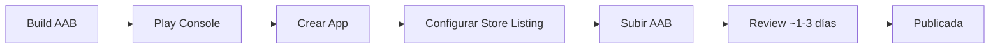
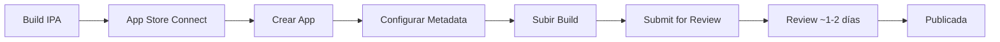

# 03 - Preparación para Stores

## 🎯 Objetivos de Aprendizaje

Al finalizar este módulo, serás capaz de:

- [ ] Preparar la app para Google Play Store
- [ ] Preparar la app para Apple App Store
- [ ] Generar builds firmados
- [ ] Crear metadata y assets requeridos
- [ ] Conocer las políticas de publicación

---

## 📚 Contenido

### 1. Requisitos Generales

Antes de publicar, tu app debe cumplir:

| Requisito              | Play Store | App Store |
| ---------------------- | ---------- | --------- |
| Icono de app           | ✅ 512x512 | ✅ 1024x1024 |
| Screenshots            | ✅ Mín. 2  | ✅ Mín. 3 por dispositivo |
| Descripción            | ✅ 4000 chars | ✅ 4000 chars |
| Política de privacidad | ✅ Obligatoria | ✅ Obligatoria |
| Clasificación de edad  | ✅ Cuestionario | ✅ Cuestionario |
| Cuenta de desarrollador| ✅ $25 (único) | ✅ $99/año |

---

### 2. Configuración de Android

#### 2.1 Generar Keystore

```bash
# Generar nuevo keystore para firma
keytool -genkey -v \
  -keystore ~/upload-keystore.jks \
  -keyalg RSA \
  -keysize 2048 \
  -validity 10000 \
  -alias upload

# Te pedirá:
# - Contraseña del keystore
# - Nombre y apellido
# - Unidad organizacional
# - Organización
# - Ciudad, Estado, País
```

> ⚠️ **IMPORTANTE**: Guarda el keystore y contraseñas de forma segura. Si los pierdes, no podrás actualizar tu app.

#### 2.2 Configurar key.properties

```properties
# android/key.properties (NO comitear a git)
storePassword=tu_password_seguro
keyPassword=tu_password_seguro
keyAlias=upload
storeFile=/ruta/completa/a/upload-keystore.jks
```

```gitignore
# .gitignore
*.jks
*.keystore
key.properties
```

#### 2.3 Configurar build.gradle

```groovy
// android/app/build.gradle

// Cargar propiedades de firma
def keystoreProperties = new Properties()
def keystorePropertiesFile = rootProject.file('key.properties')
if (keystorePropertiesFile.exists()) {
    keystoreProperties.load(new FileInputStream(keystorePropertiesFile))
}

android {
    // ... configuración existente ...

    defaultConfig {
        applicationId "com.tuempresa.tuapp"
        minSdkVersion 21
        targetSdkVersion 34
        versionCode 1
        versionName "1.0.0"
    }

    signingConfigs {
        release {
            keyAlias keystoreProperties['keyAlias']
            keyPassword keystoreProperties['keyPassword']
            storeFile keystoreProperties['storeFile'] ? file(keystoreProperties['storeFile']) : null
            storePassword keystoreProperties['storePassword']
        }
    }

    buildTypes {
        release {
            signingConfig signingConfigs.release
            minifyEnabled true
            shrinkResources true
            proguardFiles getDefaultProguardFile('proguard-android-optimize.txt'), 'proguard-rules.pro'
        }
    }
}
```

#### 2.4 Configurar AndroidManifest.xml

```xml
<!-- android/app/src/main/AndroidManifest.xml -->
<manifest xmlns:android="http://schemas.android.com/apk/res/android">
    
    <!-- Permisos necesarios -->
    <uses-permission android:name="android.permission.INTERNET"/>
    
    <application
        android:label="Tu App"
        android:name="${applicationName}"
        android:icon="@mipmap/ic_launcher"
        android:roundIcon="@mipmap/ic_launcher_round">
        
        <activity
            android:name=".MainActivity"
            android:exported="true"
            android:launchMode="singleTop"
            android:theme="@style/LaunchTheme"
            android:configChanges="orientation|keyboardHidden|keyboard|screenSize|smallestScreenSize|locale|layoutDirection|fontScale|screenLayout|density|uiMode"
            android:hardwareAccelerated="true"
            android:windowSoftInputMode="adjustResize">
            
            <meta-data
                android:name="io.flutter.embedding.android.NormalTheme"
                android:resource="@style/NormalTheme"/>
            
            <intent-filter>
                <action android:name="android.intent.action.MAIN"/>
                <category android:name="android.intent.category.LAUNCHER"/>
            </intent-filter>
        </activity>
        
        <meta-data
            android:name="flutterEmbedding"
            android:value="2"/>
    </application>
</manifest>
```

#### 2.5 Build Commands

```bash
# Build APK de release
flutter build apk --release

# Build App Bundle (recomendado para Play Store)
flutter build appbundle --release

# Build con análisis de tamaño
flutter build appbundle --release --analyze-size

# Build con obfuscación
flutter build appbundle --release \
  --obfuscate \
  --split-debug-info=build/debug-info

# Ubicación de outputs:
# APK: build/app/outputs/flutter-apk/app-release.apk
# AAB: build/app/outputs/bundle/release/app-release.aab
```

---

### 3. Configuración de iOS

#### 3.1 Requisitos de Apple Developer

1. Cuenta de Apple Developer ($99/año)
2. Certificado de distribución
3. Provisioning Profile
4. App ID configurado en App Store Connect

#### 3.2 Configurar Info.plist

```xml
<!-- ios/Runner/Info.plist -->
<?xml version="1.0" encoding="UTF-8"?>
<!DOCTYPE plist PUBLIC "-//Apple//DTD PLIST 1.0//EN" "http://www.apple.com/DTDs/PropertyList-1.0.dtd">
<plist version="1.0">
<dict>
    <!-- Nombre de la app -->
    <key>CFBundleDisplayName</key>
    <string>Tu App</string>
    
    <!-- Bundle identifier -->
    <key>CFBundleIdentifier</key>
    <string>$(PRODUCT_BUNDLE_IDENTIFIER)</string>
    
    <!-- Versión -->
    <key>CFBundleShortVersionString</key>
    <string>$(FLUTTER_BUILD_NAME)</string>
    
    <!-- Build number -->
    <key>CFBundleVersion</key>
    <string>$(FLUTTER_BUILD_NUMBER)</string>
    
    <!-- Permisos (agregar según uso) -->
    
    <!-- Cámara -->
    <key>NSCameraUsageDescription</key>
    <string>Esta app necesita acceso a la cámara para tomar fotos</string>
    
    <!-- Galería -->
    <key>NSPhotoLibraryUsageDescription</key>
    <string>Esta app necesita acceso a tus fotos para seleccionar imágenes</string>
    
    <!-- Ubicación -->
    <key>NSLocationWhenInUseUsageDescription</key>
    <string>Esta app necesita tu ubicación para mostrarte lugares cercanos</string>
    
    <!-- Notificaciones -->
    <key>UIBackgroundModes</key>
    <array>
        <string>remote-notification</string>
    </array>
</dict>
</plist>
```

#### 3.3 Configurar en Xcode

1. Abrir `ios/Runner.xcworkspace` en Xcode
2. Seleccionar Runner en el navegador
3. Configurar en **General**:
   - Display Name
   - Bundle Identifier
   - Version
   - Build
4. Configurar en **Signing & Capabilities**:
   - Team (tu cuenta de desarrollador)
   - Provisioning Profile
   - Signing Certificate

#### 3.4 Build Commands iOS

```bash
# Build para dispositivo
flutter build ios --release

# Build IPA (Archive)
flutter build ipa --release

# Build con análisis
flutter build ipa --release --analyze-size

# Build con obfuscación
flutter build ipa --release \
  --obfuscate \
  --split-debug-info=build/debug-info

# Ubicación del output:
# IPA: build/ios/ipa/
```

---

### 4. Assets para Stores

#### 4.1 Iconos

| Plataforma | Tamaño      | Formato | Notas                    |
| ---------- | ----------- | ------- | ------------------------ |
| Play Store | 512 x 512   | PNG     | Sin transparencia        |
| App Store  | 1024 x 1024 | PNG     | Sin transparencia, sin alpha |

#### 4.2 Screenshots

**Play Store:**
- Mínimo 2, máximo 8 por tipo de dispositivo
- Teléfono: 16:9 o 9:16 (ej: 1080x1920)
- Tablet 7": 16:9
- Tablet 10": 16:9

**App Store:**
- iPhone 6.5": 1284 x 2778 (obligatorio)
- iPhone 5.5": 1242 x 2208 (obligatorio)
- iPad Pro 12.9": 2048 x 2732 (si soportas iPad)

#### 4.3 Feature Graphic (Play Store)

- Tamaño: 1024 x 500 px
- Formato: PNG o JPEG
- Sin texto excesivo

---

### 5. Metadata de la App

#### 5.1 Descripción

```markdown
# Plantilla de descripción (4000 caracteres máx)

## Descripción corta (80 chars)
La mejor app para [tu propósito] - Gestiona [funcionalidad] fácilmente.

## Descripción larga
[Tu App] es la solución perfecta para [problema que resuelve].

### Características principales:
✅ [Característica 1]
✅ [Característica 2]
✅ [Característica 3]
✅ [Característica 4]

### ¿Por qué elegir [Tu App]?
• [Beneficio 1]
• [Beneficio 2]
• [Beneficio 3]

### Cómo empezar:
1. [Paso 1]
2. [Paso 2]
3. [Paso 3]

### Contacto y soporte:
📧 soporte@tuapp.com
🌐 www.tuapp.com
```

#### 5.2 Keywords

```yaml
# Keywords para ASO (App Store Optimization)
primary_keywords:
  - [palabra clave principal]
  - [funcionalidad principal]
  - [categoría]

secondary_keywords:
  - [sinónimos]
  - [términos relacionados]
  - [características]
```

---

### 6. Política de Privacidad

Obligatoria para ambas stores:

```markdown
# Política de Privacidad de [Tu App]

**Última actualización:** [Fecha]

## Información que recopilamos

### Información proporcionada por el usuario
- Nombre y dirección de email (para crear cuenta)
- [Otros datos que recopilas]

### Información recopilada automáticamente
- Datos de uso y analytics
- Información del dispositivo
- [Otros datos automáticos]

## Cómo usamos la información
- Para proporcionar y mejorar el servicio
- Para enviar notificaciones importantes
- Para analytics y mejora de la app

## Compartir información
No vendemos ni compartimos tu información personal con terceros.

## Seguridad
Implementamos medidas de seguridad para proteger tu información.

## Tus derechos
- Acceder a tu información
- Corregir datos incorrectos
- Eliminar tu cuenta

## Contacto
Para preguntas sobre privacidad: privacidad@tuapp.com

## Cambios a esta política
Notificaremos cambios importantes por email o en la app.
```

---

### 7. Proceso de Publicación

#### 7.1 Google Play Store



**Pasos detallados:**

1. **Crear cuenta** en [Play Console](https://play.google.com/console)
2. **Crear app** → Nombre, idioma predeterminado
3. **Store Listing**:
   - Título, descripción corta/larga
   - Screenshots, feature graphic
   - Categoría, etiquetas
4. **App content**:
   - Política de privacidad
   - Clasificación de contenido
   - Target audience
5. **Release**:
   - Internal testing (opcional)
   - Closed testing (opcional)
   - Open testing (opcional)
   - Production

#### 7.2 Apple App Store



**Pasos detallados:**

1. **Crear cuenta** en [Apple Developer](https://developer.apple.com)
2. **App Store Connect** → Crear nueva app
3. **App Information**:
   - Nombre, categoría, privacidad
4. **Version Information**:
   - Screenshots por dispositivo
   - Descripción, keywords, support URL
5. **Build**:
   - Subir desde Xcode o Transporter
6. **Submit for Review**

---

### 8. Checklist Pre-publicación

```markdown
## Android Checklist

### Configuración
- [ ] applicationId único y correcto
- [ ] versionCode incrementado
- [ ] versionName actualizado
- [ ] Keystore generado y respaldado
- [ ] key.properties configurado
- [ ] minSdkVersion apropiado (21+)
- [ ] targetSdkVersion actualizado (34)

### Build
- [ ] Build release sin errores
- [ ] APK/AAB firmado correctamente
- [ ] ProGuard configurado
- [ ] Tamaño del bundle optimizado

### Play Store
- [ ] Screenshots subidos
- [ ] Feature graphic creado
- [ ] Descripción completa
- [ ] Política de privacidad URL
- [ ] Clasificación de contenido completa

---

## iOS Checklist

### Configuración
- [ ] Bundle ID único
- [ ] Version actualizada
- [ ] Build number incrementado
- [ ] Certificados válidos
- [ ] Provisioning profile correcto

### Build
- [ ] Build archive sin errores
- [ ] IPA generado correctamente
- [ ] Sin warnings críticos

### App Store
- [ ] Screenshots por dispositivo
- [ ] Descripción completa
- [ ] Keywords optimizados
- [ ] Política de privacidad URL
- [ ] App Review Information completa
```

---

### 9. Errores Comunes

| Error                              | Solución                                    |
| ---------------------------------- | ------------------------------------------- |
| Keystore no encontrado             | Verificar ruta en key.properties            |
| Signing failed                     | Verificar contraseñas y alias               |
| Version code ya existe             | Incrementar versionCode                     |
| Screenshots rechazados             | Verificar dimensiones exactas               |
| App rechazada por contenido        | Revisar guidelines de la store              |
| Certificado expirado (iOS)         | Renovar en Apple Developer                  |

---

## 🎯 Resumen

| Aspecto          | Android (Play Store)        | iOS (App Store)              |
| ---------------- | --------------------------- | ---------------------------- |
| **Costo**        | $25 (único)                 | $99/año                      |
| **Formato**      | AAB (App Bundle)            | IPA                          |
| **Firma**        | Keystore JKS                | Certificados Apple           |
| **Review**       | 1-3 días                    | 1-2 días                     |
| **Screenshots**  | Mín. 2                      | Mín. 3 por dispositivo       |
| **Icon**         | 512x512                     | 1024x1024                    |

---

## 🔗 Navegación

| ⬅️ Anterior                                          | 🏠 Índice                 | Siguiente ➡️                          |
| ---------------------------------------------------- | ------------------------- | ------------------------------------- |
| [Optimización Performance](./02-optimizacion-performance.md) | [Semana 10](../README.md) | [CI/CD y Deployment](./04-ci-cd-deployment.md) |
