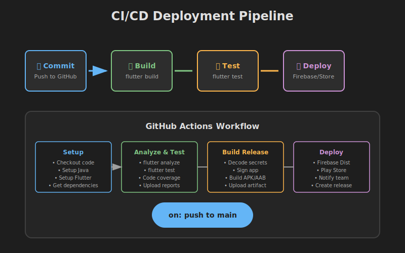
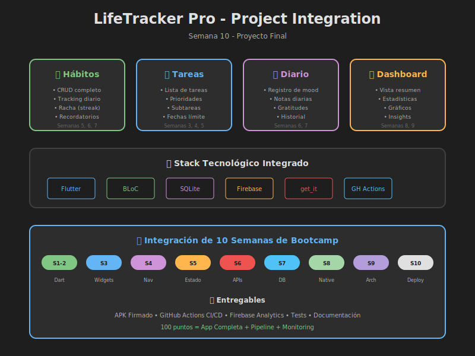

# 📱 Semana 10: Proyecto Final y Deployment



## 📋 Información General

| Aspecto            | Detalle                      |
| ------------------ | ---------------------------- |
| **Duración**       | 8-10 horas                   |
| **Nivel**          | ⭐⭐⭐⭐ Avanzado            |
| **Prerrequisitos** | Semanas 1-9 completadas      |
| **Proyecto**       | LifeTracker Pro (Integrador) |

---

## 🎯 Objetivos de Aprendizaje

Al finalizar esta semana, serás capaz de:

- [ ] Configurar entornos múltiples (dev, staging, prod) con `dart-define`
- [ ] Implementar flavors para diferentes versiones de la app
- [ ] Optimizar assets (iconos, splash, imágenes) para producción
- [ ] Crear builds firmados para Android (keystore) y iOS (certificates)
- [ ] Configurar pipelines CI/CD con GitHub Actions
- [ ] Implementar Firebase Analytics y Crashlytics
- [ ] Preparar metadata completo para publicación en stores
- [ ] Integrar todos los conocimientos del bootcamp en un proyecto final

---

## 📚 Contenido

### 1️⃣ Teoría

| #   | Módulo                     | Archivo                                                                     | Duración |
| --- | -------------------------- | --------------------------------------------------------------------------- | -------- |
| 01  | Arquitectura de Producción | [01-arquitectura-produccion.md](./1-teoria/01-arquitectura-produccion.md)   | 45 min   |
| 02  | Optimización y Performance | [02-optimizacion-performance.md](./1-teoria/02-optimizacion-performance.md) | 40 min   |
| 03  | Preparación para Stores    | [03-preparacion-stores.md](./1-teoria/03-preparacion-stores.md)             | 50 min   |
| 04  | CI/CD y Deployment         | [04-ci-cd-deployment.md](./1-teoria/04-ci-cd-deployment.md)                 | 45 min   |

### 2️⃣ Prácticas

| #   | Práctica                    | Archivo                                                                                  | Tiempo | Dificultad |
| --- | --------------------------- | ---------------------------------------------------------------------------------------- | ------ | ---------- |
| 01  | Configuración de Producción | [practica-01-config-produccion.md](./2-practicas/practica-01-config-produccion.md)       | 40 min | ⭐⭐       |
| 02  | Optimización de Assets      | [practica-02-optimizacion-assets.md](./2-practicas/practica-02-optimizacion-assets.md)   | 35 min | ⭐⭐       |
| 03  | Build y Firma               | [practica-03-build-firma.md](./2-practicas/practica-03-build-firma.md)                   | 45 min | ⭐⭐⭐     |
| 04  | CI/CD con GitHub Actions    | [practica-04-cicd-github.md](./2-practicas/practica-04-cicd-github.md)                   | 50 min | ⭐⭐⭐     |
| 05  | Analytics y Monitoring      | [practica-05-analytics-monitoring.md](./2-practicas/practica-05-analytics-monitoring.md) | 40 min | ⭐⭐⭐     |

### 3️⃣ Proyecto Final

| Documento                                           | Descripción                          |
| --------------------------------------------------- | ------------------------------------ |
| [README.md](./3-proyecto/README.md)                 | Especificación completa del proyecto |
| [GUIA-DISENO.md](./3-proyecto/GUIA-DISENO.md)       | Sistema de diseño                    |
| [EJEMPLOS-DATOS.md](./3-proyecto/EJEMPLOS-DATOS.md) | Modelos y datos de prueba            |

### 4️⃣ Recursos

| Recurso             | Archivo                                                             |
| ------------------- | ------------------------------------------------------------------- |
| Videos Deployment   | [01-videos-deployment.md](./4-recursos/01-videos-deployment.md)     |
| Videos CI/CD        | [02-videos-cicd.md](./4-recursos/02-videos-cicd.md)                 |
| Videos Optimización | [03-videos-optimization.md](./4-recursos/03-videos-optimization.md) |
| eBooks y Artículos  | [04-ebooks-articulos.md](./4-recursos/04-ebooks-articulos.md)       |
| Webgrafía           | [05-webgrafia.md](./4-recursos/05-webgrafia.md)                     |

### 5️⃣ Glosario

| Documento                           | Descripción                        |
| ----------------------------------- | ---------------------------------- |
| [README.md](./5-glosario/README.md) | Términos A-Z de deployment y CI/CD |

---

## 🗺️ Mapa del Proyecto Final



### LifeTracker Pro - Funcionalidades

```
┌─────────────────────────────────────────────────────────┐
│                   LifeTracker Pro                       │
├─────────────────────────────────────────────────────────┤
│  🔄 Hábitos        │  ✅ Tareas        │  📓 Diario     │
│  • CRUD            │  • CRUD           │  • Mood        │
│  • Tracking        │  • Prioridades    │  • Notas       │
│  • Streaks         │  • Subtareas      │  • Gratitudes  │
│  • Recordatorios   │  • Fechas límite  │  • Historial   │
├─────────────────────────────────────────────────────────┤
│                   📊 Dashboard                          │
│  • Resumen diario  • Estadísticas  • Gráficos          │
├─────────────────────────────────────────────────────────┤
│                   🛠️ Infraestructura                    │
│  • Clean Architecture  • BLoC  • SQLite  • Firebase    │
│  • CI/CD GitHub Actions  • Signed Builds  • Analytics  │
└─────────────────────────────────────────────────────────┘
```

---

## ⏱️ Distribución del Tiempo

| Actividad                | Tiempo       | Porcentaje |
| ------------------------ | ------------ | ---------- |
| Teoría (4 módulos)       | 3 horas      | 30%        |
| Prácticas (5 ejercicios) | 3.5 horas    | 35%        |
| Proyecto Final           | 3.5 horas    | 35%        |
| **TOTAL**                | **10 horas** | 100%       |

---

## 🔧 Stack Tecnológico

### Paquetes Principales

```yaml
dependencies:
  flutter:
    sdk: flutter

  # State Management
  flutter_bloc: ^8.1.3
  equatable: ^2.0.5

  # DI
  get_it: ^7.6.4
  injectable: ^2.3.2

  # Database
  sqflite: ^2.3.0
  path: ^1.8.3

  # Firebase
  firebase_core: ^2.24.0
  firebase_analytics: ^10.7.0
  firebase_crashlytics: ^3.4.7

  # Utilities
  intl: ^0.18.1
  uuid: ^4.2.1

dev_dependencies:
  flutter_test:
    sdk: flutter

  # Build
  flutter_launcher_icons: ^0.13.1
  flutter_native_splash: ^2.3.5

  # Testing
  bloc_test: ^9.1.5
  mocktail: ^1.0.1
```

### Herramientas de Deployment

- **GitHub Actions** - CI/CD
- **Firebase App Distribution** - Beta testing
- **Play Console** - Android publishing
- **App Store Connect** - iOS publishing

---

## ✅ Checklist de Completitud

### Teoría

- [ ] Arquitectura de producción estudiada
- [ ] Optimización y performance comprendida
- [ ] Preparación para stores revisada
- [ ] CI/CD y deployment entendido

### Prácticas

- [ ] Práctica 1: Config producción completada
- [ ] Práctica 2: Assets optimizados
- [ ] Práctica 3: Build firmado generado
- [ ] Práctica 4: Pipeline CI/CD configurado
- [ ] Práctica 5: Analytics implementado

### Proyecto Final

- [ ] 4 features principales implementadas
- [ ] Clean Architecture aplicada
- [ ] Tests escritos (10 unit, 5 widget, 2 integration)
- [ ] CI/CD pipeline funcionando
- [ ] APK/AAB firmado generado
- [ ] Firebase integrado

---

## 🎓 Evaluación

### Distribución de Puntos

| Componente     | Puntos  | Porcentaje |
| -------------- | ------- | ---------- |
| Prácticas (5)  | 30      | 30%        |
| Proyecto Final | 70      | 70%        |
| **TOTAL**      | **100** | 100%       |

### Criterios del Proyecto

| Criterio               | Puntos |
| ---------------------- | ------ |
| Funcionalidad completa | 25     |
| Clean Architecture     | 15     |
| Testing                | 10     |
| CI/CD Pipeline         | 10     |
| Build firmado          | 5      |
| Firebase Analytics     | 5      |
| **Total Proyecto**     | **70** |

Ver detalles completos en [RUBRICA-EVALUACION.md](./RUBRICA-EVALUACION.md)

---

## 🏆 Entregables Finales

Al completar esta semana deberás entregar:

1. **Código fuente** - Repositorio GitHub con el proyecto LifeTracker Pro
2. **APK/AAB firmado** - Build de release listo para distribución
3. **Pipeline CI/CD** - GitHub Actions configurado y funcionando
4. **Firebase Project** - Analytics y Crashlytics integrados
5. **Documentación** - README completo del proyecto

---

## 📖 Recursos Rápidos

### Comandos Esenciales

```bash
# Build de release Android
flutter build apk --release
flutter build appbundle --release

# Build con análisis de tamaño
flutter build apk --analyze-size

# Build con obfuscación
flutter build apk --obfuscate --split-debug-info=build/symbols

# Generar iconos y splash
dart run flutter_launcher_icons
dart run flutter_native_splash:create

# Tests
flutter test
flutter test --coverage
```

### Enlaces Importantes

- [Flutter Deployment Docs](https://docs.flutter.dev/deployment)
- [GitHub Actions](https://github.com/features/actions)
- [Firebase Console](https://console.firebase.google.com)
- [Play Console](https://play.google.com/console)

---

## 🔗 Navegación

| ⬅️ Anterior                         | 🏠 Índice                | Siguiente ➡️    |
| ----------------------------------- | ------------------------ | --------------- |
| [Semana 09](../semana-09/README.md) | [Bootcamp](../README.md) | 🎓 ¡Completado! |

---

## 🎉 ¡Felicitaciones!

Has llegado al final del **Bootcamp de Flutter**. Durante estas 10 semanas has aprendido:

- ✅ **Dart** - Fundamentos y POO
- ✅ **Widgets** - Construcción de UI
- ✅ **Navegación** - Rutas y paso de datos
- ✅ **Estado** - Provider, BLoC, Riverpod
- ✅ **APIs** - HTTP, JSON, async/await
- ✅ **Persistencia** - SQLite, SharedPreferences
- ✅ **Features Nativas** - Cámara, GPS, notificaciones
- ✅ **Arquitectura** - Clean Architecture, Testing
- ✅ **Deployment** - CI/CD, Stores, Analytics

**¡Ahora estás listo para crear aplicaciones Flutter profesionales!** 🚀
