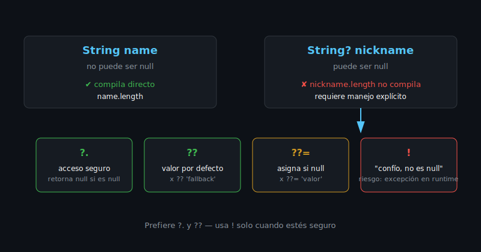

# Variables, Tipos y Null Safety

## 🎯 Objetivos

Al finalizar este archivo, comprenderás:

- Cómo declarar variables con `var`, `final` y `const`
- Los tipos básicos de Dart
- Qué es null safety y cómo usar `?`, `!`, `late`, `??` y `??=`

## 📋 Conceptos Clave

### 1. Declaración de variables

```dart
// var: tipo inferido, valor puede cambiar
var city = 'Bogotá';

// final: se asigna una sola vez, en tiempo de ejecución
final foundedYear = 1538;

// const: se asigna una sola vez, en tiempo de COMPILACIÓN
const appName = 'BC Flutter';
```

> 💡 **`final` vs `const`**: usa `const` cuando el valor se conoce al compilar (literales,
> constructores `const`). Usa `final` cuando el valor se calcula en runtime pero no debe
> reasignarse. En Flutter, `const` en constructores de widgets es clave para performance
> (lo verás en semana 16).

### 2. Tipos básicos

```dart
int age = 25;
double price = 19.99;
String name = 'Ada';
bool isActive = true;
List<String> tags = ['dart', 'flutter'];

// Dart infiere el tipo si lo omites, pero sigue siendo fuertemente tipado
var count = 0; // inferido como int, no puede volverse String después
```

### 3. Null safety



Desde Dart 2.12, todo tipo es **no-nulable por defecto**. Si quieres permitir `null`, lo marcas
explícitamente con `?`:

```dart
String name = 'Ada';       // NO puede ser null
String? nickname;          // SÍ puede ser null (y arranca en null)

// nickname.length; // ❌ Error de compilación: podría ser null

// Operador ?. — acceso seguro, retorna null si el objeto es null
print(nickname?.length);   // null, sin lanzar excepción

// Operador ?? — valor por defecto si es null
final displayName = nickname ?? 'Sin apodo';

// Operador ??= — asigna solo si la variable es null
nickname ??= 'Anónimo';

// Operador ! — "confío en que no es null" (úsalo solo si estás seguro)
String? maybeNull = 'seguro';
String definitelyNotNull = maybeNull!;
```

> ⚠️ **`!` es una promesa, no una garantía**: si te equivocas, Dart lanza una excepción en
> runtime. Prefiere `??`/`?.` siempre que puedas evitar `!`.

### 4. `late`: null safety diferida

```dart
class UserSession {
  // Se inicializa después del constructor, pero Dart confía en que
  // estará lista antes de usarse (por ejemplo, tras un login).
  late String token;

  void login(String receivedToken) {
    token = receivedToken;
  }
}
```

Usarás `late` en semana 9 (autenticación) para variables que dependen de un login exitoso.

## ⚠️ Errores Comunes

- Abusar de `!` para silenciar errores del analyzer sin entender por qué el tipo es nulable.
- Declarar todo como `var` sin considerar si debería ser `final` (menos mutabilidad = menos bugs).
- Usar `late` para "posponer el problema" en vez de modelar el nulo correctamente con `?`.

## 📚 Recursos Adicionales

- [Dart — Variables](https://dart.dev/language/variables)
- [Dart — Sound null safety](https://dart.dev/null-safety)

## ✅ Checklist de Verificación

- [ ] Sé cuándo usar `var`, `final` y `const`
- [ ] Entiendo la diferencia entre `String` y `String?`
- [ ] Puedo usar `?.`, `??`, `??=` y `!` correctamente
- [ ] Sé cuándo `late` es apropiado y cuándo es un parche
