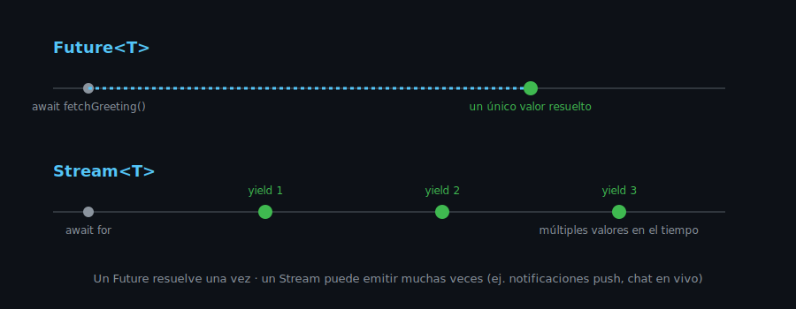

# Programación Asíncrona: Future, async/await y Stream

## 🎯 Objetivos

Al finalizar este archivo, comprenderás:

- Qué es un `Future` y por qué Dart lo usa para operaciones que toman tiempo
- Cómo usar `async`/`await` para trabajar con Futures de forma legible
- Qué es un `Stream` y en qué se diferencia de un `Future`

## 📋 Conceptos Clave

### 1. El problema: operaciones que toman tiempo

Leer una API, acceder a una base de datos local o esperar la respuesta del usuario son
operaciones que **no terminan inmediatamente**. Dart representa "un valor que estará disponible
en el futuro" con el tipo `Future<T>`.

```dart
// Simula una llamada de red que tarda 2 segundos
Future<String> fetchGreeting() {
  return Future.delayed(const Duration(seconds: 2), () => 'Hola desde el servidor');
}
```

### 2. async / await

```dart
Future<void> main() async {
  print('Pidiendo saludo...');
  final greeting = await fetchGreeting(); // pausa esta función hasta que el Future resuelva
  print(greeting); // 'Hola desde el servidor'
}
```

> 💡 **`await` no bloquea el programa**, solo pausa la función actual. Mientras se espera,
> Dart puede seguir atendiendo otros eventos (como redibujar la interfaz) — esto es clave en
> Flutter: nunca bloqueas la UI esperando datos.

### 3. Manejo de errores con try/catch

```dart
Future<String> fetchUser(String id) async {
  if (id.isEmpty) {
    throw ArgumentError('id no puede estar vacío');
  }
  return 'Usuario $id';
}

Future<void> loadUser() async {
  try {
    final user = await fetchUser('');
  } catch (error) {
    print('Error al cargar usuario: $error');
  }
}
```

En semana 6 (networking con Dio) este mismo patrón se usa para manejar errores de red — nada
nuevo que aprender, solo aplicarlo a un caso real.

### 4. Stream: una secuencia de valores en el tiempo

Un `Future` resuelve **una vez**. Un `Stream` puede emitir **múltiples valores** a lo largo del
tiempo — como una lista que llega de a poco.

```dart
Stream<int> countTo(int max) async* {
  for (var i = 1; i <= max; i++) {
    await Future.delayed(const Duration(seconds: 1));
    yield i; // emite un valor y continúa
  }
}

Future<void> main() async {
  await for (final number in countTo(3)) {
    print(number); // 1, 2, 3 (uno por segundo)
  }
}
```

> 💡 **Casos de uso móvil**: notificaciones push (semana 14), actualizaciones en tiempo real de
> un chat, o el progreso de una subida de archivo — todos son `Stream`, no `Future`, porque
> emiten varios eventos en el tiempo, no un único resultado final.



### 5. `Future` vs `Stream` — cuándo usar cada uno

| Necesitas | Usa |
|---|---|
| Un solo resultado (ej. respuesta de una API REST) | `Future<T>` |
| Múltiples valores a lo largo del tiempo (ej. mensajes de un chat) | `Stream<T>` |

## ⚠️ Errores Comunes

- Olvidar `await` frente a un `Future` — el código sigue ejecutándose sin esperar el resultado
  y el analyzer solo avisa con un warning, no un error.
- Usar `Future` cuando en realidad hay múltiples eventos a lo largo del tiempo (debería ser
  `Stream`).
- No envolver código async en `try/catch` cuando puede fallar (una API caída, por ejemplo).

## 📚 Recursos Adicionales

- [Dart — Asynchronous programming](https://dart.dev/language/async)
- [Dart — Streams tutorial](https://dart.dev/tutorials/language/streams)

## ✅ Checklist de Verificación

- [ ] Entiendo qué representa un `Future<T>`
- [ ] Puedo usar `async`/`await` y manejar errores con `try/catch`
- [ ] Sé cuándo usar `Stream` en vez de `Future`
