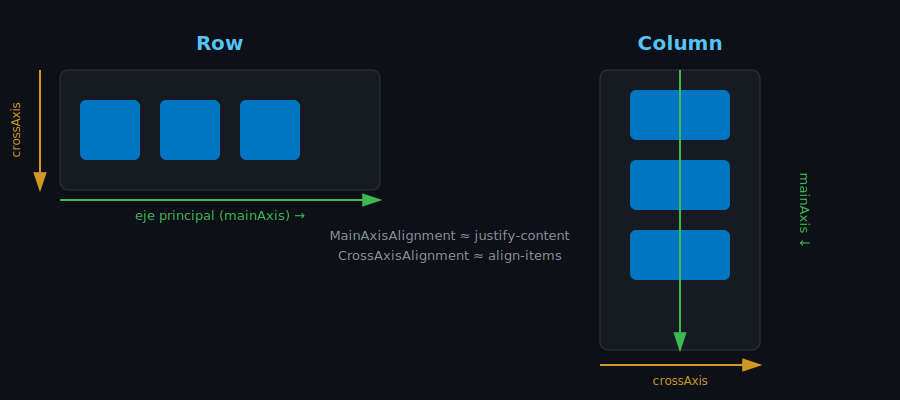

# Layout: Row, Column y Flex

## 🎯 Objetivos

Al finalizar este archivo, comprenderás:

- Cómo organizar widgets horizontal y verticalmente con `Row`/`Column`
- Los ejes principal y transversal, y cómo alinearlos
- Cuándo usar `Expanded`, `Flexible` y `Spacer`

## 📋 Conceptos Clave

### 1. Row y Column

```dart
Column(
  children: [
    const Text('Título'),
    const Text('Subtítulo'),
    Row(
      children: [
        const Icon(Icons.star),
        const Text('4.8'),
      ],
    ),
  ],
)
```

`Column` apila widgets **verticalmente**, `Row` los coloca **horizontalmente**. Ambos aceptan
una lista `children` — se pueden anidar libremente para construir cualquier layout.



### 2. Eje principal y eje transversal

- **Eje principal** (`mainAxis`): la dirección en la que se apilan los widgets (vertical en
  `Column`, horizontal en `Row`).
- **Eje transversal** (`crossAxis`): la dirección perpendicular.

```dart
Column(
  mainAxisAlignment: MainAxisAlignment.spaceBetween, // distribuye en el eje vertical
  crossAxisAlignment: CrossAxisAlignment.start,       // alinea a la izquierda
  children: [...],
)
```

> 💡 **Analogía con Flexbox web**: `Row`/`Column` en Flutter son conceptualmente CSS Flexbox
> con `flex-direction: row`/`column`. `MainAxisAlignment` ≈ `justify-content`,
> `CrossAxisAlignment` ≈ `align-items`.

### 3. Expanded y Flexible

Por defecto, un `Row`/`Column` da a cada hijo solo el espacio que necesita. Para que un hijo
**ocupe el espacio disponible**, se envuelve en `Expanded`:

```dart
Row(
  children: [
    const Icon(Icons.person),
    Expanded(
      child: Text('Este texto ocupa todo el espacio restante', overflow: TextOverflow.ellipsis),
    ),
    const Icon(Icons.arrow_forward),
  ],
)
```

`Flexible` es similar pero permite que el hijo sea **más pequeño** que el espacio disponible si
no lo necesita todo; `Expanded` fuerza a ocupar exactamente el espacio asignado.

### 4. Spacer

```dart
Row(
  children: [
    const Text('Izquierda'),
    const Spacer(), // empuja lo siguiente al extremo opuesto
    const Text('Derecha'),
  ],
)
```

### 5. Container: caja con padding, margin y decoración

```dart
Container(
  padding: const EdgeInsets.all(16),
  margin: const EdgeInsets.symmetric(vertical: 8),
  decoration: BoxDecoration(
    color: Colors.white,
    borderRadius: BorderRadius.circular(12),
    boxShadow: const [BoxShadow(color: Colors.black12, blurRadius: 6)],
  ),
  child: const Text('Tarjeta'),
)
```

`Container` es el widget "todo en uno" para espaciado, tamaño, color y bordes — lo usarás
constantemente al construir tarjetas y secciones.

## ⚠️ Errores Comunes

- `RenderFlex overflowed` — el error más común de principiante: un `Row`/`Column` con hijos que
  no caben. Se soluciona con `Expanded`, `Flexible`, o envolviendo en `SingleChildScrollView`
  (semana siguiente en teoría de listas).
- Poner `Expanded` fuera de un `Row`/`Column` — solo funciona como hijo directo de un widget
  flex.
- Anidar `Container`s innecesariamente cuando `Padding`/`SizedBox` bastarían (más simple, más
  performante).

## 📚 Recursos Adicionales

- [Flutter — Layout: Row and Column](https://docs.flutter.dev/ui/layout/widgets#row)
- [Flutter — Understanding constraints](https://docs.flutter.dev/ui/layout/constraints)

## ✅ Checklist de Verificación

- [ ] Puedo construir un layout combinando Row y Column anidados
- [ ] Entiendo mainAxis vs crossAxis
- [ ] Sé cuándo usar Expanded vs Flexible
- [ ] Puedo resolver un `RenderFlex overflowed` básico
