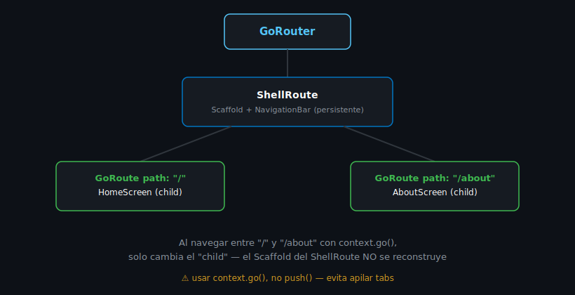

# Rutas Anidadas y ShellRoute

## 🎯 Objetivos

Al finalizar este archivo, comprenderás:

- Qué problema resuelve `ShellRoute`
- Cómo construir una navegación con bottom navigation bar persistente
- La diferencia entre rutas anidadas dentro de un `ShellRoute` y rutas independientes

## 📋 Conceptos Clave

### 1. El problema: UI persistente entre pantallas

Muchas apps tienen una barra de navegación inferior (bottom nav bar) que **no debe
reconstruirse** al cambiar de pestaña — cada pestaña mantiene su propio estado y su propia pila
de navegación. Si usaras rutas planas normales, la barra se recrearía en cada `GoRoute`.



### 2. ShellRoute

```dart
final router = GoRouter(
  routes: [
    ShellRoute(
      builder: (context, state, child) {
        return Scaffold(
          body: child, // la pantalla activa de la pestaña actual
          bottomNavigationBar: NavigationBar(
            selectedIndex: _indexForLocation(state.uri.toString()),
            onDestinationSelected: (index) {
              context.go(index == 0 ? '/' : '/about');
            },
            destinations: const [
              NavigationDestination(icon: Icon(Icons.list), label: 'Inicio'),
              NavigationDestination(icon: Icon(Icons.info), label: 'Acerca de'),
            ],
          ),
        );
      },
      routes: [
        GoRoute(path: '/', builder: (context, state) => const HomeScreen()),
        GoRoute(path: '/about', builder: (context, state) => const AboutScreen()),
      ],
    ),
  ],
);
```

`ShellRoute` define un `builder` que envuelve a todas sus rutas hijas (`child` es la pantalla
activa) — el `Scaffold` con la `NavigationBar` se construye **una sola vez** y persiste mientras
navegas entre `/` y `/about`.

> 💡 **Analogía con React Navigation**: `ShellRoute` es conceptualmente un `Tab.Navigator` de
> React Navigation — un contenedor persistente con pantallas hijas intercambiables.

### 3. Rutas anidadas dentro de una ruta (no confundir con ShellRoute)

También puedes anidar `GoRoute`s dentro de otro `GoRoute` (no un `ShellRoute`) cuando una
pantalla es literalmente "hija" de otra en la jerarquía de la app:

```dart
GoRoute(
  path: '/items',
  builder: (context, state) => const ItemsScreen(),
  routes: [
    GoRoute(
      path: ':id', // la ruta completa resultante es /items/:id
      builder: (context, state) => DetailScreen(itemId: state.pathParameters['id']!),
    ),
  ],
),
```

Aquí no hay UI compartida — es solo una forma de organizar rutas relacionadas jerárquicamente
en el código.

### 4. ¿Cuándo usar cada uno?

| Necesitas | Usa |
|---|---|
| Bottom nav bar / tabs con UI persistente entre pantallas | `ShellRoute` |
| Organizar rutas relacionadas sin UI compartida (ej. `/items/:id`) | `GoRoute` con `routes:` anidados |

## ⚠️ Errores Comunes

- Poner un `Scaffold` completo dentro de cada pantalla hija **y también** en el `ShellRoute` —
  duplica `AppBar`/estructura. El `Scaffold` compartido va en el `ShellRoute`, las pantallas
  hijas retornan solo su contenido.
- Usar `push()` para cambiar de tab dentro de un `ShellRoute` — esto apila pantallas en vez de
  reemplazar, rompiendo la sensación de "tabs". Usa `go()` para cambiar de tab.
- Confundir rutas anidadas (organización de código) con `ShellRoute` (UI compartida) — no son
  lo mismo, aunque ambas usan la palabra "anidada" coloquialmente.

## 📚 Recursos Adicionales

- [go_router — ShellRoute](https://pub.dev/documentation/go_router/latest/topics/Configuration-topic.html)
- [Flutter cookbook — Navigation](https://docs.flutter.dev/cookbook/navigation)

## ✅ Checklist de Verificación

- [ ] Entiendo qué problema resuelve ShellRoute
- [ ] Puedo construir una navegación con bottom nav bar persistente
- [ ] Sé diferenciar ShellRoute de rutas anidadas dentro de un GoRoute
