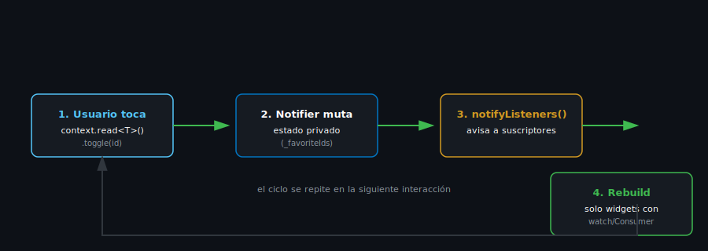

# ChangeNotifier y ChangeNotifierProvider

## 🎯 Objetivos

Al finalizar este archivo, comprenderás:

- Cómo declarar un `ChangeNotifier` como contenedor de estado
- Cómo exponerlo a la app con `ChangeNotifierProvider`
- El ciclo completo: mutación → `notifyListeners()` → rebuild

## 📋 Conceptos Clave

### 1. ChangeNotifier: estado + notificación de cambios

```dart
import 'package:flutter/foundation.dart';

class CounterNotifier extends ChangeNotifier {
  int _count = 0;
  int get count => _count;

  void increment() {
    _count++;
    notifyListeners(); // avisa a todos los widgets suscritos que deben reconstruirse
  }
}
```

> 💡 **Patrón "ViewModel"**: piensa en un `ChangeNotifier` como el equivalente Flutter de un
> store de Zustand o un ViewModel de Android — contiene el estado y la lógica para mutarlo,
> completamente separado de los widgets que lo muestran.

### 2. Instalación

```bash
flutter pub add provider
```

### 3. ChangeNotifierProvider: exponer el notifier al árbol

```dart
void main() {
  runApp(
    ChangeNotifierProvider(
      create: (context) => CounterNotifier(),
      child: const MyApp(),
    ),
  );
}
```

`create` recibe una función que construye **una sola instancia** del notifier — Provider la
crea perezosamente (la primera vez que algo la pide) y la destruye automáticamente (llamando
`dispose()`) cuando el `ChangeNotifierProvider` sale del árbol.

### 4. Consumer: reconstruir solo lo necesario

```dart
Consumer<CounterNotifier>(
  builder: (context, notifier, child) {
    return Text('${notifier.count}');
  },
)
```

`Consumer<T>` busca el `ChangeNotifierProvider<T>` más cercano hacia arriba, se suscribe a sus
cambios, y **solo reconstruye lo que está dentro de su `builder`** — no toda la pantalla.

### 5. El ciclo completo



```
Usuario toca botón
  → notifier.increment() (lógica de negocio, fuera de la UI)
    → _count++
    → notifyListeners()
      → Flutter reconstruye SOLO los widgets suscritos (Consumer, o context.watch — archivo 4)
```

Este ciclo — acción del usuario → mutación en el notifier → `notifyListeners()` → rebuild — es
el mismo concepto que reaparecerá en Riverpod (`ref.notifyListeners` interno de `Notifier`) y
en Bloc (`emit()`), solo con sintaxis distinta. Entenderlo bien aquí paga dividendos el resto
del bootcamp.

## ⚠️ Errores Comunes

- Olvidar `notifyListeners()` tras mutar el estado — la UI simplemente no se actualiza, sin
  ningún error visible (el bug más común de esta semana).
- Exponer los campos mutables directamente (`int count = 0;` público) en vez de un getter +
  setter privado — rompe el control sobre cuándo se notifica el cambio.
- Crear una nueva instancia del notifier en cada rebuild (por ejemplo, dentro de `build()`) en
  vez de una sola vez en `create:` — pierde todo el estado en cada reconstrucción.

## 📚 Recursos Adicionales

- [provider — pub.dev](https://pub.dev/packages/provider)
- [Flutter — ChangeNotifier class](https://api.flutter.dev/flutter/foundation/ChangeNotifier-class.html)
- [Flutter — Simple app state management](https://docs.flutter.dev/data-and-backend/state-mgmt/simple)

## ✅ Checklist de Verificación

- [ ] Puedo declarar un ChangeNotifier con estado privado y un método que lo muta
- [ ] Sé exponerlo con ChangeNotifierProvider
- [ ] Entiendo el ciclo completo: mutación → notifyListeners → rebuild
