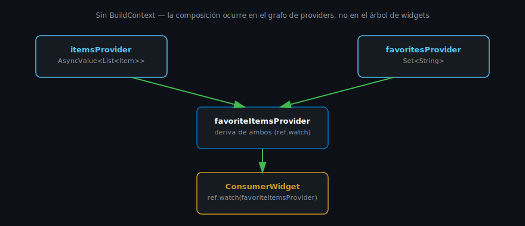

# Providers Funcionales con Code Generation

## 🎯 Objetivos

Al finalizar este archivo, comprenderás:

- Cómo declarar un provider funcional con `@riverpod`
- Qué genera exactamente `build_runner`
- Cómo un provider puede depender de otro (composición)

## 📋 Conceptos Clave

### 1. Tu primer provider funcional

```dart
// greeting_provider.dart
import 'package:riverpod_annotation/riverpod_annotation.dart';

part 'greeting_provider.g.dart';

@riverpod
String greeting(Ref ref) {
  return 'Hola, Riverpod';
}
```

Tras correr `build_runner`, esto genera automáticamente un `greetingProvider` en
`greeting_provider.g.dart` — nunca edites ese archivo a mano, se regenera solo.

```dart
// Consumo en un widget:
final message = ref.watch(greetingProvider);
```

> 💡 **Convención de nombres**: una función `greeting` genera un provider llamado
> `greetingProvider` (camelCase + sufijo `Provider`). Una clase `Counter` genera
> `counterProvider`. Es automático, no lo escribes tú.

### 2. Providers con parámetros (family, simplificado)

```dart
@riverpod
String greetingFor(Ref ref, String name) {
  return 'Hola, $name';
}

// Consumo: cada valor de `name` es una instancia independiente y cacheada
final message = ref.watch(greetingForProvider('Ada'));
```

Con `riverpod_generator`, un provider "con parámetros" (lo que en la API manual se llamaba
`.family`) es simplemente una función con argumentos adicionales — el generador se encarga del
resto.

### 3. Composición: un provider que depende de otro



```dart
@riverpod
String fullGreeting(Ref ref) {
  final name = ref.watch(currentUserNameProvider); // depende de otro provider
  return 'Hola, $name. Bienvenido de nuevo.';
}
```

`ref.watch(otroProvider)` dentro de un provider (no solo en un widget) es la forma en que
Riverpod compone estado derivado — si `currentUserNameProvider` cambia, `fullGreetingProvider`
se recalcula automáticamente. Esto es exactamente lo que en Provider requería `ProxyProvider`
(semana 4, mucho más verboso).

### 4. keepAlive: providers que no se destruyen automáticamente

Por defecto, los providers generados con `@riverpod` son `autoDispose`: se destruyen cuando
nadie los está observando (por ejemplo, al salir de la pantalla que los usa). Para mantener el
estado vivo durante toda la sesión de la app:

```dart
@Riverpod(keepAlive: true)
String appConfig(Ref ref) {
  return 'config estable';
}
```

> 💡 **Cuándo usar `keepAlive: true`**: datos de sesión (usuario autenticado, configuración
> global) que no deberías recalcular cada vez que el usuario navega. Lo verás en semana 9 con
> el estado de autenticación.

## ⚠️ Errores Comunes

- Escribir lógica de negocio pesada directamente en el `build()` sin memorizar resultados —
  Riverpod ya cachea el resultado del provider, no necesitas tu propio caché manual encima.
- Olvidar que `autoDispose` (el comportamiento por defecto) puede destruir tu provider si nadie
  lo observa temporalmente — usa `keepAlive: true` solo cuando el dato realmente debe persistir.
- Editar un archivo `*.g.dart` a mano — cualquier cambio se pierde en la siguiente generación.

## 📚 Recursos Adicionales

- [riverpod_generator — pub.dev](https://pub.dev/packages/riverpod_generator)
- [riverpod_annotation — pub.dev](https://pub.dev/packages/riverpod_annotation)

## ✅ Checklist de Verificación

- [ ] Puedo declarar un provider funcional con @riverpod
- [ ] Sé cómo un provider puede depender de otro con ref.watch
- [ ] Entiendo la diferencia entre autoDispose (por defecto) y keepAlive: true
