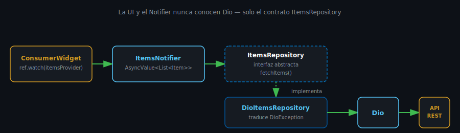

# Repository Pattern con Dio

## 🎯 Objetivos

Al finalizar este archivo, comprenderás:

- Qué problema resuelve separar Dio de los providers
- Cómo definir un repository como interfaz abstracta + implementación concreta
- Cómo exponer un repository a través de un provider de Riverpod



## 📋 Conceptos Clave

### 1. El problema: Dio mezclado con el provider

Sin repository, un `AsyncNotifier` llama a Dio directamente:

```dart
@riverpod
class ItemsNotifier extends _$ItemsNotifier {
  @override
  Future<List<Item>> build() async {
    final dio = ref.watch(dioProvider);
    final response = await dio.get('/posts'); // ❌ Dio mezclado con el estado
    return (response.data as List)
        .map((json) => Item.fromJson(json))
        .toList();
  }
}
```

Funciona, pero mezcla dos responsabilidades: **cómo obtener los datos** (HTTP, JSON, endpoint) y
**cómo se expone el estado a la UI** (`AsyncValue`, loading/error/data). Si mañana cambias de
API, o quieres testear la lógica de estado sin hacer requests reales, tienes que tocar el mismo
archivo.

### 2. La solución: Repository

Un repository es una clase cuya única responsabilidad es **obtener datos** — no sabe nada de
Riverpod ni de `AsyncValue`.

```dart
// repositories/items_repository.dart
abstract class ItemsRepository {
  Future<List<Item>> fetchItems();
}

class DioItemsRepository implements ItemsRepository {
  DioItemsRepository(this._dio);

  final Dio _dio;

  @override
  Future<List<Item>> fetchItems() async {
    try {
      final response = await _dio.get('/posts');
      return (response.data as List)
          .map((json) => Item.fromJson(json as Map<String, dynamic>))
          .toList();
    } on DioException catch (e) {
      throw Exception(_messageFor(e));
    }
  }

  String _messageFor(DioException e) {
    if (e.type == DioExceptionType.connectionError) {
      return 'Sin conexión a internet';
    }
    return 'No se pudo cargar la información';
  }
}
```

Ahora el `AsyncNotifier` solo depende de la **interfaz** `ItemsRepository`, no de Dio:

```dart
@riverpod
class ItemsNotifier extends _$ItemsNotifier {
  @override
  Future<List<Item>> build() async {
    final repository = ref.watch(itemsRepositoryProvider);
    return repository.fetchItems(); // ✅ no sabe que existe Dio
  }
}
```

### 3. Por qué una interfaz abstracta (y no solo una clase)

| Sin interfaz | Con interfaz `ItemsRepository` |
|---|---|
| El Notifier depende de `DioItemsRepository` concreto | El Notifier depende del contrato `ItemsRepository` |
| Cambiar de fuente de datos (otra API, caché local) obliga a tocar el Notifier | Basta crear otra implementación (`CachedItemsRepository`, `FakeItemsRepository`) |
| Testear el Notifier requiere requests HTTP reales | Se puede inyectar una implementación falsa en el test |

> 💡 Este es el mismo principio de **inversión de dependencias** que verás formalizado en
> semana 10 (Clean Architecture) — hoy lo practicas a escala pequeña, con una sola interfaz.

### 4. Exponer el repository con Riverpod

```dart
// providers/items_repository_provider.dart
@riverpod
ItemsRepository itemsRepository(Ref ref) {
  final dio = ref.watch(dioProvider);
  return DioItemsRepository(dio);
}
```

El `AsyncNotifier` nunca instancia `DioItemsRepository()` directamente — siempre lo obtiene vía
`ref.watch(itemsRepositoryProvider)`. Esto es lo que permite, en un test, sobreescribir ese
provider con una implementación falsa sin tocar ni una línea de `ItemsNotifier`:

```dart
final container = ProviderContainer(
  overrides: [
    itemsRepositoryProvider.overrideWithValue(FakeItemsRepository()),
  ],
);
```

## ✅ Checklist de Verificación

- [ ] Sé explicar qué responsabilidad tiene un repository (y cuál no)
- [ ] Sé escribir una interfaz abstracta + una implementación concreta con Dio
- [ ] Sé exponer un repository con un provider funcional de Riverpod
- [ ] Entiendo por qué esto facilita testear el Notifier sin requests reales

## 📚 Próximo paso

[Riverpod Async para Networking →](05-riverpod-async-para-networking.md)
