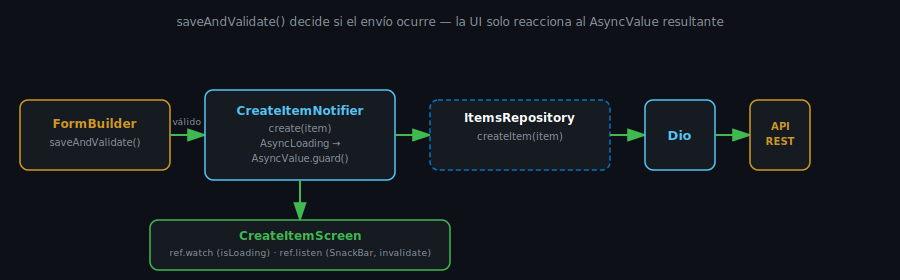

# Envío de Formularios con Dio y Riverpod

## 🎯 Objetivos

Al finalizar este archivo, comprenderás:

- Por qué el envío de un formulario es una "acción", distinta de un `AsyncNotifier` de lectura
- Cómo modelar loading/éxito/error de un envío con `AsyncNotifier<void>`
- Cómo deshabilitar el formulario y mostrar feedback según ese estado



## 📋 Conceptos Clave

### 1. Leer datos vs enviar datos — dos formas distintas de AsyncNotifier

Hasta semana 6, todo `AsyncNotifier` seguía el mismo patrón: `build()` retorna un `Future<T>` que
se ejecuta automáticamente al observarse (`ItemsNotifier` cargando la lista). Un envío de
formulario es distinto: **no debe ejecutarse solo** — debe esperar a que el usuario presione
"Enviar". Para esto, `build()` retorna un estado "idle" inmediato, y un **método** dispara la
acción:

```dart
@riverpod
class CreateItemNotifier extends _$CreateItemNotifier {
  @override
  Future<void> build() async {
    // idle — no hace nada hasta que se llama create()
  }

  Future<void> create(Item item) async {
    state = const AsyncLoading();
    final repository = ref.read(itemsRepositoryProvider);
    state = await AsyncValue.guard(() => repository.createItem(item));
  }
}
```

- `state = const AsyncLoading()` — dispara el estado de carga manualmente, antes de esperar el
  resultado.
- `AsyncValue.guard(() => ...)` ejecuta el `Future`, y automáticamente lo envuelve en
  `AsyncData(null)` si tiene éxito, o `AsyncError` si lanza una excepción — evitas escribir
  `try`/`catch` a mano.

### 2. Consumir el estado del envío desde la UI

```dart
class CreateItemScreen extends ConsumerWidget {
  const CreateItemScreen({super.key});

  @override
  Widget build(BuildContext context, WidgetRef ref) {
    final submitState = ref.watch(createItemProvider);
    final isLoading = submitState.isLoading;

    ref.listen(createItemProvider, (previous, next) {
      if (next.hasError && !next.isLoading) {
        ScaffoldMessenger.of(context).showSnackBar(
          SnackBar(content: Text('${next.error}')),
        );
      }
      if (previous?.isLoading == true && next.hasValue && !next.hasError) {
        ScaffoldMessenger.of(context).showSnackBar(
          const SnackBar(content: Text('Elemento creado con éxito')),
        );
        Navigator.of(context).pop();
      }
    });

    return FormBuilder(
      key: _formKey,
      child: Column(
        children: [
          FormBuilderTextField(name: 'name', enabled: !isLoading),
          ElevatedButton(
            onPressed: isLoading
                ? null
                : () {
                    if (_formKey.currentState!.saveAndValidate()) {
                      final values = _formKey.currentState!.value;
                      ref.read(createItemProvider.notifier).create(
                        Item(id: '', name: values['name'] as String, description: ''),
                      );
                    }
                  },
            child: isLoading
                ? const SizedBox(
                    width: 20,
                    height: 20,
                    child: CircularProgressIndicator(strokeWidth: 2),
                  )
                : const Text('Enviar'),
          ),
        ],
      ),
    );
  }
}
```

Puntos clave:

- **`ref.watch()` para leer el estado y reconstruir la UI** (deshabilitar campos, cambiar el
  botón). **`ref.listen()` para efectos secundarios** (`SnackBar`, navegación) — el mismo
  principio de semana 5, ahora aplicado a un envío real.
- `enabled: !isLoading` en cada campo — el usuario no puede seguir editando mientras el request
  está en curso.
- `onPressed: isLoading ? null : () { ... }` — un botón deshabilitado (`onPressed: null`) se ve
  visualmente distinto y no responde a toques, comunicando "espera" sin texto adicional.

### 3. Por qué invalidar itemsProvider al terminar

Después de crear un elemento, la lista de semana 6 (`itemsProvider`) sigue mostrando los datos
viejos — no se entera solo. El patrón correcto es invalidarla explícitamente tras el éxito:

```dart
if (previous?.isLoading == true && next.hasValue && !next.hasError) {
  ref.invalidate(itemsProvider); // fuerza recarga de la lista al volver
  Navigator.of(context).pop();
}
```

## ✅ Checklist de Verificación

- [ ] Sé explicar la diferencia entre un `AsyncNotifier` de lectura y uno de acción
- [ ] Sé usar `AsyncValue.guard()` para evitar `try`/`catch` manual
- [ ] Sé combinar `ref.watch()` (UI) con `ref.listen()` (efectos secundarios) en un mismo widget
- [ ] Sé por qué hay que invalidar `itemsProvider` tras crear un elemento

## 📚 Próximo paso

[Buenas Prácticas de Formularios Móviles →](06-buenas-practicas-de-formularios-moviles.md)
