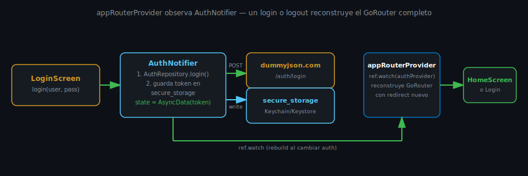

# Guards de Rutas con go_router

## 🎯 Objetivos

Al finalizar este archivo, comprenderás:

- Cómo redirigir a `/login` cuando el usuario no está autenticado
- Por qué este proyecto reconstruye el `GoRouter` completo en vez de usar `refreshListenable`
- Cómo `appRouter` pasa de ser una constante a ser un provider de Riverpod

## 📋 Conceptos Clave



### 1. `redirect` — la función que decide a dónde navegar realmente

`GoRouter` acepta una función `redirect` que se evalúa antes de cada navegación — retorna una
ruta nueva para redirigir, o `null` para dejar pasar la navegación original:

```dart
redirect: (context, state) {
  final isLoggedIn = /* ... */;
  final isLoggingIn = state.uri.toString() == '/login';

  if (!isLoggedIn && !isLoggingIn) return '/login'; // no autenticado → a login
  if (isLoggedIn && isLoggingIn) return '/';         // ya autenticado → afuera de login
  return null;                                        // sin cambios
}
```

### 2. El problema: `redirect` no observa Riverpod por sí solo

`GoRouter` es un objeto plano de Dart, no un widget — su función `redirect` no se re-ejecuta
sola cuando cambia el estado de `AuthNotifier`. Si `appRouter` fuera la constante `final
appRouter = GoRouter(...)` de semanas 3-8, un login exitoso nunca dispararía la navegación a
`/`: el usuario tendría que forzar manualmente algún cambio de ruta para que `redirect` se
volviera a evaluar.

### 3. La solución de este proyecto: `appRouter` como provider

```dart
@riverpod
GoRouter appRouter(Ref ref) {
  final isLoggedIn = ref.watch(authProvider).value != null;

  return GoRouter(
    initialLocation: isLoggedIn ? '/' : '/login',
    redirect: (context, state) {
      final isLoggingIn = state.uri.toString() == '/login';
      if (!isLoggedIn && !isLoggingIn) return '/login';
      if (isLoggedIn && isLoggingIn) return '/';
      return null;
    },
    routes: [ /* ... */ ],
  );
}
```

`ref.watch(authProvider)` dentro del provider hace que **todo `appRouterProvider` se vuelva a
ejecutar** cada vez que el estado de auth cambia — login o logout construyen un `GoRouter` nuevo,
con `isLoggedIn` ya actualizado capturado en el closure de `redirect`. En `main.dart`,
`MaterialApp.router(routerConfig: ref.watch(appRouterProvider))` reemplaza el router activo por
el nuevo automáticamente.

### 4. Por qué no `refreshListenable` (y cuándo sí usarlo)

La alternativa más conocida es pasarle a `GoRouter` un `refreshListenable` (un `Listenable` que,
al notificar, hace que **el mismo** `GoRouter` vuelva a evaluar `redirect` sin reconstruirse) —
preserva mejor el historial de navegación interno en apps con stacks de navegación complejos.

Este proyecto reconstruye el `GoRouter` completo a propósito: es más simple de razonar (un
provider más, sin una clase `ChangeNotifier` adicional conectada a un `Stream`), y el costo —
perder el historial de navegación al hacer login/logout — es exactamente el comportamiento
deseado: después de un logout no queremos poder "atrás" hacia pantallas de una sesión cerrada.
Si tu app necesita preservar navegación profunda a través de cambios de auth, `refreshListenable`
es la herramienta correcta — search "GoRouterRefreshStream" en la documentación de `go_router`
cuando lo necesites.

## ✅ Checklist de Verificación

- [ ] Sé escribir un `redirect` que envía a `/login` si no hay sesión
- [ ] Sé por qué `redirect` no reacciona solo a cambios de Riverpod
- [ ] Sé por qué `appRouter` pasó de ser una constante a ser un `@riverpod GoRouter appRouter(Ref ref)`
- [ ] Sé cuándo preferirías `refreshListenable` sobre reconstruir el router completo

## 📚 Próximo paso

[Firebase Auth como Alternativa y Buenas Prácticas →](06-firebase-auth-como-alternativa-y-buenas-practicas.md)
