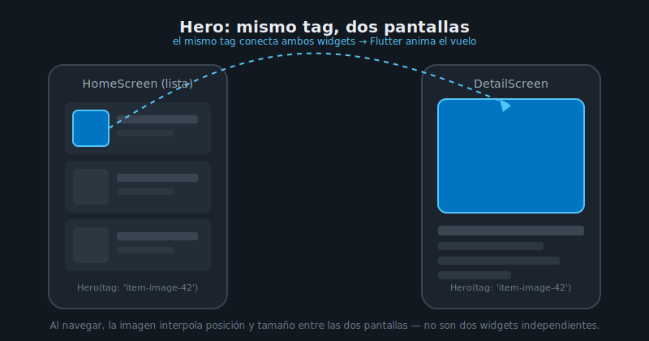

# Hero Animations

## 🎯 Objetivos

Al finalizar este archivo, comprenderás:

- Qué problema resuelve `Hero` al navegar entre pantallas con `go_router`
- Cómo emparejar dos `Hero` con el mismo `tag` para que Flutter calcule el "vuelo" automáticamente
- Errores comunes que rompen la animación silenciosamente

## 📋 Conceptos Clave

### 1. El problema: navegar se siente abrupto

Desde semana 3 navegas con `go_router` — al hacer `context.push('/items/$id')`, la pantalla nueva
entra con una transición genérica (deslizar o fundir), pero **el elemento que el usuario tocó**
(la imagen de un producto en una lista) desaparece de golpe y reaparece en otro lugar de la
pantalla de detalle. `Hero` conecta visualmente ambos widgets: en vez de dos elementos
independientes, el usuario ve **uno solo** que vuela de su posición en la lista hasta su posición
en el detalle.



### 2. El emparejamiento: mismo `tag`, dos pantallas

`Hero` funciona por **coincidencia de `tag`**. Flutter recorre el árbol de la pantalla de origen y
el de destino buscando dos widgets `Hero` con el mismo `tag`; si los encuentra, construye la
animación de vuelo automáticamente — interpola posición, tamaño y forma entre ambos.

```dart
// Pantalla de origen (lista)
Hero(
  tag: 'item-image-${item.id}',
  child: Image.network(item.imageUrl, fit: BoxFit.cover),
)

// Pantalla de destino (detalle) — MISMO tag
Hero(
  tag: 'item-image-${item.id}',
  child: Image.network(item.imageUrl, fit: BoxFit.cover),
)
```

El `tag` debe ser **único por instancia** (por eso incluye `item.id`, no un string fijo) — si dos
`Hero` visibles en la misma pantalla comparten `tag`, Flutter lanza un error en tiempo de
desarrollo (`There are multiple heroes that share the same tag`).

### 3. Errores comunes que rompen el vuelo

- **Tags que no coinciden exactamente**: `'item-$id'` en una pantalla y `'item_$id'` en la otra —
  son strings distintos, Flutter no los empareja y no hay error visible, simplemente no anima.
- **`Hero` sin `Material`/`Scaffold` ancestro**: el vuelo se renderiza en un `Overlay` que necesita
  un `MaterialApp`/`Navigator` válido en el árbol — normal en cualquier pantalla montada por
  `go_router`, pero falla si pruebas un `Hero` aislado en un test sin `MaterialApp`.
- **Child con `Image.network` de tamaños distintos entre pantallas**: si la imagen de la lista y
  la del detalle no son literalmente el mismo widget (mismo `BoxFit`, misma imagen), el vuelo se ve
  con un "salto" de aspecto — usa el mismo widget hijo en ambas pantallas, solo cambia el tamaño
  del `Hero` que lo envuelve.
- **Envolver todo el `ItemCard`** en vez de solo la imagen: `Hero` anima *un* elemento — si envuelves
  una tarjeta completa con texto, botones y layout distinto entre pantallas, el vuelo intenta
  interpolar toda esa estructura y el resultado se ve distorsionado. Limita el `Hero` al elemento
  visual central (la imagen), no al contenedor completo.

### 4. Hero con go_router

`go_router` no requiere configuración adicional para `Hero` — usa el `Navigator` de Flutter por
debajo, así que el emparejamiento de `tag` funciona igual que con `Navigator.push` clásico. Lo
único a vigilar: la ruta de destino debe montar el `Hero` de destino **en el primer frame**, no
detrás de un `FutureBuilder` que muestre un loader primero — si el `Hero` de destino no existe
todavía cuando arranca la transición, Flutter no encuentra pareja y la imagen simplemente aparece
sin vuelo. Por eso el patrón común es pasar los datos ya cargados (`item` completo) al navegar, no
solo el `id`, para que el detalle pueda montar su `Hero` de inmediato mientras el resto de datos
(si los hay) carga en segundo plano.

## ✅ Checklist de Verificación

- [ ] Sé explicar el problema visual que resuelve `Hero` frente a una transición genérica
- [ ] Sé que el emparejamiento depende exclusivamente de que el `tag` coincida exactamente
- [ ] Reconozco al menos tres errores comunes que rompen el vuelo sin lanzar excepción
- [ ] Sé por qué el `Hero` debe envolver el elemento visual central, no la tarjeta completa

## 📚 Próximo paso

[AnimatedSwitcher y AnimatedList →](05-animatedswitcher-y-animatedlist.md)
