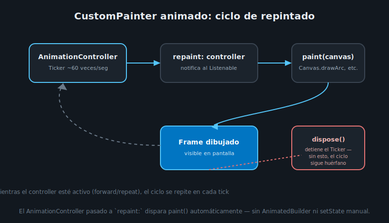

# CustomPainter Animado

## 🎯 Objetivos

Al finalizar este archivo, comprenderás:

- Cómo dibujar formas custom con `CustomPainter` y `Canvas`
- Cómo conectar un `AnimationController` para que el painter se repinte en cada frame
- Por qué `shouldRepaint` existe y qué retornar ahí

## 📋 Conceptos Clave

### 1. Qué es CustomPainter

Todo lo que has construido hasta ahora (`Container`, `Icon`, `Text`) son widgets que Flutter ya
sabe dibujar. `CustomPainter` es la puerta de salida cuando necesitas una forma que ningún widget
provee — un anillo de progreso custom, un gráfico, una firma a mano alzada. Recibe un `Canvas` (la
superficie de dibujo) y un `Paint` (color, grosor, estilo del trazo).

```dart
class ProgressRingPainter extends CustomPainter {
  ProgressRingPainter({required this.progress});

  final double progress; // 0.0 – 1.0

  @override
  void paint(Canvas canvas, Size size) {
    final center = size.center(Offset.zero);
    final radius = size.shortestSide / 2 - 8;

    final trackPaint = Paint()
      ..color = Colors.grey.shade300
      ..style = PaintingStyle.stroke
      ..strokeWidth = 8;
    canvas.drawCircle(center, radius, trackPaint);

    final progressPaint = Paint()
      ..color = Colors.indigo
      ..style = PaintingStyle.stroke
      ..strokeWidth = 8
      ..strokeCap = StrokeCap.round;
    canvas.drawArc(
      Rect.fromCircle(center: center, radius: radius),
      -pi / 2, // empieza arriba (12 en punto)
      2 * pi * progress, // cuánto arco dibujar según el progreso
      false,
      progressPaint,
    );
  }

  @override
  bool shouldRepaint(ProgressRingPainter oldDelegate) => oldDelegate.progress != progress;
}
```

`CustomPaint(painter: ProgressRingPainter(progress: 0.7), size: const Size(80, 80))` dibuja un
anillo estático con 70% de progreso. Para animarlo, falta conectar un `AnimationController`.
(`drawArc` usa `pi` de `import 'dart:math';` — no es específico de Flutter, es la constante
matemática estándar de Dart.)



### 2. Conectar el AnimationController: el parámetro repaint

`CustomPainter` acepta un `Listenable` en su constructor (`super(repaint: ...)`) — cuando ese
`Listenable` notifica un cambio, Flutter vuelve a llamar `paint()` automáticamente, sin que
necesites `AnimatedBuilder` ni `setState`:

```dart
class ProgressRingPainter extends CustomPainter {
  ProgressRingPainter({required Animation<double> animation})
      : progress = animation,
        super(repaint: animation);

  final Animation<double> progress;

  @override
  void paint(Canvas canvas, Size size) {
    // usa progress.value en vez de un campo fijo
    // ...
  }

  @override
  bool shouldRepaint(covariant ProgressRingPainter oldDelegate) => true;
}
```

Un `AnimationController` **es** un `Listenable` — pasarlo directo a `repaint:` es suficiente para
que el painter se repinte en cada tick, sin código adicional de suscripción.

### 3. shouldRepaint — evitar repintar cuando nada cambió

Flutter llama `shouldRepaint(oldDelegate)` antes de cada repintado potencial para decidir si de
verdad hace falta. Cuando el painter se alimenta de un `Animation` vía `repaint:`, el repintado ya
está garantizado por ese mecanismo — `shouldRepaint` puede retornar `true` sin costo real. Pero
cuando el painter recibe un valor fijo (como el primer ejemplo, sin `repaint:`), comparar el
campo relevante (`oldDelegate.progress != progress`) evita repintar cuando Flutter reconstruye el
widget por otra razón (ej. un rebuild del padre) sin que el valor real haya cambiado.

### 4. CustomPaint como widget final

```dart
AnimatedBuilder(
  animation: _controller,
  builder: (context, _) => CustomPaint(
    size: const Size(80, 80),
    painter: ProgressRingPainter(animation: _controller),
  ),
)
```

Envolver en `AnimatedBuilder` aquí es opcional cuando ya usas `repaint:` en el painter — ambos
mecanismos logran el repintado en cada frame; usa uno u otro, no ambos a la vez para el mismo
controller (sería redundante).

## ✅ Checklist de Verificación

- [ ] Sé dibujar una forma básica con `Canvas` (`drawCircle`, `drawArc`) y `Paint`
- [ ] Sé conectar un `AnimationController` a un `CustomPainter` con el parámetro `repaint`
- [ ] Sé qué debe retornar `shouldRepaint` según si el painter recibe un valor fijo o un
      `Listenable`
- [ ] Sé que no hace falta envolver en `AnimatedBuilder` un painter que ya usa `repaint:`

## 📚 Próximo paso

[Buenas Prácticas: Ciclo de Vida y Performance →](06-buenas-practicas-ciclo-de-vida.md)
