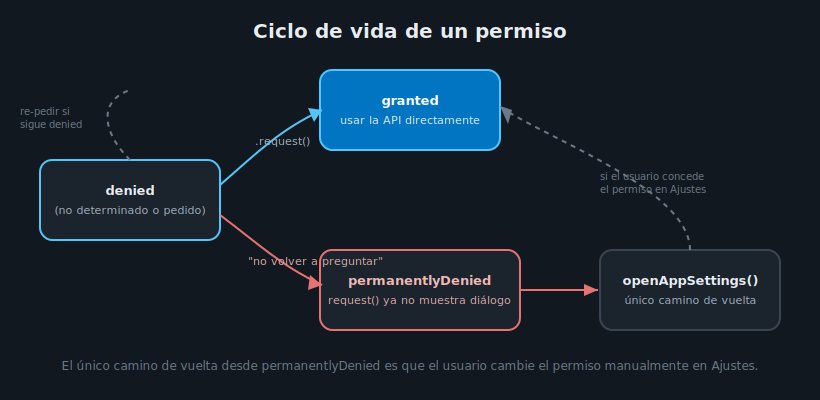

# Permisos con permission_handler

## 🎯 Objetivos

Al finalizar este archivo, comprenderás:

- Por qué acceder a hardware del dispositivo (cámara, ubicación) requiere permiso explícito del
  usuario, a diferencia de todo lo visto hasta semana 12
- El ciclo de vida de un permiso: no determinado → concedido/denegado → denegado permanentemente
- Cómo verificar y solicitar un permiso con `permission_handler`, y qué hacer en cada resultado

## 📋 Conceptos Clave

### 1. Por qué esto es distinto a todo lo anterior

Desde semana 1, cada widget que construiste corría dentro de la sandbox de tu propia app — sin
tocar nada que otra app o el sistema operativo controle. Cámara, ubicación GPS, contactos,
micrófono: estos SÍ son recursos sensibles del dispositivo, y tanto Android como iOS exigen que el
usuario **apruebe explícitamente** cada uno antes de que tu código pueda usarlo. Esto no es una
particularidad de Flutter — es una capa de seguridad del sistema operativo que cualquier app nativa
(Kotlin, Swift) también debe atravesar.



### 2. Los estados de un permiso

`permission_handler` modela el estado de un permiso con el enum `PermissionStatus`:

| Estado | Significado |
|---|---|
| `PermissionStatus.granted` | El usuario ya concedió el permiso — puedes usar la API directamente |
| `PermissionStatus.denied` | El usuario aún no decidió, o denegó una vez — puedes volver a pedirlo |
| `PermissionStatus.permanentlyDenied` | El usuario denegó marcando "no volver a preguntar" (Android) o denegó dos veces (iOS) — pedirlo de nuevo NO muestra el diálogo, hay que enviarlo a Ajustes |
| `PermissionStatus.restricted` | Bloqueado por control parental o política del dispositivo (principalmente iOS) |

### 3. El patrón: check → request → actuar según resultado

```dart
Future<bool> ensureCameraPermission() async {
  var status = await Permission.camera.status;

  if (status.isGranted) return true;

  if (status.isDenied) {
    status = await Permission.camera.request();
  }

  if (status.isPermanentlyDenied) {
    // El diálogo del sistema ya no aparecerá — solo queda enviar al usuario
    // a la pantalla de ajustes de la app.
    await openAppSettings();
    return false;
  }

  return status.isGranted;
}
```

`Permission.camera.status` consulta sin mostrar ningún diálogo — úsalo para decidir si necesitas
pedirlo. `Permission.camera.request()` sí puede mostrar el diálogo nativo (solo si el estado no es
ya `permanentlyDenied`, en cuyo caso el sistema operativo lo ignora silenciosamente). Por eso
`permanentlyDenied` se maneja aparte, redirigiendo a `openAppSettings()` en vez de insistir con
`request()`.

### 4. Dónde verificar el permiso: antes de la API, no dentro del widget de UI

El chequeo de permiso pertenece a la capa que va a usar la API nativa (un repository o un caso de
uso), no a un widget de presentación — igual que un widget nunca debería instanciar un `Dio`
directamente (semana 6), tampoco debería llamar `Permission.camera.request()` en medio de un
`build()`. Esto también facilita testear la lógica de negocio con un permiso simulado (ver
teoría 06), sin depender del diálogo real del sistema operativo.

### 5. Permisos declarados, no solo solicitados en runtime

Pedir el permiso en runtime **no alcanza** — cada plataforma exige además que el permiso esté
**declarado** en un archivo de configuración nativo:

- **Android**: `<uses-permission android:name="android.permission.CAMERA"/>` en
  `android/app/src/main/AndroidManifest.xml`.
- **iOS**: una clave `NSCameraUsageDescription` (con el texto que el usuario verá en el diálogo)
  en `ios/Runner/Info.plist`.

Sin esa declaración, `permission_handler` reporta el permiso como denegado sin siquiera mostrar el
diálogo — un error común que parece un bug de `permission_handler` pero es, en realidad, una
declaración faltante en el proyecto nativo.

## ✅ Checklist de Verificación

- [ ] Sé por qué acceder a cámara/ubicación exige permiso explícito, a diferencia de todo lo
      anterior en el curso
- [ ] Sé los cuatro estados de `PermissionStatus` y qué hacer en cada uno
- [ ] Sé el patrón check → request → actuar, y por qué `permanentlyDenied` se maneja aparte con
      `openAppSettings()`
- [ ] Sé que el permiso debe estar declarado en `AndroidManifest.xml`/`Info.plist`, además de
      solicitado en runtime

## 📚 Próximo paso

[Cámara con image_picker →](02-camara-con-image-picker.md)
