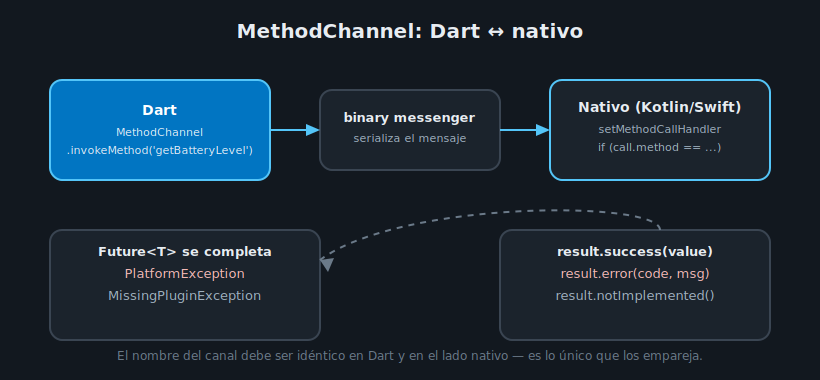

# Platform Channels: MethodChannel

## 🎯 Objetivos

Al finalizar este archivo, comprenderás:

- Qué es un platform channel y cuándo necesitas escribir uno (más allá de usar un plugin existente)
- Cómo invocar código nativo desde Dart con `MethodChannel.invokeMethod`
- Cómo responde el lado nativo (Android/Kotlin, iOS/Swift) a esa invocación

## 📋 Conceptos Clave

### 1. Cuándo escribir tu propio platform channel

Todo lo de teorías 01-03 (`permission_handler`, `image_picker`, `geolocator`) son plugins ya
escritos por la comunidad — alguien más ya construyó el platform channel por ti. Escribes tu
**propio** platform channel solo cuando necesitas una API nativa para la que no existe un plugin
en pub.dev — por ejemplo, un SDK propietario del banco/institución que solo distribuye una
librería Android/iOS nativa, sin versión Flutter.

### 2. Cómo se comunican Dart y el código nativo

Un `MethodChannel` es un canal con nombre (una cadena única, por convención con formato de
paquete invertido) por donde Dart y el código nativo se pasan mensajes serializados —
`invokeMethod` del lado Dart, un `MethodCallHandler` del lado nativo:



```dart
class BatteryService {
  static const _channel = MethodChannel('com.bcflutter.week13/battery');

  Future<int> getBatteryLevel() async {
    final level = await _channel.invokeMethod<int>('getBatteryLevel');
    return level ?? -1;
  }
}
```

`invokeMethod` retorna un `Future` porque la llamada cruza a código nativo de forma asíncrona —
igual que una petición HTTP con Dio, aunque aquí no hay red de por medio, solo una frontera entre
el motor de Flutter y la plataforma anfitriona.

### 3. El lado nativo: Android (Kotlin)

En `android/app/src/main/kotlin/.../MainActivity.kt`:

```kotlin
import io.flutter.embedding.android.FlutterActivity
import io.flutter.embedding.engine.FlutterEngine
import io.flutter.plugin.common.MethodChannel

class MainActivity : FlutterActivity() {
    private val CHANNEL = "com.bcflutter.week13/battery"

    override fun configureFlutterEngine(flutterEngine: FlutterEngine) {
        super.configureFlutterEngine(flutterEngine)
        MethodChannel(flutterEngine.dartExecutor.binaryMessenger, CHANNEL).setMethodCallHandler { call, result ->
            if (call.method == "getBatteryLevel") {
                val batteryLevel = getBatteryLevel()
                if (batteryLevel != -1) {
                    result.success(batteryLevel)
                } else {
                    result.error("UNAVAILABLE", "Battery level not available.", null)
                }
            } else {
                result.notImplemented()
            }
        }
    }

    private fun getBatteryLevel(): Int {
        val batteryManager = getSystemService(BATTERY_SERVICE) as BatteryManager
        return batteryManager.getIntProperty(BatteryManager.BATTERY_PROPERTY_CAPACITY)
    }
}
```

El nombre del canal (`"com.bcflutter.week13/battery"`) debe ser **idéntico** en Dart y en Kotlin —
es la única forma en que ambos lados se emparejan, igual que el `tag` de un `Hero` (semana 11).

### 4. El lado nativo: iOS (Swift), como referencia

```swift
import Flutter
import UIKit

@main
@objc class AppDelegate: FlutterAppDelegate {
  override func application(
    _ application: UIApplication,
    didFinishLaunchingWithOptions launchOptions: [UIApplication.LaunchOptionsKey: Any]?
  ) -> Bool {
    let controller = window?.rootViewController as! FlutterViewController
    let channel = FlutterMethodChannel(name: "com.bcflutter.week13/battery", binaryMessenger: controller.binaryMessenger)

    channel.setMethodCallHandler { call, result in
      if call.method == "getBatteryLevel" {
        result(Int(UIDevice.current.batteryLevel * 100))
      } else {
        result(FlutterMethodNotImplemented)
      }
    }
    GeneratedPluginRegistrant.register(with: self)
    return super.application(application, didFinishLaunchingWithOptions: launchOptions)
  }
}
```

Este bootcamp no puede verificar el lado iOS en Docker (requiere macOS con Xcode — ver
`docs/docker-setup.md`); el código de arriba es una referencia fiel al patrón, pero solo el lado
Android se compila y verifica en el ejercicio de esta semana.

### 5. result.success / result.error / result.notImplemented

El objeto `result` que recibe el `MethodCallHandler` nativo tiene exactamente tres formas de
responder:

| Llamada nativa | Qué recibe Dart |
|---|---|
| `result.success(value)` | El `Future<T>` de `invokeMethod` se completa con `value` |
| `result.error(code, message, details)` | El `Future` lanza una `PlatformException` (ver teoría 05) |
| `result.notImplemented()` | El `Future` lanza `MissingPluginException` — el método no existe en ese canal |

## ✅ Checklist de Verificación

- [ ] Sé cuándo un platform channel propio es necesario (vs. usar un plugin existente)
- [ ] Sé invocar un método nativo desde Dart con `MethodChannel.invokeMethod`
- [ ] Sé el rol de `setMethodCallHandler` y las tres formas de responder (`success`/`error`/
      `notImplemented`)
- [ ] Sé que el nombre del canal debe coincidir exactamente entre Dart y el lado nativo

## 📚 Próximo paso

[Manejo de Errores de Plataforma →](05-manejo-de-errores-de-plataforma.md)
