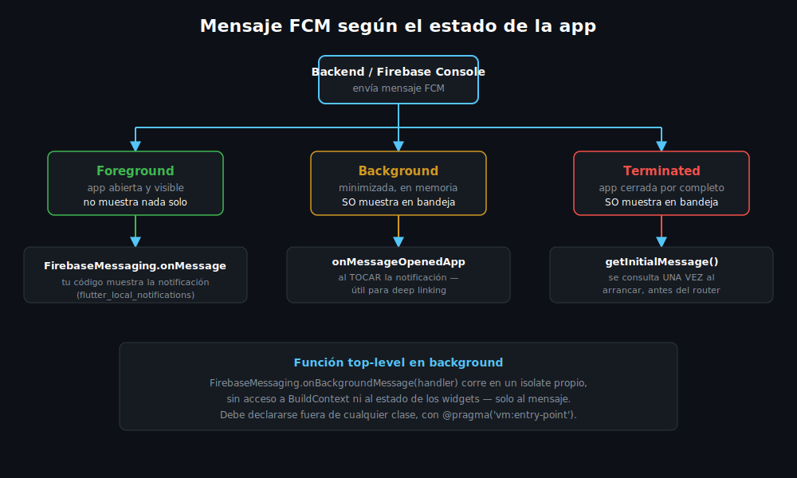

# Manejo de Mensajes: Foreground, Background y Terminated

## 🎯 Objetivos

Al finalizar este archivo, comprenderás:

- Los tres estados posibles de la app cuando llega un mensaje FCM
- Qué callback de `firebase_messaging` corresponde a cada estado
- Por qué Android no muestra el mensaje automáticamente en foreground
- Cómo mostrar una notificación local con `flutter_local_notifications`

## 📋 Conceptos Clave

### 1. Los tres estados de la app

Un mensaje FCM puede llegar mientras la app está en tres estados distintos, y cada uno dispara
un callback diferente:



| Estado | La app está... | Callback |
|---|---|---|
| **Foreground** | Abierta y visible | `FirebaseMessaging.onMessage` |
| **Background** | Minimizada, corriendo en memoria | `FirebaseMessaging.onMessageOpenedApp` (al tocar) |
| **Terminated** | Cerrada por completo | `FirebaseMessaging.instance.getInitialMessage()` |

> 💡 **Diferencia con otros frameworks**: en desarrollo web, el Service Worker maneja push
> incluso con la pestaña cerrada gracias al navegador. En mobile no hay equivalente único — el
> sistema operativo (no tu código) decide si despierta la app o solo muestra la notificación en
> la bandeja del sistema.

### 2. Foreground — tú controlas si se muestra

Con la app abierta, FCM **no** muestra ninguna notificación visual por sí solo — solo entrega el
mensaje a tu código vía `onMessage`. Depende de ti decidir si lo muestras:

```dart
FirebaseMessaging.onMessage.listen((RemoteMessage message) {
  final notification = message.notification;
  if (notification == null) return;

  // Sin esto, el usuario con la app abierta nunca se entera del mensaje —
  // a diferencia de background/terminated, donde el sistema operativo sí
  // lo muestra automáticamente en la bandeja.
  _showLocalNotification(notification.title, notification.body);
});
```

### 3. `flutter_local_notifications` — mostrar la notificación local

```dart
import 'package:flutter_local_notifications/flutter_local_notifications.dart';

final _localNotifications = FlutterLocalNotificationsPlugin();

Future<void> _showLocalNotification(String? title, String? body) async {
  const androidDetails = AndroidNotificationDetails(
    'high_importance_channel', // debe coincidir con el canal creado al iniciar
    'Notificaciones importantes',
    importance: Importance.max,
  );

  // flutter_local_notifications 22+: show() usa parámetros nombrados —
  // solo `id` es posicional-requerido, el resto es opcional.
  await _localNotifications.show(
    id: 0,
    title: title,
    body: body,
    notificationDetails: const NotificationDetails(android: androidDetails),
  );
}
```

### 4. Background handler — función top-level obligatoria

Cuando la app está en background, Android puede despertarla en un **isolate separado** para
procesar el mensaje antes de que el usuario lo toque. Ese código debe ser una función top-level
(fuera de cualquier clase), porque el isolate no tiene acceso al estado de tus widgets:

```dart
// Debe estar FUERA de cualquier clase, y registrarse antes de runApp().
@pragma('vm:entry-point')
Future<void> firebaseMessagingBackgroundHandler(RemoteMessage message) async {
  // Aquí NO hay acceso a BuildContext ni a providers/cubits — solo a datos
  // del propio mensaje. Útil para actualizar un contador local o loguear.
  debugPrint('Mensaje en background: ${message.messageId}');
}

Future<void> main() async {
  WidgetsFlutterBinding.ensureInitialized();
  await Firebase.initializeApp(options: DefaultFirebaseOptions.currentPlatform);
  FirebaseMessaging.onBackgroundMessage(firebaseMessagingBackgroundHandler);
  runApp(const MyApp());
}
```

### 5. Terminated — el mensaje que abrió la app

Si el usuario tocó una notificación con la app completamente cerrada, hay que preguntarle a FCM
si fue así **una sola vez**, al arrancar:

```dart
Future<void> checkInitialMessage() async {
  final initialMessage = await FirebaseMessaging.instance.getInitialMessage();
  if (initialMessage != null) {
    // La app se abrió por esta notificación — navegar según su payload
    // (ver teoría 05, deep linking).
  }
}
```

## ⚠️ Errores Comunes

- **Esperar que Android muestre el mensaje solo en foreground**: es exactamente lo contrario a
  background/terminated, donde el sistema operativo sí lo hace automáticamente.
- **Poner el background handler dentro de una clase o como closure**: falla en tiempo de
  ejecución — debe ser una función top-level con `@pragma('vm:entry-point')`.
- **No consultar `getInitialMessage()` antes de montar el router**: la navegación al abrir desde
  terminated se pierde si se consulta tarde (ver teoría 05).

## 📚 Recursos Adicionales

- [FCM — Recibir mensajes en Flutter](https://firebase.google.com/docs/cloud-messaging/flutter/receive)
- [flutter_local_notifications — pub.dev](https://pub.dev/packages/flutter_local_notifications)

## ✅ Checklist de Verificación

Antes de continuar, verifica que entiendes:

- [ ] Qué callback corresponde a cada uno de los tres estados
- [ ] Por qué el foreground necesita mostrar la notificación manualmente
- [ ] Por qué el background handler debe ser una función top-level
