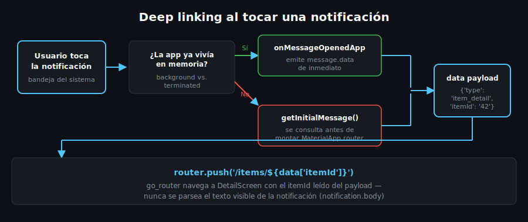

# Deep Linking desde Notificaciones

## 🎯 Objetivos

Al finalizar este archivo, comprenderás:

- Cómo codificar a dónde debe navegar la app en el `data` payload de un mensaje
- Cómo conectar los tres callbacks de mensajes con `go_router`
- Por qué el caso terminated necesita resolverse antes de montar el router
- Cómo evitar navegar dos veces por el mismo mensaje

## 📋 Conceptos Clave

### 1. El payload lleva la ruta, no la UI

Un mensaje FCM tiene dos partes: `notification` (título/cuerpo, lo que ve el usuario) y `data`
(pares clave-valor invisibles). El deep linking se resuelve leyendo `data`, nunca parseando el
texto de la notificación:



```dart
// Convención de este proyecto: data = {'type': 'item_detail', 'itemId': '42'}
void _handleNotificationTap(RemoteMessage message) {
  final type = message.data['type'];
  final itemId = message.data['itemId'];

  if (type == 'item_detail' && itemId != null) {
    _router.push('/items/$itemId');
  }
}
```

### 2. Conectar `onMessageOpenedApp` (background → foreground)

```dart
FirebaseMessaging.onMessageOpenedApp.listen(_handleNotificationTap);
```

Este stream solo emite cuando la app **ya existía** en memoria (background) y el usuario tocó la
notificación para traerla al frente — con `GoRouter` ya inicializado, `_router.push(...)`
funciona de inmediato.

### 3. Conectar `getInitialMessage()` (terminated → foreground)

Cuando la app arranca desde cero por un toque, el router aún no existe en el primer frame. Hay
que resolver el mensaje inicial **antes** de construir `MaterialApp.router`:

```dart
Future<void> main() async {
  WidgetsFlutterBinding.ensureInitialized();
  await Firebase.initializeApp(options: DefaultFirebaseOptions.currentPlatform);

  final initialMessage = await FirebaseMessaging.instance.getInitialMessage();

  runApp(MyApp(initialMessage: initialMessage));
}

class MyApp extends StatelessWidget {
  const MyApp({super.key, this.initialMessage});

  final RemoteMessage? initialMessage;

  @override
  Widget build(BuildContext context) {
    // El router lee la ruta inicial de initialMessage.data en vez de '/'
    // cuando existe — así el deep link también funciona en cold start.
    final initialLocation = _resolveInitialLocation(initialMessage);
    return MaterialApp.router(routerConfig: buildRouter(initialLocation));
  }
}
```

### 4. Evitar navegar dos veces

`onMessageOpenedApp` y `getInitialMessage()` son mutuamente excluyentes por diseño — un mismo
toque solo dispara uno de los dos, según si la app ya vivía en memoria o no. No hace falta
deduplicar manualmente, pero sí evitar suscribirse a `onMessageOpenedApp` más de una vez (por
ejemplo, si el widget que lo hace se reconstruye).

### 5. Casos de Uso Móvil

Instagram navega directamente al post o al chat mencionado en la notificación, no a la pantalla
de inicio — el `data` payload lleva el ID exacto del recurso, igual que el patrón de `itemId`
usado aquí.

## ⚠️ Errores Comunes

- **Parsear el texto de `notification.body`** para decidir la ruta: es texto para humanos, puede
  cambiar de redacción — usa siempre el `data` payload, pensado para máquinas.
- **Llamar `getInitialMessage()` después de que el router ya montó `/`**: la navegación al deep
  link se pierde porque el usuario ya está viendo la pantalla de inicio.
- **Suscribirse a `onMessageOpenedApp` dentro de `build()`**: crea una nueva suscripción en cada
  rebuild — hazlo una sola vez en `initState()` o en un servicio de inicialización.

## 📚 Recursos Adicionales

- [FCM — Mensajes con datos](https://firebase.google.com/docs/cloud-messaging/concept-options#notifications_and_data_messages)
- [go_router — Redirection](https://pub.dev/documentation/go_router/latest/topics/Redirection-topic.html)

## ✅ Checklist de Verificación

Antes de continuar, verifica que entiendes:

- [ ] Por qué el deep link usa `data`, no `notification`
- [ ] Qué diferencia a `onMessageOpenedApp` de `getInitialMessage()`
- [ ] Por qué el mensaje inicial debe resolverse antes de montar el router
