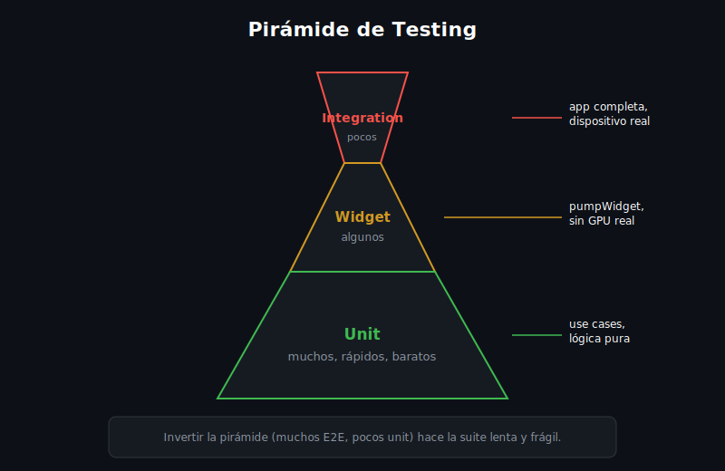

# Unit Testing con flutter_test

## 🎯 Objetivos

Al finalizar este archivo, comprenderás:

- Qué es un unit test y por qué es la base de la pirámide de testing
- La estructura `group`/`test`/`expect` de `flutter_test`
- Cómo testear un use case sin tocar red, base de datos ni UI
- Los matchers más comunes de `expect`

## 📋 Conceptos Clave

### 1. La pirámide de testing



Un unit test prueba **una unidad de lógica aislada** — una función, un método, una clase — sin
Flutter, sin widgets, sin red. Es el tipo de test más rápido y más barato de mantener, por eso
debe haber muchos más unit tests que de cualquier otro tipo.

> 💡 **Diferencia con otros frameworks**: el mismo principio existe en Jest (JS/TS) o pytest
> (Python) — Flutter usa el paquete `flutter_test`, que reexporta `package:test` (el framework
> de testing puro de Dart) más utilidades específicas de widgets.

### 2. `group`, `test`, `expect`

```dart
import 'package:flutter_test/flutter_test.dart';

int add(int a, int b) => a + b;

void main() {
  group('add', () {
    test('suma dos números positivos', () {
      expect(add(2, 3), 5);
    });

    test('suma con negativos', () {
      expect(add(-1, 1), 0);
    });
  });
}
```

`group` agrupa tests relacionados (aparecen anidados en el reporte); `test` declara un caso
individual; `expect(actual, matcher)` compara el resultado real contra el esperado.

### 3. Testear un use case (sin mocks todavía)

Los use cases de Clean Architecture (semana 10) son la unidad ideal para empezar: lógica pura,
sin `BuildContext`, sin plugins nativos.

```dart
// Entidad simple, sin dependencias externas.
class Item {
  const Item({required this.id, required this.name});
  final String id;
  final String name;
}

// Filtra localmente — no llama a ningún repository.
List<Item> filterByName(List<Item> items, String query) {
  return items.where((i) => i.name.toLowerCase().contains(query.toLowerCase())).toList();
}

void main() {
  test('filterByName filtra sin importar mayúsculas', () {
    final items = [const Item(id: '1', name: 'Laptop'), const Item(id: '2', name: 'Mouse')];
    final result = filterByName(items, 'lap');
    expect(result, hasLength(1));
    expect(result.first.name, 'Laptop');
  });
}
```

### 4. Matchers comunes

| Matcher | Verifica |
|---|---|
| `equals(x)` (o `expect(a, x)` directo) | Igualdad de valor |
| `isTrue` / `isFalse` | Booleanos |
| `throwsA(isA<MiExcepcion>())` | Que una llamada lance una excepción de cierto tipo |
| `hasLength(n)` | Longitud de una lista/colección |
| `isA<Tipo>()` | Tipo en runtime |
| `contains(x)` | Un elemento presente en una colección |

### 5. Casos de Uso Móvil

Un cálculo de precio con descuento, la validación de un formulario, el formateo de una fecha —
toda lógica que no depende de Flutter directamente merece un unit test antes que un widget test,
porque corre en milisegundos y no requiere renderizar nada.

## ⚠️ Errores Comunes

- **Testear un use case que depende de un repository real**: sin mocks (ver teoría 02), el test
  termina llamando a una API real — lento, no reproducible, y falla si no hay red.
- **Un solo `test()` gigante que prueba diez cosas**: si falla, no queda claro cuál falló — un
  test, una responsabilidad.
- **Nombrar los tests como el código** ("test1", "testAdd") en vez de describir el
  comportamiento ("suma dos números positivos") — el nombre es la primera pista al fallar.

## 📚 Recursos Adicionales

- [flutter_test — pub.dev (paquete SDK)](https://api.flutter.dev/flutter/flutter_test/flutter_test-library.html)
- [Dart — Effective Dart: testing](https://dart.dev/effective-dart)
- [Flutter docs — An introduction to unit testing](https://docs.flutter.dev/cookbook/testing/unit/introduction)

## ✅ Checklist de Verificación

Antes de continuar, verifica que entiendes:

- [ ] Por qué un unit test no debe depender de red ni de Flutter
- [ ] La diferencia entre `group` y `test`
- [ ] Al menos tres matchers de `expect`
