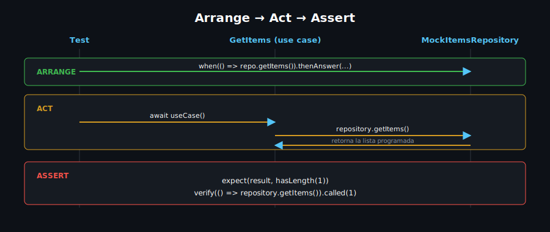

# Mocking con mocktail

## 🎯 Objetivos

Al finalizar este archivo, comprenderás:

- Por qué un test necesita un doble (mock) del repository, no el repository real
- Cómo declarar un mock con `mocktail` y programar su comportamiento con `when()`
- Cuándo y por qué hace falta `registerFallbackValue()`
- Cómo verificar interacciones con `verify()`

## 📋 Conceptos Clave

### 1. El problema: probar un use case que depende de un repository

Un use case como `GetItems` depende de `ItemsRepository` (interfaz del dominio, semana 10). Si
el test usa la implementación real, termina llamando a `jsonplaceholder.typicode.com` — lento,
no reproducible sin red, y no es lo que se quiere probar (el use case, no la API).



### 2. Declarar un mock

```dart
import 'package:mocktail/mocktail.dart';

// Extiende Mock e implementa la interfaz del dominio — nunca la
// implementación real (ItemsRepositoryImpl), siempre el contrato
// (ItemsRepository).
class MockItemsRepository extends Mock implements ItemsRepository {}
```

`mocktail` no necesita generación de código (`build_runner`) — a diferencia de `mockito`, que sí
la requiere para mocks con tipos genéricos complejos.

### 3. Programar el comportamiento con `when()`

```dart
void main() {
  test('GetItems retorna la lista del repository', () async {
    final repository = MockItemsRepository();
    when(() => repository.getItems()).thenAnswer(
      (_) async => const [Item(id: '1', name: 'Laptop', description: 'Portátil')],
    );

    final useCase = GetItems(repository);
    final result = await useCase();

    expect(result, hasLength(1));
    expect(result.first.name, 'Laptop');
  });
}
```

`thenAnswer` es para respuestas asíncronas (`Future`); `thenReturn` para valores síncronos
directos. Sin `when()`, cualquier método del mock devuelve `null` (o lanza, según el tipo).

### 4. `registerFallbackValue()` — cuándo hace falta

Si un método del mock recibe un argumento y en el test se usa un matcher genérico (`any()`) en
vez de un valor concreto, `mocktail` necesita saber qué instancia "de mentira" usar internamente
para ese tipo:

```dart
class FakeItem extends Fake implements Item {}

void main() {
  setUpAll(() {
    // Se registra UNA VEZ, antes de todos los tests de este archivo —
    // sin esto, `any<Item>()` lanza un error en tiempo de ejecución.
    registerFallbackValue(FakeItem());
  });

  test('createItem llama a repository.createItem con el item correcto', () async {
    final repository = MockItemsRepository();
    when(() => repository.createItem(any())).thenAnswer((_) async {});

    await CreateItem(repository)(const Item(id: '', name: 'Mouse', description: 'Inalámbrico'));

    verify(() => repository.createItem(any())).called(1);
  });
}
```

Solo hace falta para tipos usados con matchers (`any()`, `captureAny()`) — no para tipos
primitivos (`String`, `int`), que `mocktail` ya sabe manejar.

### 5. `verify()` — confirmar interacción, no solo el resultado

`when()` define comportamiento; `verify()` confirma que algo **ocurrió**. Útil cuando el use
case no retorna nada observable directamente (como `createItem`, que retorna `void`) — la única
forma de saber que funcionó es verificar que llamó al método correcto del repository.

### 6. Casos de Uso Móvil

Testear un `AuthRepository` simulado para el login (semana 9-10): sin mock, cada test de
`LoginCubit` haría una petición real a `dummyjson.com`, dependiendo de que el servicio esté
arriba y que las credenciales de prueba sigan siendo válidas.

## ⚠️ Errores Comunes

- **Mockear la implementación en vez de la interfaz**: `class MockItemsRepositoryImpl extends
  Mock implements ItemsRepositoryImpl` acopla el test a detalles internos — siempre mockear la
  interfaz del dominio.
- **Olvidar `registerFallbackValue()`** cuando se usa `any()`: el error (`Bad state: Fallback
  value` o similar) aparece recién al correr el test, no al escribirlo.
- **Usar `verify()` sin haber llamado `when()` primero** para un método que retorna un valor: sin
  `when()`, el mock devuelve `null`, y el código bajo prueba puede fallar antes de llegar al
  punto que se quiere verificar.

## 📚 Recursos Adicionales

- [mocktail — pub.dev](https://pub.dev/packages/mocktail)
- [mocktail — README con ejemplos completos](https://pub.dev/packages/mocktail/example)

## ✅ Checklist de Verificación

Antes de continuar, verifica que entiendes:

- [ ] Por qué se mockea la interfaz del dominio, no la implementación
- [ ] La diferencia entre `thenReturn` y `thenAnswer`
- [ ] Cuándo hace falta `registerFallbackValue()`
